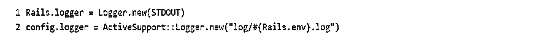
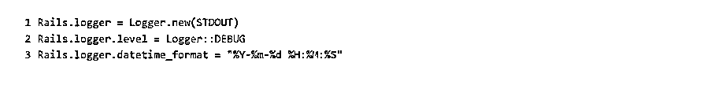
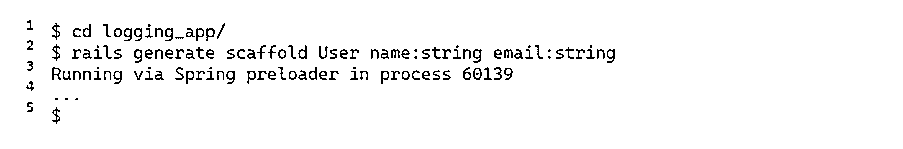
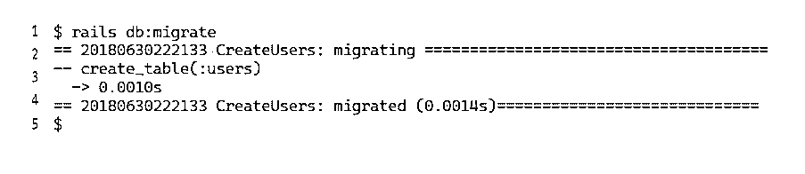
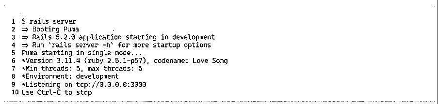

# 铁路记录器

> 原文：<https://www.educba.com/rails-logger/>

## Rails 记录器简介

Rails 登录是最佳实践之一。Rails logger 帮助维护正在运行的应用程序中的日志。它还有一些额外的优势。日志消息将使用相关信息自动格式化；我们可以通过标记日志和指定相似的日志级别来指定相似的日志。Rails logger 将把用户放在一个正确的应用程序登录路径中。此外，还可以快速访问任何相关信息。当报告问题时，日志记录将在调试过程中帮助我们。使用日志记录器的优势在于，它通过提供对统计数据、使用情况和指标的深入了解，为应用程序增加了价值。

### 什么是 Rails 日志记录器？

在 Ruby rails 中，作为初始化的一部分，将创建 ActiveSupport::Logger 来获取标准输出。正如我们所知，日志维护数据使用的历史。同样，在 ruby rails 中，当我们在应用程序上工作时，会维护日志，这在出现错误时会帮助我们。日志文件通常使用环境中的默认文件名生成。例如，如果我们保存开发文件，日志文件名将是 development.log，如果我们保存生产文件，文件名将是 production.log。生活中的日志让用户很惬意。他们有他们的优势。它让生活变得简单！

<small>网页开发、编程语言、软件测试&其他</small>

让我们看看应用程序日志记录。信息将被记录在应用程序日志记录过程中，例如应用程序运行时的行为。你为什么认为日志数据很重要？通常，当我们做一些事情，比如写一个代码，然后我们离开网站去做别的事情，如果之前做的代码出错了，会发生什么呢？我们最终只会得到日志数据。这些数据将帮助我们诊断问题。我们可以从日志中收集的信息是每天加载的页面数量、经常被考虑和经常被忽略的功能、我们停留在页面上的时间(以小时和秒为单位)以及新用户的数据。

### 如何使用 Rails Logger？

当我们开始使用 Rails logger 时，我们有几个选项要考虑。首先，我们需要配置记录器属性。在环境文件中，键入以下内容开始。

然后，我们将得到以下格式的输出。

这里将存储所有默认日志。但是我们可以使用不同的日志级别，根据客户的要求定制日志数据。因为有时，我们不想记录所有环境的所有数据。我们可能需要配置特定环境文件中的某些数据。例如，我们需要一些环境日志数据和一些生产日志数据。因此，最好记录不同级别的数据。

上面是设置日志级别的代码，它自动调试到测试和开发中。这是基本步骤，然后我们可以通过为传入的日志消息添加日期和时间格式来进行改进。这只是前面看到的代码的延续。

这里我们将日期和时间格式改为“年-月-小时-分钟-秒”格式，输出如下所示。

因此，在这一节中，我们看到了如何启动记录器并根据客户端需求修改默认代码。下一节将介绍如何创建 Rails logger 应用程序。

### 创建 Rails 记录器应用程序

要创建一个 rails logger 应用程序，我们需要执行如下所示的代码:

在屏幕的几次输出之后，您将得到 Loggers 应用程序。之后，我们将让 Rails 为我们生成一个模型和一个控制器，这样我们就可以记录任何有用的东西。通过转到日志应用程序目录来运行它。

Rails 为包含姓名和电子邮件地址的用户记录构建了框架。最后用 Rails 把 app 转换成 SQLite。

我们已经申请了！所以让我们运行它，确保一切正常。

### 配置文件

ActiveSupport::Logger 和其他记录器一样，提供了许多级别。有五个级别:调试、信息、警告、错误和致命。通过调用关联的方法，我们可以在以下任何级别记录消息:

上面的代码帮助我们在不同的层次上对消息进行分类。也可以过滤消息。在 Rails 中，我们可以选择基于血统进行配置。为此，我们必须添加日志配置，如下所示:config/application.rb 或 config/environment/{ environment _ name } . Rb。在这种情况下，环境文件将占据优势。我们可以通过传递 Rail 来改变日志文件的名称和位置；根据我们的喜好配置的日志对象。这也意味着，如果我们希望修改日志行为，我们可以构造 Logger 的新子类。

Rails 配置有一种为 Rails 提供日志消息格式化程序实例的方法。第一步是开发消息格式化程序类。对 active support::Logger::simple formatter 进行了改进，其中它是一个调用方法并被重载。对于设置，我们需要一个 SimpleFormatter 对象。记录器向调用发送四个参数。它们是日志级别(严重性)、消息时间、程序名称和消息本身。严重性被结构化为固定宽度的字段，而时间被格式化为人类可读的字符串。然后，我们将这些片段组合成一个可识别的消息结构。这个类可以通过多种方式添加到我们的代码中。在 Rails 中使用 libs 目录可能会引起争议，但是为了获得一个格式化程序，我们将使用它。

### 结论

这篇博客探讨了 Rails 日志记录器以及如何在我们的应用程序代码中使用它。然后，我们看到了如何在日志消息中进行更改，以根据客户端需求获得更多信息，我们还看到了如何更改和扩展设置。对于日志记录，您可以做更多的事情。您还了解了如何创建配置文件。最后，重要的是，当我们遇到错误时，每次记录都非常重要。它帮助我们调试。

### 推荐文章

这是一个 Rails 日志记录器的指南。这里我们讨论 Rails 日志记录器，如何从我们的应用程序代码中使用它，以及如何在日志消息中进行更改。您也可以阅读以下文章，了解更多信息——

1.  [Ruby on Rails 的职业生涯](https://www.educba.com/career-in-ruby-on-rails/)
2.  [轨道命令](https://www.educba.com/rails-commands/)
3.  [铁轨的优点](https://www.educba.com/advantages-of-rails/)
4.  [Ruby On Rails 语言](https://www.educba.com/ruby-on-rails-language/)

