# Intellij 快捷键

> 原文：<https://www.educba.com/intellij-shortcuts/>

## Intellij 快捷方式的定义

我们知道 Intellij 是用于开发目的的 ide 之一。它向用户提供不同种类的特性，以实现一致性、代码的适当表示、代码格式化等。Intellij 还提供了所有可能的不同快捷方式来简化开发。让我们考虑一下，如果我们想要搜索任何指定的操作，那么我们可以使用 Ctrl + Shift + A，这样我们就可以获得所有建议的操作列表，然后选择所需的操作，并按 enter 键。

### 顶级 IntelliJ 键盘快捷键

现在让我们来看看 Intellij 中的顶部快捷方式如下。

<small>网页开发、编程语言、软件测试&其他</small>

#### 1.到处搜索

我们可以使用 git 搜索项目内外的任何东西，包括文件、类、符号、元素和动作。

因此，首先我们需要按下 shift 键两次，然后我们得到如下截图所示的弹出窗口。

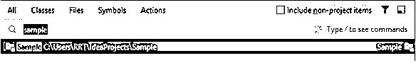

在这里，我们可以搜索我们想要的任何项目，例如，在这里，我试图搜索一个样本，并按下回车键，然后，我们得到上面的结果。

#### 2.寻找行动

这是用于搜索关键字的另一种方法，在这里我们可以搜索我们需要的任何操作，所以首先我们需要按 Ctrl +Shift + A，然后，我们得到一个弹出窗口，在这里我们需要提供所需的项目，如下图所示。

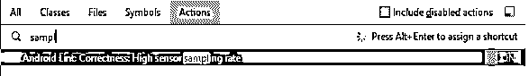

#### 3.显示项目窗口

有时我们需要从不同的角度来看整个项目，我们需要执行不同类型的任务，如创建类和文件，或者我们可以说打开一个现有的文件，编辑文件等。所以首先我们需要按 Alt + 1 来得到一个弹出窗口，如下图所示。

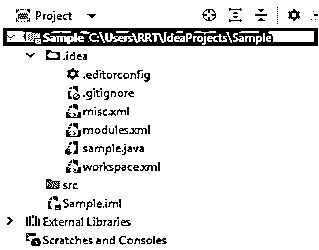

#### 4.重建

当我们尝试执行 rebuild 命令时，Intellij 会尝试清理整个项目，比如输出文件夹和删除缓存，这在我们更改类路径时很有帮助。所以我们需要按 Ctrl + Shift + F9，按下这个快捷键后，重建过程将开始，如屏幕截图所示。

#### 5.显示意图操作

我们知道，当我们使用 Intellij 时，它提供了不同种类的功能，如代码优化和代码分析，并且它主要检测问题。为了应用意图搜索，我们需要按 Alt + Enter 键，然后我们得到所有动作的列表。现在我们需要选择 Ctrl + Q 来预览意图，最后，我们需要按 enter 键来应用意图动作，如下图所示。

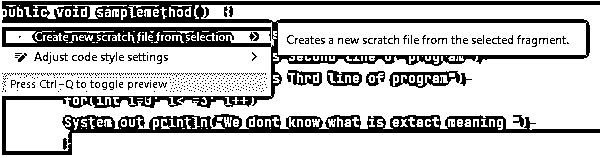

#### 6.最近的文件

有时在工作时，我们需要搜索一些最近编辑过的文件，这时我们可以使用这个快捷方式来打开所需的文件，所以首先我们需要按 Ctrl + E，我们会得到一个弹出窗口，其中包含所有详细信息，如下所示。

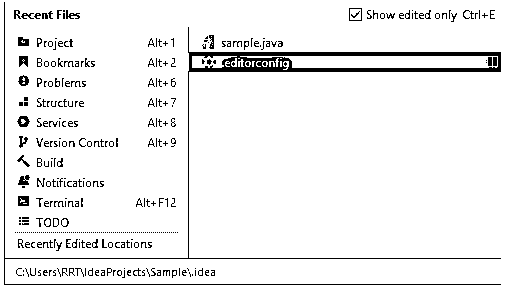

如果我们想看到最近更新的文件，那么我们需要再次点击 Ctrl + E。

#### 7.查找用法

在编写或修改代码时，您可以检查需要更改或删除的代码组件。在您推出改进之前，查看代码组件在哪里被利用以及它对应用程序意味着什么是一个不错的实践。通过 Find Usages 活动，您可以在整个代码库中查找代码组件的引用。在 Intellij 上工作时，有时我们需要搜索一个特定的项目，然后我们可以使用这个快捷键，这意味着我们需要按 Alt + F7，所以我们得到如下所示的高亮文本。

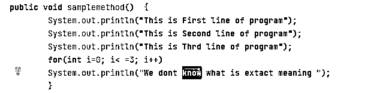

#### 8.在中选择

如果我们想在项目窗口中自动定位这个类，我们可以使用这个快捷方式。所以，我们需要按 Alt + F1，在我们得到如下所示的结果之后。

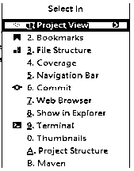

#### 9.设置

借助这个快捷键，我们可以改变项目设置以及 VCS 设置，如果我们想改变代码风格和语言的设置等。所以，我们需要使用 Ctrl + Alt + S 来查看如下所示的设置选项。

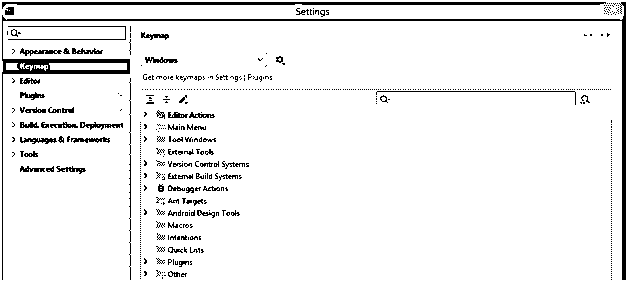

#### 10.生成;产生;引起

Intellij 提供了生成公共可用代码以及循环元素的功能，因此我们可以轻松地提高生产率。所以我们需要使用 Alt + Insert 键。

#### 11.运行任何东西

如果我们想运行当前文件或任何其他文件，那么我们可以使用这个快捷方式。所以我们需要按两次 Ctrl 键。

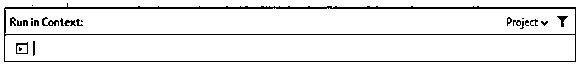

这里我们需要为执行提供上下文。

#### 12.查看断点

断点是在特定点暂停程序执行的特殊标记。这允许你查看程序的状态和行为。所以我们需要使用 Ctrl + Shift + F9 快捷键来获得一个新的弹出窗口，如下所示。

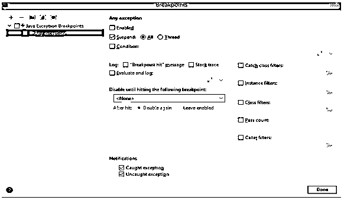

它还为用户提供了许多其他快捷方式，如调试、附加到进程、VCS 操作弹出等。

### IntelliJ 快捷键键映射

现在让我们知道 IntelliJ 中的 Keymap 是什么如下。

通过使用键映射，我们可以在选定的键映射中定制搜索选项，这意味着我们可以根据我们的要求创建键映射、删除、编辑以及更改键映射。如果我们有一个预定义的键映射，那么我们就不能进行更改。键映射提供了不同的方案操作，如复制、重命名、默认恢复和删除。

键盘映射还提供了创建快捷方式的工具栏，如全部展开、全部折叠和编辑快捷方式。为了实现，我们需要首先打开如下所示的设置。

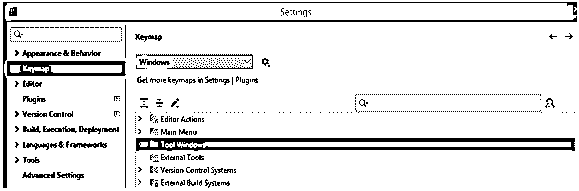

在这里，根据我们的要求，我们可以制作键位图，点击后，我们得到如下所示的工具栏。

### 结论

在本文中，我们试图探索 Intellij 的快捷方式。我们学习了 Intellij 快捷方式的基本概念，以及这些 Intellij 快捷方式的用途和功能。文章中的另一点是我们如何看到 Intellij 快捷方式的基本实现。

### 推荐文章

这是 Intellij 快捷方式指南。为了更好的理解，我们在这里讨论了 IntelliJ 键盘快捷键的定义。您也可以看看以下文章，了解更多信息–

1.  [Intellij 插件](https://www.educba.com/intellij-plugins/)
2.  [IntelliJ 版本](https://www.educba.com/intellij-version/)
3.  [IntelliJ vs NetBeans](https://www.educba.com/intellij-vs-netbeans/)
4.  [IntelliJ 备忘单](https://www.educba.com/intellij-cheat-sheet/)

