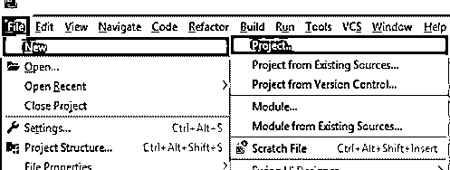
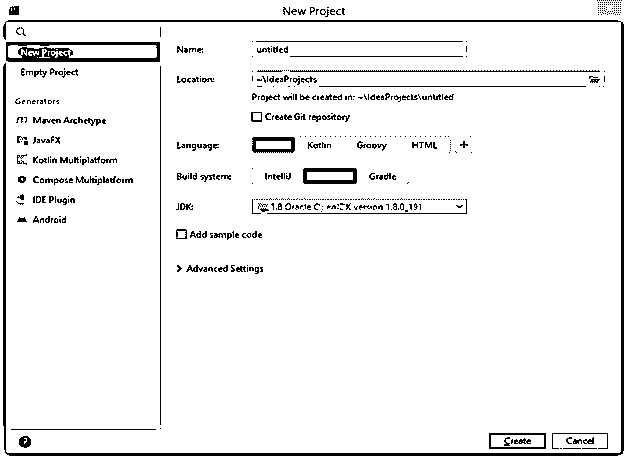
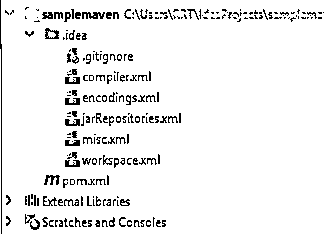
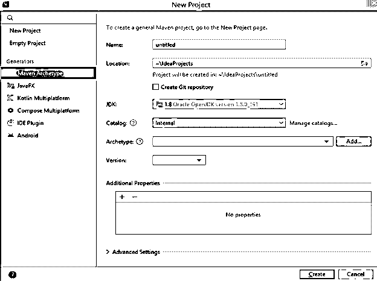
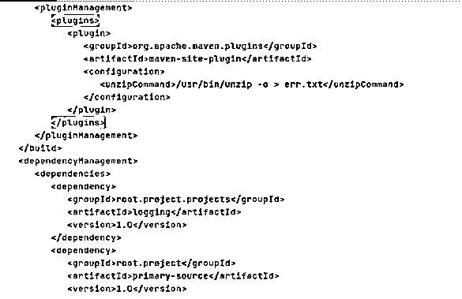
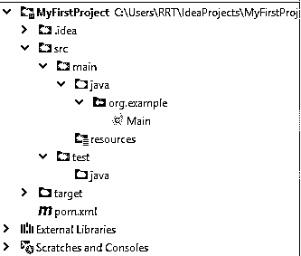
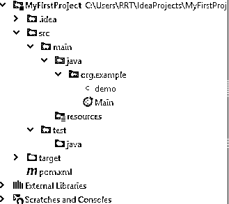
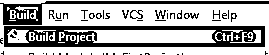
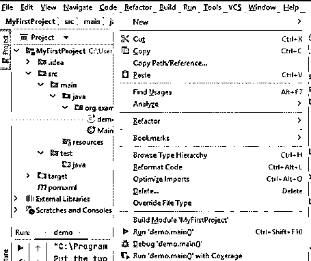

# 聪明的胃

> 原文：<https://www.educba.com/intellij-maven/>


## IntelliJ Maven 简介

我们知道 IntelliJ 为用户支持不同类型的特性，maven 是用来进行自动化构建的特性之一。换句话说，我们可以说在 Intellij 和 maven 的帮助下，我们可以对自动化构建过程进行全面的功能集成。在 IntelliJ 中，我们可以轻松地创建一个 maven 项目，并且我们能够将现有项目与 maven 同步，这意味着根据我们的需求，我们可以配置它。

### 什么是 IntelliJ Maven？

IntelliJ IDEA 支持与 Maven 完全有用的结合，帮助你将你的结构周期计算机化。没有太多困难，您可以创建另一个 Maven 任务，打开并同步当前的任务，向任何当前的 IntelliJ IDEA 项目添加 Maven 支持，并设计和处理多模块项目。Maven 是一个强大的基于 POM(项目对象模型)的承接板设备。它用于项目建设、可靠性和文档编制。它像 ANT 一样处理表单交互。然而，它比蚂蚁更先进。目前，我们可以将 Maven 视为一种工具，它可以制造和处理任何基于 Java 的项目。Maven 使 Java 设计人员的日常工作变得更简单，并且大体上有助于理解任何基于 Java 的项目。

<small>网页开发、编程语言、软件测试&其他</small>

### 如何创建 Maven 项目 IntelliJ？

现在让我们看看如何在 Intellij 中创建一个 maven 项目，如下所示。

1.  首先，我们需要打开 Intellij IDE。
2.  第二步，我们需要选择文件菜单。在文件菜单中点击新建项目，如下图所示。




3.  点击项目命令后，我们得到一个新的屏幕，如下图所示。




**名称:**根据您的先决条件提供一个合理的名称。

**地点:**选择你需要存放你的企业的地方。

**语言:**根据您的先决条件选择编程语言。

**构建系统:**这里你需要挑选 Maven。

JDK: 选择你需要利用的 JDK。

4.以上设置如上截图所示。最后，单击 create 按钮，在单击 create 按钮之后，我们的项目就创建好了，它会自动下载 maven 需要的所有依赖项。创建的项目如下所示。




我们可以使用如下所示的原型创建相同的项目。




在上面的截图中，我们可以看到我们需要提供项目名称、JDK 版本、原型和版本。

### IntelliJ Maven 是如何工作的？

在上面这一点上，我们已经看到了如何创建一个 maven 项目。现在让我们看看如何使用它，如下所示。

基本上，在创建了 maven project pom.xml 文件之后，我们可以添加所有我们需要的依赖项，如下图所示。




假设我们有一个名为 MyFirstProject 的 maven 项目，如下所示。




现在我们来看一个例子，首先，我们需要在 org.example 文件夹中创建一个类，如下图所示。




我们还需要了解构建过程，所以首先，我们需要选择我们想要构建的项目，然后单击“build”菜单并选择“Rebuild Project”选项，如下图所示。




在点击 Build Project 之后，我们得到如下的结果，如下面的截图所示。


现在，我们可以从屏幕上执行我们创建的 java 类，或者我们有另一种方法，就是右键单击该类并选择 run 命令，如下所示。




### IntelliJ Maven 想法

Maven 是执行人员的任务和认知工具，它为工程师提供了一个完整的表单生命周期结构。随着 Maven 利用标准的注册设计和默认的制造生命周期，改进小组可以在瞬间将企业的构建基础自动化。IntelliJ IDEA 依赖于自然地建立在 Maven 的 pom.xml 上的执行程序。IntelliJ IDEA 从其工作区解决 Maven 条件，而不将其引入附近的 Maven 档案(要求 reliance 项目位于同一工作区)。IntelliJ IDEA 自然会从遥远的 Maven vaults 下载预期的条件和源代码。IntelliJ IDEA 使向导能够创建新的 Maven 项目 pom.xml。

### 例子

在上面这一点上，我们已经知道如何创建一个 maven 项目和类。现在让我们看一个简单的基本 java 程序，如下所示。

```
package org.example;
public class Main {
    public static void main(String[] args) {
        int first_num = 20;
        int second_num = 40;
  System.out.println("put the two number for addition:");
  System.out.println("This is first number: " + first_num + " & " + "This is second number: " + second_num);
        int add = first_num + second_num;
        System.out.println("Final addition is : " + add);
    }
} 
```

**说明:**

在上面的例子中，我们试着做了一个简单的加法程序，执行后，我们得到了如下截图所示的结果。


### 关键要点

*   它提供了在 Intellij 的帮助下运行 maven 目标的功能。
*   根据我们的要求，我们可以在 IntelliJ 内部更新 maven 依赖项。
*   通过使用 IntelliJ，我们可以启动 maven 构建。
*   基本上，maven 为开发人员提供了不同的特性来管理他们的任务，比如构建、文档、报告、发布，

### 常见问题解答

下面是提到的常见问题:

#### Q1。我们为什么要用 Maven？

**Ans:** 我们知道 maven 是最受欢迎的开源构建工具之一，有助于开发、报告生成、文档以及管理框架的生命周期。

#### Q2。maven 中的 POM.xml 文件有什么用？

**Ans:** POM 只不过是项目对象模型，或者我们可以说它是 maven 项目的一个单元，它只不过是存储所有项目相关信息的 XML 文件，我们可以在需要时更新所有依赖关系。

#### Q3。Maven 和 Eclipse 有什么区别？

**Ans:** 基本上两者都不一样，因为 maven 和 eclipse build 不一样。另一方面，Eclipse 确实以自己的方式构建，maven 有不同的构建插件。

### 结论

在本文中，我们试图探索 Intellij maven。我们已经学习了 Intellij maven 的基本概念，以及 Intellij maven 的用途和功能。本文的另一点是我们如何看到 Intellij maven 的基本实现。

### 推荐文章

这是 IntelliJ Maven 的指南。在这里，我们讨论了简介以及如何创建和使用 IntelliJ Maven，并给出了一些想法和例子。您也可以看看以下文章，了解更多信息–

1.  [IntelliJ 备忘单](https://www.educba.com/intellij-cheat-sheet/)
2.  科特林·格雷尔
3.  [弹簧靴 ide](https://www.educba.com/spring-boot-ide/)
4.  [Maven 面试问题](https://www.educba.com/maven-interview-questions/)