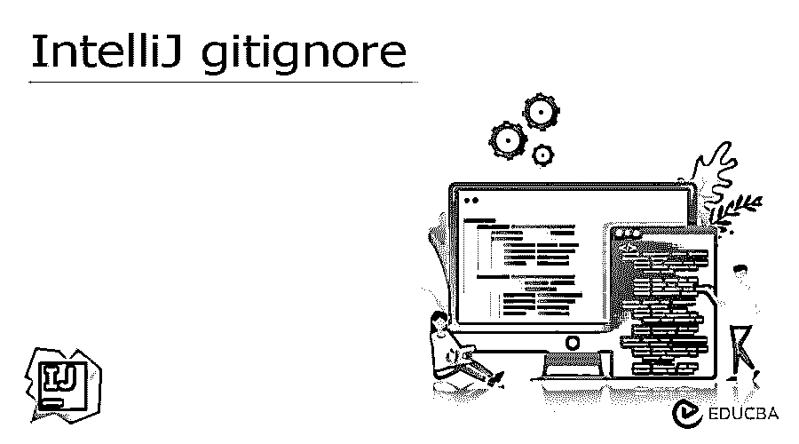
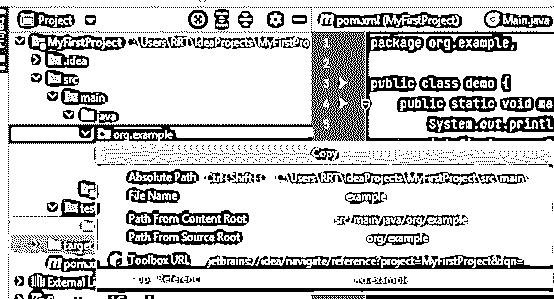
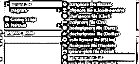
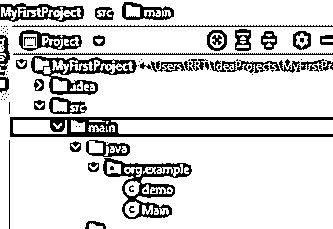
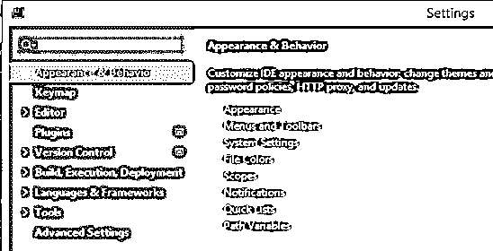
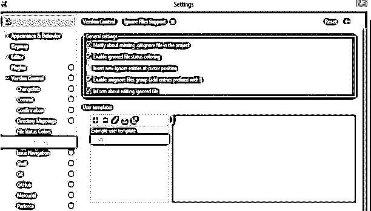

# 智能 gitignore

> 原文:# t0]https://www . educba . com/intelli j-gitignore/

## IntelliJ gitignore 简介

以下文章提供了 IntelliJ gitignore 的概述。Intellij 是用于开发的免费开源工具之一，它为开发人员提供了不同的功能，以简化开发并保持编码的一致性。所以 gitignore 是用来跟踪文件夹和文件的功能之一。它允许我们将文本文件放在 git 存储库中，并告诉它们不要跟随我们上传到主存储库中的指定文件和文件夹。

### 关键要点

*   它帮助我们使代码变得干净，这意味着 gitignore 允许我们从
*   gitignore 的一个好处是它可以帮助我们控制存储库的大小。
*   此外，它还提供提交、推送和拉取等干净的操作。

### 什么是 IntelliJ gitignore？

.gitignore 文件保持干净，我们不需要嵌入与 JetBrains 项连接的行；该记录更好地用于 parallels、库和自动生成信息。Intellij 继续刷新其活动和内部记录。思想继续改变着 JB 的每一个关键交付。这意味着我们需要继续更新我们的。gitignore 同样，这不是时间的最佳利用。Intellij 在这里有缺陷的例子；大多数编辑器 Atom，VS Code，Eclipse…没有人把他们的 IDE 内容存储在项目根中。出于同样的原因，JB 不应该是一个特例。Jetbrains 有责任让外部企业根跟踪这些文档。他们需要放弃污染 VCS 根。这种方法恰恰做到了这一点。的。思想组织者在 PROJECT_ROOT 之外。

<small>网页开发、编程语言、软件测试&其他</small>

### 如何使用 IntelliJ gitignore 文件？

当您克隆一个当前的 Git 库或者将一个当前的任务置于 Git 表单控制之下时，IntelliJ IDEA 会很自然地识别假设您的 PC 上已经引入了 Git。万一 IDE 找不到 Git 可执行文件，它建议下载它。

如果我们想要手动配置 Intellij ideA，我们需要使用它，所以首先，我们需要转到 IDE 设置的 Git 页面内的版本控制。对于设置打开，我们需要使用 Ctrl + Alt +S，尝试找出 Git 的可执行路径，这里选择 Git 表单 WSL。

有时，您可能不得不保留特定的记录不被修改。这些可以是 VCS 组织的文件，关于公用事业的古玩，钢筋副本等。您可以通过 IntelliJ IDEA 忽略文档，IDE 不会建议将它们添加到 Git 中，并且会将它们作为被忽略的特征。

我们可以忽略您在签名文件更改列表中找到的文档的签名记录。如果一条记录被添加到 Git 中，但还没有提交，那么您可以在 Local Changes 视图中右键单击它并选择 Rollback。

我们需要为忽略的列表配置两种类型的模式，如下所示。

**1。git/info/exclude 文件。**

我们在文件中编写的模式只适用于我们的本地存储库。

当我们签出回购协议时，gitignore 是自动的，我们也可以在 VCS 目录中创建多个 git ignore 文件。

2.这些文件被检入到存储库中，以使被忽略的模式对整个团队可用。这只是一个公共区域，我们可以在这里存储被忽略的文件。

如果我们没有. gitignore 文件，我们可以快速创建它，这样我们就可以在项目中右键单击，选择一个新文件，然后单击. gitignore。

现在让我们看看如何将文件添加到 gitignore 中。

总结您将使用哪种 Git 安排文档来忽略记录。如果其他方法都失败了，使用. gitignore。

在“本地更改”视图或“项目设备”窗口中找到您必须忽略的未版本化的文档或信封。这些透视图中的记录颜色有助于您识别文档的情况。

右键点击确定并选择 Git | Add to。gitignore 或 Git |添加到。git/data/bar。

这些视角中的文档颜色有助于您识别记录的情况。

### 如何添加 IntelliJ gitignore idea 文件夹？

在 Intellij 中，我们没有像 eclipse 那样的直接选项，所以这里我们需要遵循如下一些不同的步骤。

1.首先，我们需要在项目内部的文件上右击文件，选择复制路径；在这里，我们也可以使用截图所示的快捷键。

2.现在，在第二步中，我们需要打开我们项目的 gitignore 文件并粘贴我们已经复制的路径，如下面的截图所示。

3.点击后。gitignore，我们得到一个新窗口，在这里，我们需要选择我们想要创建的窗口，然后点击 Generate 按钮，如下图所示。

### 例子

让我们考虑一个名为 MyFirstProject 的项目，如下图所示。

之后，我们需要打开设置，如下图截图所示。

在这里，我们可以看到版本控制选项，因此单击版本控制并选择忽略文件选项，如下图所示。

### 常见问题解答

下面提到了其他常见问题:

#### Q1。在 gitignore IntelliJ 中应该怎么做？

**回答:**基本上，gitignore 是用来存储我们构建项目时生成的文件，保持了资源库的整洁。

#### 2.如何在 IntelliJ 中创建一个. gitignore 文件？

**回答:**首先我们需要创建一个名为 gitignore.txt 的文本文件；之后，我们需要打开它，添加我们想要的规则，并保存它。在下一步中，我们需要打开命令行窗口并重命名文件。

#### 3.Intellij gitignore 是自动创建的吗？

**答案:**答案是肯定的；它会在我们初始化时自动创建 gitignore 文件，或者我们可以说检查一下 git repo。

### 结论

在这篇文章中，我们试图探索智能忽略。在本文中，我们学习了 Intellij gitignore 的基本思想以及该 Intellij gitignore 的用途和功能。文章的另一点是我们如何看到 Intellij gitignore 的基本实现。

### 推荐文章

这是 IntelliJ gitignore 的指南。在这里，我们讨论了简介以及如何使用和添加 IntelliJ gitignore idea 文件夹，并附有示例。您也可以看看以下文章，了解更多信息–

1.  [IntelliJ 备忘单](https://www.educba.com/intellij-cheat-sheet/)
2.  [智能胃](https://www.educba.com/intellij-maven/)
3.  [Intellij 快捷键](https://www.educba.com/intellij-shortcuts/)
4.  [IntelliJ JavaFX](https://www.educba.com/intellij-javafx/)

