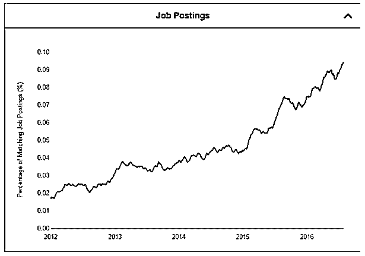
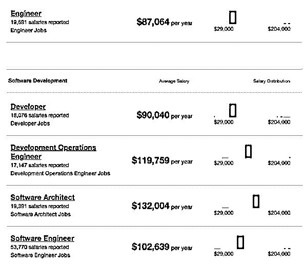
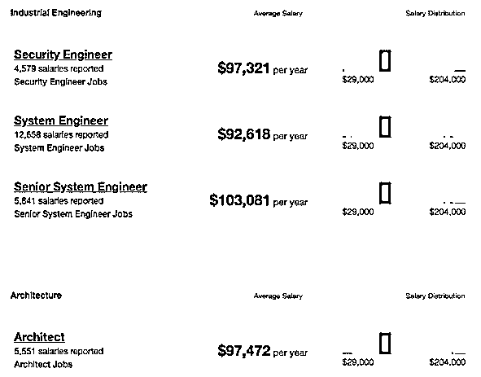
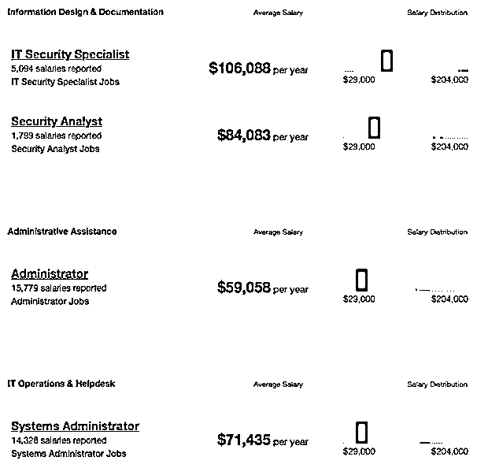

# 在 Splunk 的职业生涯

> 原文：<https://www.educba.com/career-in-splunk/>

## Splunk 职业介绍

Splunk 的设计理念是为存储在系统中的日志文件提供搜索引擎。Splunk 主要负责索引数据和处理大量数据。 [Splunk 据说是技术](https://www.educba.com/what-is-splunk/)，不好实现，但是 Splunk 为其用户提供了种类繁多的用户。Splunk 通过添加有关字段、事件和交易的信息来改进搜索。它还提供了识别先前搜索中的字段的工具，具有更大的灵活性。在 Splunk 中，可以进行调度，以便在出现任何提到的情况时从系统发送警报。

在本主题中，我们将了解 Splunk 中的职业。 [Splunk 是一种软件](https://www.educba.com/uses-of-splunk/)技术或产品，可提供高级搜索技术并为系统中的日志文件编制索引。它还提供了监控、可视化大量实时系统数据的选项。它的最初版本发布于 2003-04 年。它是由罗布·达斯、迈克尔·鲍姆和埃里克·斯旺设计的。

<small>Hadoop、数据科学、统计学&其他</small>

### 在 Splunk 发展职业所需的教育。

Splunk 为 Splunk 用户、Splunk 管理员、Splunk 云平台提供免费课程和学习途径，为应用程序开发人员、安全管理员、安全最终用户提供 Splunk，并为这些不同领域提供认证课程、付费课程、视频等。下面链接[https://www.splunk.com/en_us/training.html](https://www.splunk.com/en_us/training.html)。YouTube 上有许多视频或在线课程可供学习。这些培训帮助初学者和有经验的人提高他们的技能。通过上面的链接，您可以导航到面向用户和专业人员的课程。有免费课程，付费课程和不同平台的认证，你可以相应地为自己选择。Splunk 主要用于 DevOps 领域的[，因为它正在与不同的工具集成，这些工具将显示不同的时序图和](https://www.educba.com/itil-vs-devops/)[图](https://www.educba.com/graphs-vs-charts/)，并通过报告来可视化大量数据。它也称为 Splunk 培训和 Splunk 认证。要准备 Splunk 资料，请使用以下链接

[https://www.splunk.com/pdfs/ebooks/exploring-splunk.pdf](https://www.splunk.com/pdfs/ebooks/exploring-splunk.pdf)

### Splunk 中的职业道路

Splunk 的职业生涯有特定的工作角色:系统工程师、Splunk 管理员、Splunk 架构师、Splunk 应用程序开发人员、Splunk 编程分析师、安全工程师、技术服务经理和安全分析师。Splunk 可以有其他特定的角色；要看像 [DevOps 工程师](https://www.educba.com/devops-engineer/)，顾问等机构或公司。

Splunk 工程师的工作主要是平衡的，既不紧张也不放松，但这份工作主要是指竞争性和协作性。在 Splunk 的职业生涯在任何技术领域和其他行业领域都很成功，如金融和保险、信息技术、零售、贸易、T2 制造和技术服务。许多国家的许多企业，无论是大中型企业、政府机构、大学和服务提供商，目前都在使用 Splunk 开展业务、执行网络安全任务、了解客户、防止欺诈、提高服务绩效以及降低整体成本。Splunk 的流行及其在全球范围内被 IBM、Salesforce、脸书、惠普、Adobe 等组织所采用。

### 工作职位或应用领域

在 Splunk 的职业生涯中，市场上有很多不同行业的工作机会。这些工作机会在信息技术的不同[公司都有。这些公司就像 IBM、埃森哲、凯捷和其他大公司。工作职位包括软件工程师、技术架构师、Splunk 管理员、Splunk 应用程序开发人员、Splunk 安全分析师或工程师等。要申请这些职位，你可以去个人网站的求职页面申请。查看或访问 naukri.com，了解 Splunk 为不同类型的组织提供的不同机会，无论是小型企业还是大型企业。](https://www.educba.com/information-technology-benefits/)

下图是 Splunk 的招聘信息。

### 薪水

Splunk technology 根据职位和表现提供了丰厚的薪酬。数据可以随着时间的推移而改变。以下是美国不同地区提供的薪水。它可以根据不同组织的不同角色和职务来提供。以下数据是最新数据和收集的数据。

来源是 indeed.com。

### 职业前景

随着 Splunk 的广泛使用和普及，它的职业发展势头迅猛。它由总部位于美国的跨国公司 Splunk Inc .维护和服务。Splunk 中的职业生涯也用于生成报告、图表、警报、仪表板、[可视化](https://www.educba.com/what-is-data-visualization/)，该工具最重要的方面是索引和搜索。由于这些特性，Splunk 也被广泛应用于各种领域技术和行业。

Splunk 的功能也提供了各种机会，正因为如此，初学者和专业人士都被这些机会所吸引。对于这种产品或技术，从早期到中期到高级阶段有不同的角色和职位。它用于查找系统中的日志，主要用于大型企业。它易于学习和简单使用，并为市场中的机会提供了极大的刺激。

在 Splunk 的职业生涯在世界各地都有很好的客户，它有一个由 Splunk 托管的名为 Splunk base 的很好的社区，可以帮助用户找到 Splunk 的应用程序和插件。它还改进了 Splunk 的功能和用途。该社区还有助于将您的职业生涯推进到您期望的阶段，并帮助解决您在发展过程中遇到的任何问题。在线社区也为职业发展提供了很好的机会，并通过面试来提供有关问题的解决方案和指导。Splunk 在 DevOps 领域也有很好的职业生涯。学习 Splunk，让您的成长和职业生涯达到新的高度。

### 推荐文章

这是 Splunk 的职业指南。在这里，我们讨论了 Splunk 中的简介、教育、职业道路，以及 Splunk 中的工资和职业前景。你也可以看看下面的文章来了解更多。

1.  [大型机职业](https://www.educba.com/careers-in-mainframe/)
2.  [PL/SQL 职业](https://www.educba.com/careers-in-pl-sql/)
3.  [Linux 职业生涯](https://www.educba.com/careers-in-linux/)
4.  [机器学习领域的职业](https://www.educba.com/careers-in-machine-learning/)

