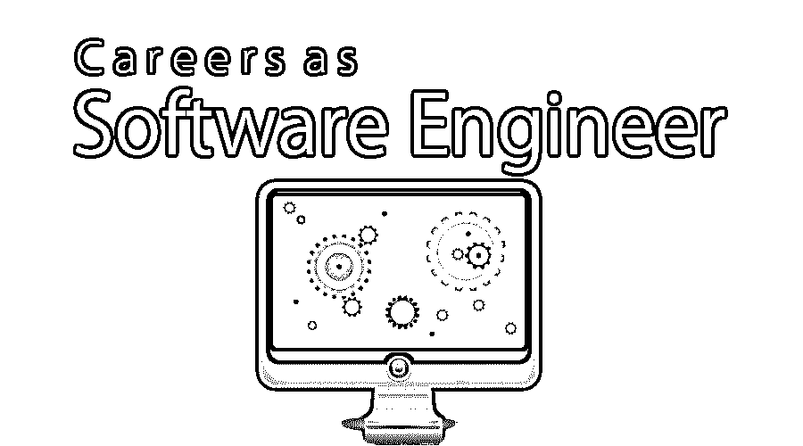
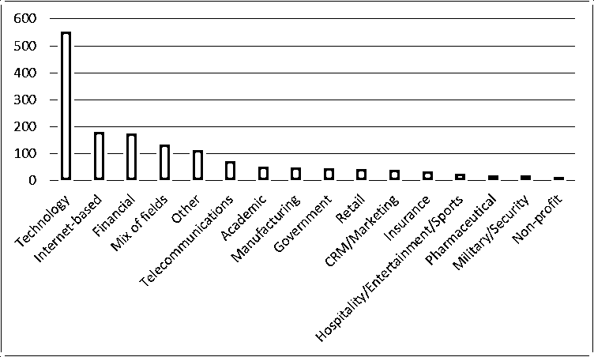
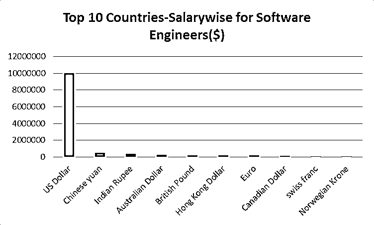

# 软件工程师的职业

> 原文：<https://www.educba.com/careers-as-a-software-engineer/>

## 软件工程师导论

构建一个软件设计有两种方式:一种是让它简单到没有明显的缺陷，另一种是让它复杂到没有明显的缺陷。第一种方法要困难得多。

**-C.A.R .霍尔**

<small>网页开发、编程语言、软件测试&其他</small>

软件工程是一门工程研究，重点是软件的设计、开发、维护、测试和评估。为了完成这些任务，软件工程师需要精通一系列特定的计算机语言。随着云计算和大数据等趋势的出现，软件工程师需要精通最新趋势，并且必须在教育方面很强，以满足应用程序开发的标准。如果你想在这个竞争激烈的时代找一份软件工程师的工作，有必要更多地了解这个行业以及与之相关的技能和机会。

### 成为软件工程师所需的教育。

软件工程可以按以下方式分解:

| **软件工程任务** | **所需学历** | **所需技能** | **排名前四的机构** |
| **设计** | **学位层次:**
计算机科学、信息技术、软件工程、数学、商业信息系统**硕士:**
计算机科学、软件工程
**认证:**
需要自愿认证像 Adobe Certified Expert、C 和 C++认证、CSSLP、微软 Certified Solutions Developer App Builder、Puppet Certified Professional 等。 | 受最后期限的驱使。团队工作能力。
采用软件工程最佳实践。
参与源代码和设计评审
了解多种编码语言，如 C/C++/C#、F#、Haskell、Java、Julia、Matlab、Python、R、SAS Scala、SQL 和 stata。
分析技术信息的能力。
解决问题的技巧。 | The top colleges for studying Computers Science and Information Systems, according to World University Rankings, are:1.麻省理工学院2.斯坦福大学3.剑桥大学4.加州大学柏克莱分校(UCB) |
| **开发** |
| **维护** |
| **测试** |
| **评估** |

### 软件工程师的职业道路

软件工程师是他们工作中的专家，并不觉得建立职业生涯很难。以下是一些软件工程师的职业道路。

1.  **应用程序开发:**这是一种解决问题的非基于 web 的软件开发，包括 Java 和 C#等编程语言。
2.  **系统开发:**设计和编写后台软件以支持应用程序开发，包括 C 和 C++等程序语言。
3.  web 开发:包括使用 HTML、JavaScript 和 PHP 等编程语言设计和创建在 Web 浏览器中运行的软件或应用程序。
4.  **嵌入式系统开发:**包括使用 C 和汇编语言等编程语言，设计在非计算设备(如汽车)上运行的计算系统和软件。职业生涯的形成是因为候选人对他们所获得的技能、他们为之工作的团队以及他们的同事所做的决定。

以下是一些塑造职业生涯的指导方针:

*   **进驻团队**

人们注意到，从事计算机科学相关工作的雇员要么在一个团队中，要么在一个文件中，从一份工作转到另一份工作。团队行动是换工作的最佳方式。加入一个优秀的团队，与熟悉的人一起工作，是完成工作最有效的方式。如果一个有能力的人换了公司，其他十个人也跟着换，那么有了这个人际网络，这个人会更有效率，取得更多的成就。

*   **加入初创企业**

初创企业是学习的好地方。因为团队很小，所以有机会看到各种挑战并从中学习。作为一名软件工程师，人们可以利用以前获得的技术技能，实现职业生涯的向上发展。要进入一家初创企业，你必须首先与孵化器取得联系，让它们进入一家初创企业。这种接触、环境和学习会对一个人的职业生涯大有裨益。

*   创办自己的公司。

如果你是一个喜欢冒险的人，那么这个选择对你来说是一个不错的选择。对于这条职业道路来说，拥有经验、团队和资本是很重要的，但长期的结果是非常令人满意和满足的。将上述因素与一个伟大的想法结合起来，你就可以开始了。这种职业道路的坏处是压力很大，工资也不固定。

**推荐课程**

*   [JSON 培训课程](https://www.educba.com/data-science/courses/predictive-modeling-course/)
*   专业 Axure 培训
*   OmniGraffle Pro 培训课程

### 应用领域

以下是不同的应用领域:

**1。嵌入式和实时系统**

嵌入式系统是像汽车和飞机一样的非计算设备，其正确运行不依赖于人的指导。嵌入式系统涉及安全关键应用，如汽车和飞机系统，远程操作系统，如卫星。嵌入式系统也用于移动电话和消费电子产品。它们是资源感知和实时系统。这意味着计算必须利用手头的资源并在时间限制内完成。

**2。安全关键系统**

用于汽车、飞机等领域或控制核电站、铁路信号等的软件。，是非常重要的，即使在没有人类指导的情况下，执行中的小错误也可能导致大规模的破坏，甚至导致人类生命的损失。记住这一点，构建具有容错性和适应性的可靠软件非常重要。

**3。安全性**

随着社会的快速变化，人们对信息技术的依赖程度越来越高，构建可靠且强大的安全软件来保护基础设施、数据和应用程序变得非常重要。

纵向而言，软件工程师及其技能主要用于技术、基于互联网的金融领域。[【1】](#_ftn1)

### 薪资(美国数据，而非印度具体数据)

根据美国劳工部的数据，2016-26 年间软件开发人员的就业前景为 24%，这应该比平均水平快得多。该局预计，2016-2026 年期间，就业人数将增加 302，500 人。软件工程师是当今收入最高的专业人士之一。以美元计，美国支付给软件工程师的薪水最高，其次是中国和印度。

### 结论或职业前景

考虑到软件工程领域的职业道路、机会和发展，这是当今最好的机会之一。它的报酬非常高，根据 Kaggle 关于数据科学和机器学习的调查，大多数参与者在工作满意度方面给了 7 分。他们还说，在你成为软件工程师之前和期间，学习是非常重要的。

### 推荐文章

这是一份软件工程师职业指南。在这里，我们讨论了软件工程师的简介、教育、职业道路、工作职位、薪水等。您也可以阅读以下文章，了解更多信息——

1.  [机器学习领域的职业](https://www.educba.com/careers-in-machine-learning/)
2.  [Java 生涯](https://www.educba.com/career-in-java/)
3.  [商业智能职业](https://www.educba.com/career-in-business-intelligence/)
4.  [项目管理职业](https://www.educba.com/career-in-project-management/)

