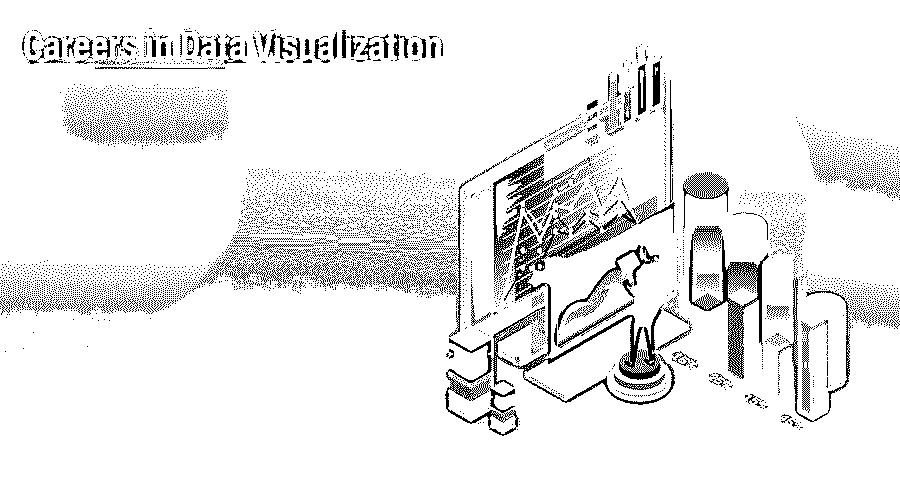

# 数据可视化职业

> 原文：<https://www.educba.com/careers-in-data-visualization/>

## 数据可视化职业

[数据可视化](https://www.educba.com/what-is-data-visualization/)定义为数据的图形表示，为决策者提供基于事实的分析，因为文本数据可能无法揭示识别数据所需的模式或趋势。它需要计算机科学学士/硕士学位或数据可视化研究生学位，因此，通过这样做，任何人都可以获得数据可视化工程师、商业智能分析师或组织中的数据分析师的角色，基于美国网站的平均年薪将在 6 万至 10 万美元之间。

<small>网页开发、编程语言、软件测试&其他</small>

### 了解数据可视化职业的教育

计算机科学或其他相关领域的学士/硕士学位

很少有初级/研究生虚拟化分析师的职位被公布——虚拟化通常是某些[数据分析师或数据科学家](https://www.educba.com/data-analyst-vs-data-scientist/)职位的组成部分。要在这些领域中的一个领域追求你的职业生涯，你通常需要一个能发展你的[分析技能](https://www.educba.com/great-analytical-skills/)的学科的学位，比如数学、统计学和计算机科学

如果你想直接专攻数据可视化，你可以考虑攻读数据可视化研究生学位。

### 数据可视化的职业道路

要成为一名数据可视化工程师，你需要一个大学学位，这个学位的主题是发展分析技能，如数学、统计学和计算机科学，因为他们必须具有很强的分析技能。

让我们清楚地了解他们所需要的不同职业道路和技能。

### 种类

数据可视化职业分为三大类:

1.  **数据可视化工程师:**数据可视化工程师专注于设计和开发报表解决方案，为决策者提供基于事实的分析，以识别文本数据可能无法揭示的模式和趋势。数据可视化工程师职位要求本科或硕士学历。
2.  **商业智能分析师:**商业智能分析师专注于数据分析和商业报告。分析业务需求并开发功能规范。[商业智能分析师](https://www.educba.com/business-intelligence-vs-data-analytics/)负责构建报告、仪表板、模型和工具来分析数据、报告和呈现与运营相关的数据，这些数据用于监控产品使用情况、做出重要的业务决策和预测业务生产力。有时，他们还需要与内部和外部客户接触，以确定需求，决定需求的优先级&确保没有沟通障碍。
3.  **数据分析师:**数据分析师在报告和可视化部分工作，借助[图、图表](https://www.educba.com/graphs-vs-charts/)等解释数据中隐藏的数字。他们的职责是分析从销售、营销等部门收集的数据。并通过以报告的形式展示他们的发现来帮助公司做出更好的决策。入门级的数据分析师职位需要学士学位。有不同类别的数据分析师职位:运营分析师、营销分析师、财务分析师等。

### 工作职位或应用领域

有许多不同类型的数据科学问题，每个问题需要不同的技能。因此，在这一领域有不同的角色:

**1。数据可视化工程师:**要成为一名数据可视化工程师，一个人需要拥有大学学位，并且是发展分析技能的学科，如数学、[、统计学](https://www.educba.com/statistical-analysis-in-r/)和计算机科学，因为他们必须具有很强的分析技能。

以下是从事数据可视化工作的人必须具备的一些技能。数据可视化工程师需要掌握 Angular.js、d3.js、Python 等语言的编码知识。

*   **技能组合:**优秀的分析工程师，[优秀的沟通技巧](https://www.educba.com/types-of-communication/)(书面和口头)，关注细节，优秀的数学和统计技能。具有 Angular.js、d3.js、Python 的编程知识，能够查询关系数据库&大数据平台(NoSQL 系统) [HTML & CSS](https://www.educba.com/html-vs-css/) 知识等。
*   **应用领域:**航空航天、信息技术、银行等。

**2。商业智能分析师**:商业智能分析师需要具备良好的书面和口头沟通技巧；他们还应该有数据分析的经验，他们应该有像 R，Python，MATLAB，& SAS 数据分析统计软件包的编码知识。

*   **技能组合:**良好的 Java、Python、Scala 等语言的编码知识。
*   **应用领域:**航空航天，医疗保健，零售业，[银行业](https://www.educba.com/finance/courses/investment-banking-course/)，交通运输

**3。数据分析师:**[数据分析师](https://www.educba.com/data-analyst-associate/)职位需要良好的 excel 编程知识和沟通技巧。[分析技能](https://www.educba.com/great-analytical-skills/)处理数据并得出结论也是必需的。数据分析师以可理解的文档形式呈现他们的发现；因此，良好的沟通(说和写)技能是必须的。

*   **技能集:**沟通、 [MS Office](https://www.educba.com/microsoft-office-application/) 套件(Excel、 [MS Word](https://www.educba.com/working-with-objects-in-ms-word/) 、 [PowerPoint](https://www.educba.com/ms-powerpoint-presentation/) )知识、SQL 技能
*   **应用领域:**咨询、医疗、银行、采购

### 薪资(美国数据，而非印度具体数据)

根据 Indeed.com 的信息:

*   **商业情报分析师:**[商业情报分析师](https://www.educba.com/career-in-business-intelligence/)的平均工资约为 9 万美元。
*   数据工程师:数据工程师的平均工资约为 10 万美元
*   **数据分析师:**根据经验水平的不同，数据分析师的平均工资可能从 60，000 美元到 90，000 美元不等

### 结论或职业前景

数据可视化工程师非常重要，因为正常人脑处理视觉效果的速度比处理文本快 60，000 倍。如今，几乎每个行业都在使用数据可视化。随着数据与日俱增，对数据可视化工程师的需求也在增加，因此理解数据并做出决策变得越来越困难，除非以更有意义或更容易理解的方式呈现；所以从事数据可视化是一个非常好的决定。如果你计划探索数据可视化的职业生涯，你应该考虑攻读数据可视化相关领域的学位&专注于发展分析技能，如数学、统计学和计算机科学。

### 推荐文章

这是数据可视化职业的指南。在这里，我们讨论了数据可视化中的简介、教育、职业道路以及工资和职业前景。您也可以阅读以下文章，了解更多信息——

1.  [商业智能职业](https://www.educba.com/career-in-business-intelligence/)
2.  [项目管理职业](https://www.educba.com/career-in-project-management/)
3.  [商业管理职业](https://www.educba.com/career-in-business-management/)
4.  [社交媒体职业](https://www.educba.com/career-in-social-media/)

