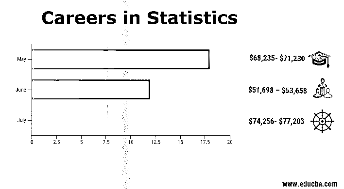
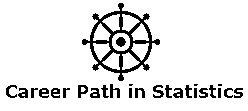
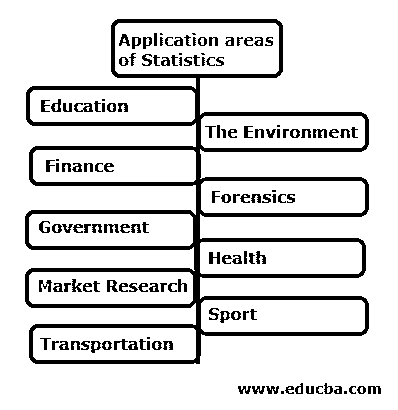

# 统计职业

> 原文：<https://www.educba.com/careers-in-statistics/>

## 统计学职业介绍

在本主题中，我们将了解统计职业，因为我们听到了[关于大数据技术](https://www.educba.com/big-data-technologies/)的内容，以及如何将不同来源的数据汇集在一起形成大型数据仓库。但是该拿它们怎么办呢？仅仅收集数据就足够了吗？谁来洞察数据的真实情况？“统计学家”是那些能够浏览数据并通过将数据转化为信息来获得洞察力的人。

一些真正了解统计学家如何工作的最佳方法可以在一些电影中看到，如艾伦·图灵的《模仿游戏》和《金钱球》。

<small>网页开发、编程语言、软件测试&其他</small>

统计学家是现实世界中发号施令的决策者，比如是否投资 ABC 公司？谁会赢得选举？油价会是多少？机票价格是多少？等等

### 发展统计职业所需的教育

*   统计学家应该拥有学士学位或硕士学位，以便在统计学、数学、工程、经济学或[计算机科学领域建立职业生涯。](https://www.educba.com/computer-science-interview-questions/)
*   统计人员应该精通 SQL(结构化查询语言)来获取分析所需的数据(通常，分析(EDA 解释性数据分析)是在一小组数据上完成的)。
*   现代统计学家还应该有很强的编码技能，可以用来设计新的算法。Python 或 R(这些是可用的开放软件)是首选语言(R 基本用于统计)；另一方面，SAS 是一个许可版本。
*   一个统计员应该具备良好的书面、[口头沟通技巧](https://www.educba.com/effective-oral-communication-in-business/)和解决问题的技巧。
*   统计人员应该有能力与其他非统计人员交流结果和发现，并有能力影响他人。
*   一个统计师应该有一个实际的和战略性的工作方法，对细节有高度的准确性。
*   统计员应该能够在截止日期前完成工作，与团队合作或独自工作。

### 统计职业的责任

*   统计员应该能够与客户协商，讨论要收集哪些数据以及需要收集多少数据。
*   统计学家应该能够设计实验，对数据进行试验，或者为调查提出问题，以产生所需的数据。
*   统计学家应该解释数据，并确保他/她做出的决定不仅仅是基于直觉。
*   统计人员应该能够向高级管理人员、监管机构或客户介绍他/她的结果，从而根据结果做出关键决定，并向政策制定者和政府当局提供建议。
*   统计员应该能够进行研究，通常作为团队的一部分，并撰写报告或文章以供发表。

### 统计学中的职业道路

有两种方式，一种是传统方式，一种是最近新潮的方式。

1.  数学学士学位是以传统方式开始的理想选择。
2.  然后在本科毕业后，读统计学中同一领域或相关领域的硕士学位课程。
3.  如果一个人走的是传统的统计学职业道路，那么攻读博士学位将是一件好事。
4.  一旦你拿到硕士学位，实习和其他职业机会就会出现，做 2-3 次实习会增加你得到梦想工作的机会。
5.  在那之后，你就可以开始一份全职工作了。

流行的方式是参加数据科学的微型课程，并参加黑客马拉松，为没有数学背景的人提供机会。

### 统计学的应用领域

如今，统计学在各个领域都有应用，以下是其中的几个。

让我们详细看看其中的几个:

*   在教育部门领域，提供未来学生人数的预测，以便考虑出生率的变化，并评估该部门需要的教师人数。
*   在医学中，设计实验以评估药物的效果和相关的副作用，或设计、实施和分析临床研究。
*   在环境领域，收集数据以监测空气污染水平，并密切关注有毒气体的水平。
*   在食品领域，研究人员收集数据来衡量食品添加剂的毒性，并建议食品生产中应包括哪些项目。

例如面包制作中的叶酸；

*   [市场研究领域](https://www.educba.com/marketing-research/)用于预测对产品和服务的需求，从而设计一个实验来提高产品质量。
*   在政治上，统计数据对于了解人们的情绪和预测结果非常有用。
*   在运输和物流中，统计可以用来预测特定区域的供应和需求，以增加或减少库存。

### 薪资(美国数据，而非印度具体数据)

下表显示了统计人员在公司中不同职位的工资及其工资级别

| **职位名称** | **工资** |
| 一级统计员 | $51,698 – $53,658 |
| 统计员 II | $68,235- $71,230 |
| 统计员三 | $74,256- $77,203 |
| 统计员四 | $92,585-$94,115 |
| 统计员 V | $114,897-$116,544 |
| 经济师(企业二) | $108,924-$110,789 |
| 经济学家(企业三) | $125,394 -$127,187 |

### 结论或职业前景

每个人都在寻找高薪工作，而统计学之所以与众不同，是因为它能把问题的点点滴滴联系起来，给出一个基于直觉但有数据中真实逻辑原因支持的解决方案。

统计学也可以应用于个人生活；例如，一个人可能对投资感兴趣，比如说[共同基金](https://www.educba.com/mutual-funds-for-beginners/)，运用他的统计技能，从中赚一些钱。

随着 AI ( [人工智能](https://www.educba.com/artificial-intelligence-vs-business-intelligence/))和[机器学习技术](https://www.educba.com/data-science-vs-machine-learning/)等技术的增加，统计学成为这些技术的核心课程(骨干)。如今或不久的将来，人们可能会称统计学家为“数据之神”。

### 推荐文章

这是一本统计学职业指南。这里我们讨论了统计学中的简介、教育、职业道路、工资和职业前景。您也可以阅读以下文章，了解更多信息——

1.  [共同基金 vs 交易所交易基金](https://www.educba.com/mutual-fund-vs-exchange-traded-fund/)
2.  [投资银行职业指南](https://www.educba.com/investment-banking-career/)
3.  [利用改善发展你的职业生涯](https://www.educba.com/develop-your-career-using-kaizen/)
4.  [对大学生有用的职业建议](https://www.educba.com/career-advice-for-college-students/)
5.  [投资银行职业指南建议](https://www.educba.com/investment-banking-career/)

