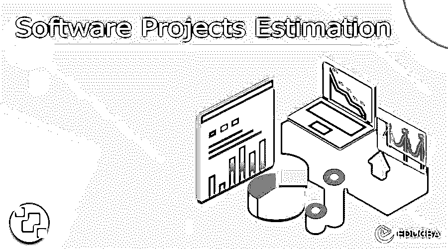

# 软件项目评估

> 原文：<https://www.educba.com/software-projects-estimation/>

## 软件项目评估导论

这是关于软件项目评估的概述。项目预算、时间和资源是项目管理的重要组成部分，也是项目成败的决定性因素。您可能有一个极好的想法，并认为自己是一个了不起的项目经理，但事实在于您的项目从长远来看如何发展，以及有多少是基于您对软件项目的估计。

软件开发的全部目的是作为许多硬件实用程序和产品的竞争性替代品。随着软件的使用，与硬件相比，成本总是保持在海湾，为工业部门带来了新的前景。随着越来越多的软件被设计用于不同的系统和计算机，软件开发人员有必要采用项目管理的方法，这种方法在早期仅限于制造和生产。因为时间表、范围和成本是整个软件开发范围内的关键组成部分；项目经理很快意识到这些组成部分是如何成反比的。如果有一个更紧的时间表，完成这项工作的成本会令人难以置信地增加，范围会扩大，以及所有不同的排列和组合。

<small>网页开发、编程语言、软件测试&其他</small>

成本、范围和时间成为项目经理控制和操纵的中心。他们使沉迷于软件项目评估成为一种最佳实践，查看每一个方面，并拥有与它们相关的数字，这些数字应该保持项目的平衡输出。这成了一项极具挑战性的工作，而且对业务至关重要。

### 软件项目评估

项目计划和控制很快就基于给定的估计，项目经理面临两种情况:

*   **低估项目**——在这种情况下，你多半会低估你的项目，把它的范围限制在质量方面，甚至保持一个紧凑的时间表，因为你不期望它是一个巨大的项目。
*   **高估项目**——在这种情况下，你多半会将你的项目人员过剩，范围超出其实际价值和质量要求，并保持一个灵活而庞大的进度。

在这两种情况下，你都将陷入亏损，并在项目上花费更多的钱:首先，为了弥补资源的短缺，其次，什么都不用。

为了避免这些情况并对你的整个项目有一个公平的评估，你必须在进入软件项目评估部分之前完全理解你的项目。软件项目评估的基础包括 4 个步骤。它们如下:

*   **项目规模**——在代码行(LOC)或功能点(FP)中估算开发软件的规模
*   **资源**——估计人-小时或月的工作量
*   **进度**——以日历月或日历日估算进度
*   **成本**——以相关货币估算项目成本

为了准确地评估项目的这些方面，掌握不同的可用方法和工具是非常必要和有益的。这些工具和方法可以集成到您的项目软件和各种工具中，或者它们可以是一个独立的工具，可以帮助您产生很大的评估，为您的项目奠定基础。这些方法和工具包括:

*   **宽带德尔菲估算法**–用于估算投入软件的工作量，宽带德尔菲估算法使用德尔菲法的原理，这是一种结构化的沟通方法，被项目经理用作预测工具。
*   **【工作分解结构(WBS)**——该技术使项目经理能够将软件项目分解成更小的、可管理的组件，这些组件可以用最好的方式进行度量和评估。这里使用的方法基于项目目标的每个单元的可交付性。
*   **【PERT】**——项目经理可以使用这个统计工具来分析成功完成一个软件项目所涉及的各种任务。它使用关键路径法(CPM)确定完成特定任务、活动或项目的最短路线，并附上完成该路线所用的时间。
*   **COCOMO 模型**——这种基于算法的成本估算工具使用过去项目历史数据的基本回归公式。
*   **【UPA】**——用例点是一种软件估算技术，专门用于软件开发项目，可以帮助你预测软件项目的规模，并据此采取进一步的决策和步骤。
*   **【FPA】**——有了功能点，这种评估技术就能深入到软件项目的更小的组件中。它建立了功能和每个功能添加到项目中的价值，反过来，也为正在开发的产品建立了价值。

### 软件项目评估需求

项目经理总是被期望对他们的软件项目的工作量、进度和成本给出最好和最准确的估计。随着项目管理的进行，这些集中的努力可以在方法和技术的帮助下达到最接近的估计。对于这个培训，你不需要有精湛的知识或者手里有认证，你需要的只是以下两样东西:

*   **计算机基础知识**——现在大多数技术都是工具，通常是系统的一部分或独立的。计算机知识将帮助您更好地理解这些技术及其内部工作原理，如果您以后想要按照您的软件项目需求定制它们的话。
*   热心学习——作为一名项目经理，知道自己永远学不够是很重要的。你的学习图应该一直保持它的势头，并且越来越高。在像项目管理这样的领域中，几乎每一步都会有更新和发展，保持对不同方法的了解并学习如何将理论付诸实践是很重要的。在所有的软件项目评估工作中，学习可能是你最大的工具。

### 观众

虽然本培训针对的是在不同组织的项目决策方面发挥关键和重要作用的个人，但本培训是专门为您准备的，如果您:

*   **项目管理专家**——你需要理解这种情况的全部借口，以及如何以最准确的方式进行评估和预测，使你的项目走向成功，并增强你的技能，为你打开许多大门和机会。
*   **一个项目经理**——你是项目的骨干，从始至终处理项目的责任都在你身上。本培训旨在帮助您成为最合适的人选，如果您在项目评估中表现不佳，需要一劳永逸地打破僵局。
*   **项目管理有志者**——那些无法进入项目管理团队，后来立志成为项目管理专业人士或经理的学生。
*   **项目发起人和任何有兴趣了解项目收尾阶段的人。T3】**
*   **任何人** 想在项目管理领域出人头地，都有领导团队、指挥软件开发项目完成的决心和领导能力。

### 常见问题–一般问题

1.  **我的估计有多准确，能否成功完成？T3】**

你对软件项目的评估取决于两件事:

*   您在现实生活场景中应用这些概念的水平
*   你作为项目经理的能力以及你与团队和利益相关者的相关性

这篇文章将引导你走上正确的道路，在这里你可以理解评估概念的细节和逻辑。这完全取决于你的奉献和应用的水平，教导继续成为准确估计的实际例子。评估不可能总是准确无误的，但是我们正在寻找最接近准确的评估，这些评估可以帮助您的项目。

1.  **这些都是经过验证的技术吗？它们可以单独使用吗，或者所有描述的技术都需要在一个项目中实现吗？T3】**

这些都是久经考验的技术，如果正确实施，在软件项目中从来不会失败。每种评估技术处理项目的不同部分:时间、范围、工作量或成本。理解你的软件项目和培训将帮助你决定使用哪种技术。

1.  **这些技术和解释只对软件项目有效吗？这种知识也可以转移到其他类型的项目中吗？T3】**

绝对的！这些技术不仅限于软件项目，还可以用于项目管理范例中的各种项目。

### 未来收益

成为一名熟练的评估者不会一蹴而就；你必须努力工作，争取让它为你服务。 无论你是项目经理、项目专业人员，甚至是有志于加入项目管理行列的学生，读完这篇文章都会对你的项目管理生涯产生巨大的影响。你将更好地运用工具和技术，更详细地理解项目定义。

### 结论

在这篇软件项目评估的文章中，除了理解软件项目评估和学习实现各种技术之外，你将能够进入你项目管理生涯的下一个阶段。如果你正在关注这次晋升，你将有很好的机会扩展你的能力来抢占先机。

### 推荐文章

这是一个软件项目评估指南。这里我们讨论一下引言。实施各种技术的好处和要求。您也可以看看下面的文章来了解更多信息—

1.  [嵌入式系统软件](https://www.educba.com/embedded-systems-software/)
2.  [软件需求](https://www.educba.com/software-requirement/)
3.  [草图软件](https://www.educba.com/sketch-software/)
4.  [项目管理工具软件](https://www.educba.com/project-management-tools-software/)

