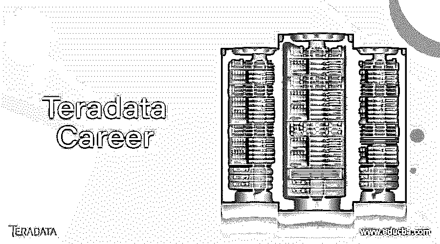

# 你想知道的关于 Teradata 职业生涯的一切

> 原文：<https://www.educba.com/teradata-career/>

## 什么是 Teradata？

它基本上是一个用来处理查询的数据库。它是世界上最大的商业数据库的关系数据库管理系统。其他 RDBMS 需要大量时间来处理和执行数据。但是 Teradata RDBMS 可以轻松处理大量数据。

的主要吸引力在于其可扩展性、并行处理和高性能。它会在几秒钟内为查询生成一个最佳计划。

<small>网页开发、编程语言、软件测试&其他</small>

[Teradata](https://www.educba.com/what-is-teradata/) 最多可以保存万亿字节的数据。并行性的概念使其成为数据仓库应用领域的行业巨头。

它基于无共享架构。

### Teradata 的特性

以下是 Teradata 的一些功能:

#### 1.更快的响应

它拥有最智能的优化器和最智能的特性，可以动态地回答任何查询。

#### 2.节省 IT 工作和时间

它易于设置和简单使用。这将为您的 It 部门节省大量时间，让他们专注于业务的主要目标。它的简单设置、自动化流程和智能设计更吸引 IT 人士。

#### 3.分析需求

它随时准备解决任何类型的查询。它处理[复杂的商业趋势](https://www.educba.com/data-analysis-tools-for-research/ "10 Cool Data Analytic Tools for Business")来定制网络服务。它同时处理多个查询，使用户很容易做出决定。

#### 4.单击一下即可管理数据仓库

它包含支持更快数据仓库部署的功能，结合了内存空间、CPU 和安全性的软件控制。它有一个明确的数据仓库，可以快速响应不断变化的业务需求。Teradata 的定义仓库包括三个主要部分。

*   Teradata 工作负载管理
*   Teradata 数据库安全区域
*   Teradata 数据实验室

#### 5.语言选择

你可以选择你最喜欢的语言，你认为这种语言能最好地处理这类问题。你可以选择 [Java](https://www.educba.com/java-app-development/ "Guide to Java App Development") 、Perl、 [Ruby](https://www.educba.com/ruby-programming-practice/ "Ruby Programming for Beginners") 、 [Python](https://www.educba.com/python-programming-for-the-absolute-beginner/ "Beginners Guide to Python Programming") 、R 或者你系统中安装的任何其他语言脚本来运行[自定义分析](https://www.educba.com/customer-analytics-techniques/ "How to get The Most of Customer Analytics")。

#### 6.结构化和多结构化数据

它允许您在同一个数据库引擎中存储和分析结构化和多结构化数据。它可以轻松使用查询中的所有数据类型，并提供数据库分析中的工作负载管理和简单的管理流程。

#### 7.安全性

该数据库提供了高级别的安全性，可以根据您的业务需求进行定制。下面列出了一些安全措施。

*   用户和系统级密码控制
*   用于保护凭证的钱包
*   IP 过滤器
*   行和列级安全性
*   全磁盘加密
*   用户授权和认证
*   审计日志

#### 8.行/列数据存储

Teradata career 有一个名为 Teradata Columnar 的元素，它有助于将基于列和基于行的表集成到数据库中。它支持高级工作负载管理、丰富的 SQL 和数据库分析。

#### 9.所有类型的用户

从业务用户到应用程序开发人员，所有类型的用户都可以使用它。它最适合商业用户，因为它具有领先的 BI 和灵活的定制商业 SQL 的特性。因为它的语言选择和灵活的应用程序架构，所以最适合应用程序开发人员。

#### 10.双时态

您将不需要任何复杂的 SQL 条件子句。Teradata career 让你更简单。它提供了完整的双时态表和查询。

### Teradata 职业的好处

*   自动数据分发–它自动分发均匀或一致或随机的数据。
*   高可扩展性
*   优化器——它有一个强大的优化器来执行许多操作
*   高度灵活
*   易于安装、使用和维护
*   它充当单个数据存储
*   低拥有成本
*   散装设施
*   完全支持图形用户界面

### Teradata 职业架构和组件

Teradata RDBMS 的架构是使用无共享架构设计的。

Teradata 职业数据库系统有两种类型

*   对称多处理
*   大规模并行处理

SMP 系统是指具有多个 CPU 共享内存池的单节点系统。MPP 系统有两个或更多的节点，通过一个叫做 BYNET 的组件连接起来。

Teradata 架构包含以下组件:

#### 1.结节

这是硬件和软件组件的集合，也是进行处理的数据库系统的构建块。渠道系统和网络系统可以与节点集成。

#### 2.体育课

解析引擎(PE)是一个解释 SQL 请求、接收输入和转换数据的组件。数据通过 BYNET 传输到 AMP。

#### 3.偏微分方程（Partial Differential Equation 的缩写）

并行数据库扩展(PDE)在每个节点上运行操作系统。它并行运行 Teradata 职业组件。

#### 4.安培

存取模块处理器(AMP)是一个虚拟处理器，用于管理数据库。它对数据进行排序、聚合和格式化。每个 AMP 都与一个存储数据的虚拟磁盘相关联。它有助于检索或更新数据。

#### 5.系统磁盘

系统磁盘是存储数据行的节点的一部分。它包括

*   [操作系统软件](https://www.educba.com/android-software/ "Best Android Software For Your PC")
*   Teradata 软件
*   [应用软件](https://www.educba.com/what-is-application-software-its-types/ "What is Application Software & Its Types")
*   [系统转储软件](https://www.educba.com/system-software-tools/ "What is Application Software and System Software?")

数据库的活动存储在磁盘阵列上。

#### 6.虚拟处理器

VPROC 是操作系统多任务环境中一个或多个软件进程的组合。在 windows 操作系统中，VPROC 是一个单独的软件进程。VPROC 的两种类型是 AMP 和 PE。

#### 7.榕树网络

BYNET 是硬件和软件的组合，在节点之间提供高性能网络。BYNET 是一个消息传递层。它有助于节点以更快的方式进行通信。BYNET 硬件和软件组件处理 VPROCs 之间的通信。BYNET 的硬件包括板卡和线缆。BYNET 的软件包括 PDE 和 BYNET 硬件之间的接口。

BYNET 的重要特性包括

*   容错
*   负载平衡
*   高可扩展性

### Teradata 职业数据仓库系统组件

以下是组件:

#### 1.Teradata 数据库服务器

其[数据库服务器管理](https://www.educba.com/database-management-system-advantages/ "Types of Database Management Systems")大量数据。它有助于提高可扩展性，并确保数据的完整性。

该数据库有下面提到的一些模块

*   **Teradata 数据库窗口**–控制 Teradata 职业数据库的操作
*   **Teradata 网关**–控制通信、客户端消息和加密
*   **并行数据扩展**–支持数据库中的并行处理
*   **Teradata 数据库管理软件**–这包括解析引擎、访问模块处理器和文件系统

#### 2.Teradata 工具和实用程序(TTU)

下面列出了重要的 Teradata 职业客户端工具

*   **Teradata SQL Assistant**——这是一个图形工具，有助于简化数据库开发和管理过程
*   **基本 Teradata 查询(BTEQ)**–是一个批处理查询处理工具
*   **装载工具**–帮助装载和卸载应用，如 TPump、FastExport、Parallel Transporter 等
*   **ODBC 驱动**–用于从其他工具和环境访问数据库。
*   OLE DB 是一个操作数据的接口
*   **管理员**–这是一个数据库管理界面。
*   **CLIv2(呼叫级接口)**–这是应用程序和 Teradata 网关之间的接口。
*   **Teradata Manager**–这是一套图形数据库管理和控制工具。
*   **性能监视器**–用于监视数据库会话、资源使用和性能统计
*   **直观解释**–SQL 脚本的图形化展示
*   **索引向导**–提高索引的性能
*   **统计向导**–自动生成统计数据。
*   **Teradata 归档和恢复(ARC)**—提供磁带归档和恢复流程。
*   **元数据服务**–元数据管理系统，包括元数据呼吸系统、MDS 引擎、元模型、Teradata Metasurf
*   **Warehouse Builder(WB)**–在 Teradata 环境中执行提取、转换和加载流程的多个实例。

#### 3.Teradata 资源

下面列出了一些资源:

*   Teradata 多负载指南
*   Teradata TPump 教程
*   Teradata 演示
*   Teradata 速成版
*   Teradata 元数据服务(MDS)
*   Teradata 企业数据仓库
*   Teradata 教程
*   Teradata 字符串操作
*   Teradata 中的日期和时间操作
*   在 Teradata SQL 中选择查询

### 成为 Teradata 专家

如果你是一名 Teradata 开发人员或接受过 It 培训并正在找工作，这一部分将帮助你回答关于职业的想法和问题。

你将知道成为 Teradata 专业人员或分析专业人员意味着什么。

首先你应该知道的是，数据分析是一个更广泛的术语，它包括许多名称。分析专家可以做很多事情。像统计学家、分析师、数据挖掘师等专业人士有好几个名字。

Teradata 通常包括使用各种复杂的技术探索数据以获得更深入的见解。Teradata professional 有许多头衔，但都有一些共同的核心技能和特征。例如，他们将来自不同的教育背景，但每个人都知道用 Python、SQL 等语言编码。区别在于有些人可能只懂两种语言，而有些人可能懂两种以上。

Teradata 分析师应该拥有独特而原始的人才档案。他们应该以创造力和好奇心为主导。当人们填补数据分析的工作时，这些品质是优先考虑的。这些品质将有助于人们更好地理解新技术。

正如我们所见，越来越多的商业智能解决方案采用了先进的技术。因此，如果你能适应这种环境，成为合适的 Teradata 专家，将会有所帮助。

新旧、结构化和非结构化数据之间的距离正在消失。你应该更有创造性，更灵活地开发，使工作流程无缝。

在你前进的时候，请记住这一切。

### Teradata 的职业道路

有职业道路吗？

是的，肯定有

Teradata 是一家公司，它也提供同名产品。

它不是一个简单的数据库。它被用于许多需要存储大量数据的顶级公司。世界上最大的数据库系统使用 Teradata。

印度只有几家顶级公司用，所以工作机会少了点。但将来很可能会增加。所以毫无疑问，Teradata 有更好的范围。

特别是如果你对数据仓库感兴趣，那么它是你职业生涯的最佳选择。Teradata warehousing 还允许您在家工作。

技术上适不适合，看你自己。

如果你对流程和系统有更深的理解，会有所帮助。从长远来看，更深入地理解数据将使您成为更好的开发人员。

你也应该不断更新自己的最新技术。里面的证书课程很少，如果你学了，那么你在市场上的需求会很高。

Teradata 是一项罕见的技能，所以你绝对可以向公司索要薪水。

### Teradata 开发人员

Teradata 开发人员的角色和职责如下

*   维护所有 DBA 功能
*   性能调优，包括收集统计数据并进行分析
*   创建和管理各种用户帐户
*   在机器之间移动数据库
*   升级和安装补丁程序集
*   使用数据仓库和数据集市
*   创建和管理分区
*   使用其管理器执行数据库健康检查
*   为客户提供新的高质量的解决方案
*   安装其驱动程序
*   使用其管理员和管理器工具来监视和控制系统。
*   使用 fastexport 和 fastload 实用程序刷新数据
*   使用某些工具将来自不同来源和遗留系统的数据加载到 Teradata 生产和开发仓库中
*   使用 Teradata Explain 和 Visual Explain 分析和改进查询性能
*   使用 UNIX 创建和修改 Informatica 的多重装载
*   将数据加载到 IDW
*   担任现场 Teradata 首席数据库管理员
*   充当离岸和现场 Teradata 团队之间的桥梁

### **结论**

因此，它帮助许多企业轻松实现他们的目标。我希望这篇文章能帮助你了解你在 Teradata 的职业生涯。

### 推荐文章

1.  [系统软件工具](https://www.educba.com/system-software-tools/)
2.  [用于研究的数据分析工具](https://www.educba.com/data-analysis-tools-for-research/)
3.  [性能监控工具](https://www.educba.com/performance-monitoring-tools/)
4.  [元数据管理工具](https://www.educba.com/metadata-management-tools/)

