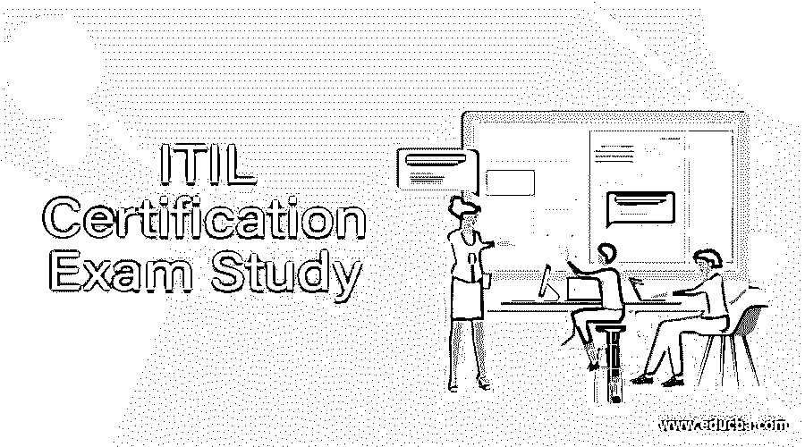

# ITIL 认证基础考试研究

> 原文：<https://www.educba.com/itil-certification-study-guide/>

## ITIL 认证考试研究介绍

**ITIL 认证——**[信息技术基础设施库(ITIL)](https://www.educba.com/itil-certification-study-guide/) 是一套信息技术服务管理(ITSM)[信息技术](https://www.educba.com/information-technology-benefits/) (IT)开发和 IT 运营的理念和实践。这是全球最广泛接受的 It 服务管理方法。

<small>网页开发、编程语言、软件测试&其他</small>

ITIL 基础证书属于 IT 服务管理的范畴。这对于需要对 itIL 框架和实施战略有基本[理解的专业人士来说非常有用，有助于提高与任何组织相关的 IT 服务管理质量。该认证受到 ITIL 公司的追捧，它们必须通过雇佣专业人士来完善其工作。本课程的参与者可以是 IT 专业人员、业务经理和业务流程所有者。](https://www.educba.com/itil-framework/)

ITIL 课程是一种全面的方法，旨在提高对如何在企业的实时工作场景中实施 ITIL 的理解水平，如关于 ITIL 的战略、设计和服务过渡以及服务运营、持续服务改进、ITIL 简介和术语表出版物等领域所述。课程大纲的整个范围旨在加强对构成 ITIL 一部分的各种概念和思想的简单参考，并使头脑得到扩展和维护。

ITIL 课程大纲的不同组成部分涵盖了 ITIL 的基本概念、服务生命周期、服务设计和战略、ITIL 工作环境中服务和实践的持续改进，以及关于服务水平管理的高端目标、关系、流程活动和基本概念的概述。候选人将学习服务目录管理、可用性、信息安全、供应商、容量、服务过渡和 IT 服务连续性等概念。

对 IT 术语有一定熟悉程度的考生可以轻松地参加本课程。如果他们对自己的商业环境有欣赏感，这是一个额外的优势。除此之外，参加 ITIL 认证基础培训课程没有正式的入门标准或任何其他先决条件。

模拟考试是课程的一部分，将帮助考生通过 ITIL 认证基础考试。教学大纲还附带了一项考试，这是确保在 IT 服务管理 ITIL 认证证书结束时给出的认证所必需的。考试由考生参加的 40 道选择题组成，采用纸笔形式。考生必须答对至少 65%的问题(40 道题中的 26 道)才能通过考试。

ITIL V3 是在更广阔的背景下编写的，支持更广泛的思考，以便能够实施最佳实践。构成教学大纲一部分的五本书有关于 ITIL V2 过程的大部分信息。然而，它们具有全新的结构和方法。设计这本书的内容的输入已经从 IT 服务管理部门的专业人员的国际论坛收集。因此，候选人将从整体上思考八本 V2 书籍的内容，而不只是像之前那样思考关于 IT 服务支持和交付的书籍。

ITIL V3 中级认证服务生命周期流侧重于介绍和实施特定的生命周期阶段以及原则、流程和相关活动的覆盖范围。每个中级模块都是独立的认证和资格。专业人员可以选择遵循两个截然不同的流(生命周期或能力)中的一个，或者获得那些他们发现特别相关且有用的模块。

### 生命周期流

以下类别由生命周期流组成

服务计划(培训课程即将推出)

*   ITIL 服务设计相关培训课程
*   ITIL 服务转型相关培训课程
*   ITIL 服务运营相关培训课程
*   ITIL 持续服务相关改进培训课程

**能力流:以下类别构成了能力流**

*   ITIL 作战支援相关分析训练课程
*   ITIL 服务项目以及协议培训课程
*   ITIL 发布、控制以及验证培训课程
*   ITIL 规划、保护以及优化培训课程
*   IT 中的生命周期管理是植入方法的有效服务，以便更全面地使用单个和组合系统来服务于商业利益。随着从 ITIL 中级认证的[学习中获得的知识和理解，掌握该科目会带来额外的好处。](https://www.educba.com/what-is-itil/)

### 通过 ITIL 认证的技巧

以下是通过 ITIL 认证的一些提示:

**参加 ITIL 认证培训有两种选择:**

ITIL 认证在线课程有自己的一套好处。有在线论坛指导他们，但人们注意到，除非候选人有热情完成课程，否则他们可能会因旷课而放弃或失败。与普通课程类似，讲师还会与学员分享演示文稿、学习材料和积极互动。可以通过电话、聊天、VOIP 或电话桥接选项轻松回答这些问题。最好从认证培训机构在线获得 ITIL 认证培训，因为培训师将获得 ITIL 认证。

参加 ITIL 认证课堂的好处是，每个候选人都可以得到单独的关注，了解自己的弱点，他们也可以在课堂上与他人互动，但这些课程的费用很高。除了日常工作之外，他们还必须留出或选择一个方便的时间来上课，而旅行时间可能会对他们产生影响。然而，如果候选人在跨国公司工作，或者他/她的雇主想支付 ITIL 认证的费用，那么这是一个更好的选择。

培训期间包括参加尽可能多的 ITIL 认证模拟考试，其中的问题涵盖了重要的主题。在这个基础考试中，考生必须面对 40 个问题，为了通过考试，他最多只能回答 26 个问题。经过认证的 ITIL 认证培训师培训学生至少答对 35 道题，这样所有学生才能通过考试。

要在 ITIL 认证考试中标出正确答案，考生可以遵循许多技巧:

1.  一个简单的选择是观察选项中的负面因素。如果其中一个答案是否定的，考生必须理解这个否定，它不结合问题。
2.  候选人还可以访问政府批准的网站，该网站提供了更好的术语信息、ITIL 认证方法和实践的解释。这一步可以帮助候选人确定问题和流程。
3.  候选人应该知道属于特定主题的各种过程，组成过程的活动，以及过程所有者的角色和职责。此外，了解流程之间的关系以及 ITIL 认证的好处也非常重要，这些好处可以从每个流程中获得。
4.  考生可以报名参加培训计划或沉迷于自学，但参加模拟考试可以使考生更好地准备和参加 ITIL 认证在线考试。
5.  要通过考试，考生必须在 ITIL 认证基础考试中正确回答 26 个问题。这相当于每个问题 1.5 分钟。先在答题卡上标出你已经知道答案的容易的，然后试着回答难的。
6.  候选人必须完全阅读和理解问题，因为有些问题中会有“没有”。很多考生失败，是因为他们阅读问题的速度很快，并标记了错误的答案。最好是理解，分析，然后标注答案。
7.  候选人必须真正专注于“最接近”、“最准确”和“最好”等问题这个问题的四个选项很难区分，选择的答案应该是“最好的”。这些问题在 ITIL 认证基础考试中有点难，因为它可能需要更多的时间。

ITIL，信息技术基础设施图书馆，被誉为世界著名的服务管理。它为候选人提供了管理 It 服务提供管理的系统和有效方法的知识。由于 ITIL 认证的内容结合了之前所有成功和不成功的流程，降低成本、改进 IT 服务只是组织从实施 ITIL 中获得的部分好处。

### ITIL 培训计划资格的特征是什么？

数据技术细节托存图书馆，更高的质量同样 ITIL，是由提供关键的，精确的住宅电梯的组织组成的。项目技术涉及诸如清单，技术和其他各种各样的杂务，其中任何 it 公司或部门可能会改变和目标，以他们不可避免的。实施 ITIL 的诸多方面包括货币价值的降低、服务运输和交付的发展、更高效的运营以及更好的全面取消，等等。单个公司可能会将任何业务提升到一个新的水平，而你在这方面的进步往往会影响到团队的其他成员。

毫无疑问，接下来的问题将确定你将如何获得你目前在 ITIL 的资格，以及你为什么要从它开始？为什么要在看起来你只能不断提高现有技术的时候获得资格呢？你可以在网上单独完成 ITIL 在线课程，这意味着你可以专注于资格认证；在您的停机时间，您需要利用个人立即发现的点。在网上并不意味着面对面，这通常完全消除了旅行到另一个地方的价格，住宿，餐饮，以及所有增加的各种账单，包括在另一个地方有一个官方认证学校。你仍然可以通过电子邮件找到一位新老师，他可以回答你的任何问题。此外，一旦你完成一个人的指令，就有可能锻炼你所发现的一切，为你立即提供真实世界的经验。

获得一个 ITIL 项目的资格会给你一个明显的优势，超过你的其他熟人，因为你有一些关于 ITIL 内部知识的书面材料。ITIL 为您提供在常规支持升级、大修设计和风格捆绑以及程序功能建议中使用创意。在您考虑该产品后，您已经获得了这方面的知识，使其能够提供关于改进操作外观、改进危险管理的建议，并为您的访问者提供最佳的高质量交付品。这个想法看起来很值得你花时间和精力。

与 ITIL 和 it 培训项目资格相关的权威人士普遍认为，ITIL 不会为你在现实生活中申请一个组织提供充分的回应或足够的设计。你从 ITIL 那里学到的东西包含了一个事实，那就是在你的课程中讨论的东西无法履行处方药的职责，而这些处方药是用来保持或增强陪伴的。相反，本培训课程包含可调整的概念，可以影响您的小型企业，您认为合适。如果一个人的教育领域令人满意，而另一个人却不能，那就简单地采用能满足你的教育领域。一个人认为允许多少，你就可以得到多少 ITIL。这不是《情报贩子手册》本身，而是某种同谋的秘密和技术，让你结合自己的道路来实现当前的目标。

ITIL 在线培训计划认证为您提供市场竞争优势。你获得的这种感觉让你可以通过应用一些任何人都在你的 ITIL 项目中学习的简单流程，将你的公司带到一个新的水平。此外，因为你可以获得大量启发性的理解，大多数公司投资于你的认证，从而使这一胜利为所有有关聚会赢得环境。ITIL 培训课程认证可以证明他们是您职业生涯中的一笔宝贵财富。

### 推荐文章

这是 ITIL 认证基础考试学习指南。在这里，我们已经讨论了整个考试指南，资格，通过提示，分别。您也可以看看以下文章，了解更多信息–

1.  [认证培训项目](https://www.educba.com/certification-training-program/)
2.  [ITIL VS PMP](https://www.educba.com/itil-vs-pmp/)
3.  [PMI 认证](https://www.educba.com/pmi-certification/)
4.  [ITIL 面试问题](https://www.educba.com/itil-interview-questions/)

