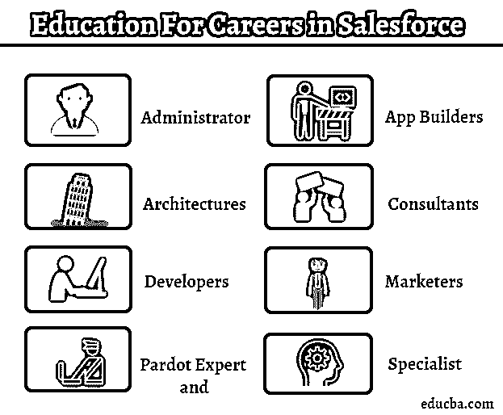
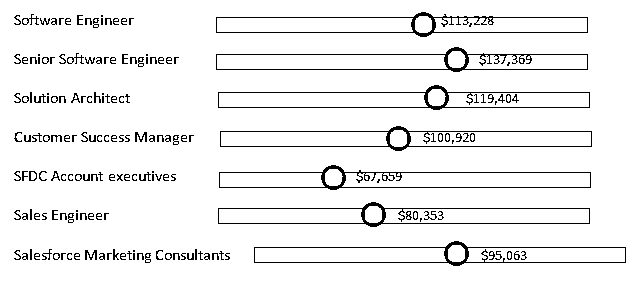

# Salesforce 中的职业

> 原文：<https://www.educba.com/careers-in-salesforce/>

## Salesforce 职业介绍

以下文章概述了 Salesforce 中的职业生涯。Salesforce(缩写为 SF 或 SFDC)是一家[美国云计算公司](https://www.educba.com/cloud-computing-companies/)，总部位于加州三藩市。马克·贝尼奥夫和帕基尔·哈里斯是该公司的创始人(成立于 1999 年)。

产品:

<small>网页开发、编程语言、软件测试&其他</small>

*   销售云
*   服务云
*   平台
*   营销云
*   商务云
*   社区云

Salesforce 是一个基于云的 CRM 平台(基于云的意思是应用程序通过互联网交付并运行或兼容任何网络浏览器)。CRM ( [客户关系管理](https://www.educba.com/customer-relationship-management-tools/))是一款存储你客户每一个细节的软件。这些细节可以是姓名、地址、电话、网站访问、电话、电子邮件等等。

### Salesforce 职业教育

分析师表示，Salesforce economy 中的职业呈指数级增长，据信到 2022 年将创造 330 万个新的职位空缺。 [Salesforce educations](https://www.educba.com/what-is-salesforce-technology/) 根据其在市场上创造的不同工作机会而设计。这些教育类别取决于个人在组织中扮演的角色。

*   管理人员
*   应用构建者
*   体系结构
*   顾问
*   开发商
*   营销人员
*   帕尔多专家
*   专家

同样，这些教育流的需求可能会根据要求和有效的候选人而有所不同。谈论高效的候选人意味着多重任务；为了说明这是一种更好的方式，我想引用开发人员和测试人员的角色。许多公司不雇佣测试人员，或者在某种程度上，他们雇佣开发人员。他们相信开发人员会补偿测试人员的角色和职责，如果不是完全补偿，那么在某种程度上。

### Salesforce 中的职业道路

以下是 salesforce 的职业发展道路:

#### 1.管理人员

面向具有 Salesforce 管理员经验的个人。希望成为 Salesforce 管理员的个人必须展示他们的专业知识，同时与利益相关方合作，以确定他们的要求、定制实施(根据客户要求)，并从最终用户的角度应用意识形态。

Salesforce 管理员职业道路有两个子级别，即:

*   [Salesforce 认证管理员](https://www.educba.com/certified-salesforce-admin/)
*   Salesforce 认证高级管理员

#### 2.应用构建器

认证 Salesforce 应用程序构建者是指拥有设计技能并能够使用 lightning 组件实现这些技能组合的个人。

#### **3。**建筑师

专为拥有技术架构师职位经验的个人设计。作为一名认证 Salesforce 架构师，需要分析客户(研究他们的背景业务)，找到最符合其业务背景的可行解决方案，将这些解决方案传达给业务合作伙伴，以确保质量和取得成功的潜力。这些解决方案必须在 Lightning 平台上解决。

Salesforce 架构师职业道路有 3 个子级别，即:

*   Salesforce 认证架构设计师
*   Salesforce 认证应用程序架构师和系统架构师
*   销售队伍认证技术架构师(CTA)

#### 4.顾问

这些专业人士致力于客户的成功。在这里，个人的技能在解决现实世界的问题中得到检验。这是技术和经验的混合体。

Salesforce consultants 的职业道路有 6 个子级别，即:

*   Salesforce 认证社区云顾问
*   Salesforce 认证现场服务闪电顾问
*   Salesforce 认证营销云顾问
*   Salesforce 认证的 Pardot 顾问
*   Salesforce 认证销售云顾问
*   Salesforce 认证服务云顾问

#### 5.开发商

认证 Salesforce 开发人员是拥有相关编程技能的个人。他们在 Lightning 平台上从后端定制应用程序。

Salesforce 开发人员的职业道路有 3 个子级别，即:

*   Salesforce 认证商务云数字开发人员
*   Salesforce 认证平台开发人员
*   Salesforce 认证平台开发人员 II

#### 6.营销人员

市场专业人员是那些在与团队互动的同时掌握直接客户处理技能的人。他们在 Salesforce 营销方面效率很高，对云及其功能有丰富的了解。这些活动与电子邮件和社交活动相结合。Salesforce 营销人员的职业道路有 3 个子级别，即

*   Salesforce 认证营销云顾问
*   Salesforce 认证营销云电子邮件专家
*   Salesforce 认证营销云社交专家

#### 7.帕尔多专家

这些商业人士利用他们的技能来提高他们的商业参与度。

在这种情况下，一名专业人员有两个级别的职业道路，即:

*   Salesforce 认证的 Pardot 顾问
*   Salesforce 认证 Pardot 专家

#### 8.专科医生

Salesforce Certified CPQ 专家证书面向具有使用 Salesforce CPQ 解决方案经验的个人。该认证确认了个人在构建捆绑包配置、定价以及生成续订和修订方面的专业知识。

### Salesforce 职业生涯的应用领域

以下是 salesforce 职业生涯的应用领域:

*   **自动化测试—**使用 [QTP 和 Selenium](https://www.educba.com/selenium-vs-qtp/) 的应用程序测试在全球范围内具有巨大的市场价值。
*   **冷打电话—**客服。
*   **见解生成–**每周/每月/每季度/每半年和每年跟踪输入，以便更好、更有效地生成见解。这被证明是一个伟大的数据分析与证明能力。
*   **SaaS—**软件即服务。
*   **平台即服务–**平台即服务。

### 薪资(美国数据，而非印度具体数据)

美国销售人员的平均年薪为 82，301 美元或每小时 42 美元。

Salesforce(美国地区)的一般市场研究有以下事实和数据:

入门级职位——58，000 美元

有经验的平级职位——11.5 万美元

### 结论 Salesforce 中的职业

Salesforce 不仅仅是一个 CRM 工具；其云存在和灵活性使其需求不断增加，并不断影响全球市场。据 Gartner 称，到 2017 年，整个 CRM 市场将达到 395 亿美元左右。Salesforce 就在最顶端，总贡献超过整体 CRM 行业的 20%。这方面的职业通过见证真实的问题展示了你在转变公司(无论大小)方面的潜力。因此，这就产生了对全球销售人员职业的持久需求。

一般来说，结论不像 Salesforce 那样只有一行。因为每个企业都有自己的客户和客户管理，所以对于任何企业来说，生存和发展都是至关重要的。因此，对于希望在云计算、CRM、开发、架构师和其他 it 相关技能方面建立职业生涯的人来说，这是一个非常好的机会。最终，好的职业会带来更高的薪水。

### 推荐文章

这是一份 Salesforce 职业指南。这里我们讨论 salesforce 所需的学历，职业道路，薪水，salesforce 的职业前景等。您也可以阅读以下文章，了解更多信息——

1.  [Hadoop 职业生涯](https://www.educba.com/career-in-hadoop/)
2.  [Linux 管理职业](https://www.educba.com/careers-in-linux-administration/)
3.  [统计职业](https://www.educba.com/careers-in-statistics/)
4.  [软件工程师职业](https://www.educba.com/careers-as-a-software-engineer/)

