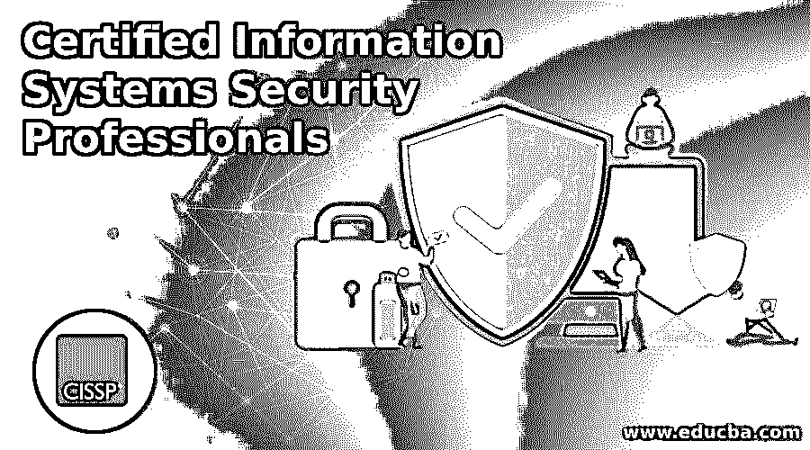

# 认证信息系统安全专家

> 原文：<https://www.educba.com/certified-information-systems-security-professionals/>

## 认证信息系统安全专家简介

大学毕业后，你可能刚刚完成你的研究生学业或者毕业典礼？找工作；然而，提供的薪水并不符合你的期望，对不对？雇主提问:除了毕业和研究生学历，你还有哪些额外的商业认证？除了你的学术课程，你还学到了什么？你还想更新自己的其他商业认证吗？

如果你能回答以上所有问题，甚至更多问题，这将有助于你获得合适的期望薪水。为此，你需要了解这个行业的市场以及它的发展方向；对于一个商业分析师来说，在你进入一份工作以获得你想要的薪水之前，你需要获得哪些最新的认证课程。

<small>网页开发、编程语言、软件测试&其他</small>

 

*图片来源:pixabay.com*

市场上现有的专业人士，你仍然没有得到你应得的。也许你的工资不正确，或者你的指定不正确。当然，有了一个称号，你的薪水就会增加。原因是什么，因为你做的每件事都是正确的，那么你缺少的是什么？可能你什么知识都有，在论文里同样缺少，说明你缺少一个证书。完成一些商业分析认证课程可能会帮助你成长。如果你没有这方面的知识，你将在所需领域的课程帮助下接受教育。

让我们关注几个行业，了解哪些是最好的商业认证课程，哪些是市场上最新的课程，这些课程会给你的简历带来巨大的市场价值？

### 信息技术行业商业分析认证

现在这个行业在市场上不是很老的一个，也不是很新；然而，仅技术一项就影响了市场中的所有其他行业。哪个行业没有利用技术以明智的方式工作并与时俱进。每个行业，每个公司都因为各种原因使用技术。这个行业随着时间的推移而发展，有许多专业人士为他们工作。这些专业人士包括经验丰富的专业人士，具有 IT 学术背景的专业人士，以及许多具有不同学术背景的商业管理课程的专业人士。

我们可以窥探一些最新的专业商业认证，这些认证可以帮助你的简历获得不错的薪水。

#### 1.CISSP(注册信息系统安全专家)

信息系统安全是当今 IT 领域最重要的领域之一。如果您是一名制定信息安全政策和程序的专业人员，那么在完成此认证后，您将会看到您的简历和您的职业有显著的增长。完成本 CISSP 课程后，您将获得信息安全经理的称号。

#### 2.IT 基础设施库(认证信息系统安全专家)

这种 ITIL 认证给你的知识和技能所需的合格的任何 IT 服务公司的经理。这个认证包括三个阶段:基础杠杆、从业者水平、管理者水平。前两个认证级别没有任何具体要求；但是申请第三级，需要已经扫清基础级，有 5 年 IT 管理经验。

#### 3.国际软件测试认证(ISTQB)

ISTQB 即国际软件测试资格委员会，是一个软件测试资格认证组织。他们负责获得 ISTQB 认证测试员资格的所有计划。这个商业分析认证项目在 70 多个国家提供，许多机构根据推荐的课程和教学大纲开展管理培训课程。这个课程在国际上被普遍接受、使用，并推荐给测试人员，让他们成长为 IT 专业人员。完成本课程后，你可以获得一份质量保证工程师、软件测试工程师和高级软件测试工程师的工作。

#### 4.CCNA 认证(思科认证网络协会)

这种 CCNA 商业分析认证给你能力，或者更确切地说，验证你的能力，配置，安装，故障排除，和操作中等规模的路线；远程位置网络连接的网络交换验证和实施。本课程包括应对安全威胁、介绍无线网络术语和基于技能的绩效。这个认证有一个庞大的课程，包括新的教学大纲和一些介绍。

#### 5.PMP(项目管理专业人员)认证

该认证的 PMP 证书包括对[项目经理](https://www.educba.com/project-managers-vs-project-leaders/ "Project Managers vs Project Leaders")的认可；这种认可和证书可以在全球范围内使用和展示，这意味着它在国内外都得到认可。商业分析认证让你展示你在有效处理和领导项目方面的能力、知识和经验。这个课程提高了你的市场竞争力，给你带来可观的薪水增长。

#### 6.道德黑客认证(EHC)

本课程让你能够从供应商的中立角度出发，在网络安全道德黑客的特定领域开发应用程序。它用于为安全管理人员、在高度敏感的领域和行业工作的安全专业人员、审计员、管理员以及关心其网络基础设施安全的专业人员构建应用程序信息。这使得有道德的黑客能够在目标系统中寻找漏洞和弱点，并将该工具用作恶意黑客。

转向敏感行业；这是一个和钱打交道的行业；如果你决定为别人处理钱，你最好小心，知道如何小心处理，并确保它的安全。

### 金融行业商业分析认证

当你想到认证信息系统，安全专家标题行业，你首先想到的是银行，[股票市场](https://www.educba.com/course/online-stock-market-essential-training/ "Comprehsensive Stock Market Training")，保险和共同基金。有很多地方你可以投资你的钱，或者你可以把别人的钱投资进去。但是，你需要知道把钱投在什么地方合适；合适的地点是根据投资者或行业的客户的要求来决定的。

为了深入这个行业，包括主要为他们的客户服务，你需要专攻他们的一些认证；然而，监管机构已经强制要求一些认证。但是，当然，如果你在金融行业，这些证书会增加你简历的价值，当然，有助于商业、公司和行业的发展。让我们看看一些与这个行业相关的金融业务分析认证课程。

#### 1.必修课，如 AMFI 或 NISM，存款业务，保险代理人认证

你是金融行业的一员，或者你正在这个行业工作，认证信息系统安全专业人员，你必须了解标题所述的必修课程。这些强制性认证考试在一段时间内有效，您需要通过重新参加这些考试或参加他们的更新课程来更新您的知识和行业变化。这些考试被称为强制性考试，因为监管机构已经制定了一些指导原则，根据这些原则，如果没有这些认证，一些金融产品的销售和服务是不可能的。

*图片来源:pixabay.com*

#### 2.客户服务与银行规范和标准证书考试

银行业是一个非常突出的服务行业，在这里你出售金融服务收取一些费用。现在，我们有了一个监管者来监管这个行业，就像监管其他行业一样；然而，这里的监管者对这个行业的工作人员有点过于警惕；保持警惕是为了保护客户利益，最大限度地减少欺诈和欺诈交易。了解银行法规和标准，为你的客户提供良好的服务，这是一个额外的好处，它给你的职业生涯和银行的客户带来了很好的价值。

#### 3.贸易金融认证考试(注册信息系统安全专家)

您希望通过国际和国内贸易交易的融资来掌握贸易。这个商业认证考试很适合你。这让你的简历变得非常有价值，因为不是每个人都能精通这个行业。银行和其他金融机构都可以通过为这些交易提供资金来帮助国内和国际贸易。如果你在这个行业，你想真正成长，你必须有这个认证。

#### 4.银行家中小企业金融认证(注册信息系统安全专家)

本课程有助于理解和帮助代表一般商业的中小型企业融资。在这里，各种组织的资本被分配、购买、周转，并根据企业的市场进行估价。这是一门非常有趣的课程；如果你是 [SME](https://www.educba.com/supply-chain-management-process/ "Supply Chain Management in SME'S") 融资团队的一员，或者想进入 SME 融资领域，你必须获得这个证书，以增加你的知识，给你良好的成长。

#### 5.预防网络犯罪和欺诈管理证书考试

技术的使用增加了网络犯罪的数量；其中最常见的是银行账户或任何其他金融账户中的欺诈交易。标题中的认证向您传授了分析这些交易的艺术，并帮助组织防范这些交易。你可以在金融机构找到一份好工作，成为欺诈分析师和欺诈防范团队的一员。这将引导你到你的组织的总部，这对你的任命和加薪非常有利。

#### 6.商业银行认证考试(认证信息系统安全专家)

你想了解印度的金融结构，证券市场监管机构制定的各种规则和条例，以及商业银行的各种条例；这个认证正适合你。这个商业证书给你一个很好的行业知识，因为金融行业是巨大的，非常广阔的，要更好地了解它，你必须更好地研究它。如果你通过这个认证更了解这个行业，没有什么能阻止你在这个行业成长。

#### 7.股票衍生品认证考试(认证信息系统安全专家)

如果你正在与股票市场或共同基金行业打交道，你必须了解股票交易的基本知识；如果你不了解这个行业，你将如何教育你的客户、你的同事或你的下属？这个认证让你了解印度股票市场，了解交易策略，特点，和使用的选项，股票清算，股票结算，风险管理，股票市场的运作机制等。它给你一个整体股票市场的简介，简而言之，确保涵盖所有领域。

准确地说，这篇文章涵盖了两个行业以及他们在 2015 年举办的最佳在线商业分析认证管理课程。肯定不可能涵盖所有的行业和他们包含的所有认证课程。然而，我们的目标是专注于市场上最常见和最受欢迎的两个行业及其最佳课程。为了更好地了解这些业务分析认证课程，您可以访问这些机构的网站。他们的网站将包括课程持续时间，课程费用，教学大纲，所有内容，课程的最大优势等。

如果你不想参加商业认证课程，而想进一步学习以获得全日制、非全日制或远程学习的商业管理学位或文凭，这些认证考试不会有帮助，因为它们不会满足你的要求。商业分析认证课程有固定的时间或者在有限的时间内有效。根据行业或监管机构的要求，这些考试及其课程需要重现或更新。刷新这些认证可以让您了解该领域的最新发展，包括产品及其政策的变化。

知识是巨大的，学习是一个永无止境的过程，直到你活着。对你来说，学习可能是有益的，也可能是无益的；然而，知识从来不会白白流失。无论你学了什么，读了什么，讨论了什么，都可能在你人生的某个阶段对你有用；你永远不知道，因为你无法预测未来，也不知道接下来会发生什么。现在，选择正确的选择，加速你的职业生涯。万事如意！!!

### 推荐文章

这是认证信息系统安全专家指南。这里我们讨论的是信息技术和金融行业的入门和业务分析认证。您也可以阅读以下文章，了解更多信息——

1.  [银行风险管理](https://www.educba.com/risk-management-in-banks/)
2.  [共同基金或交易所交易基金](https://www.educba.com/mutual-fund-vs-exchange-traded-fund/)
3.  [认证销售队伍管理员](https://www.educba.com/certified-salesforce-admin/)
4.  [主项目经理](https://www.educba.com/master-project-manager/)

