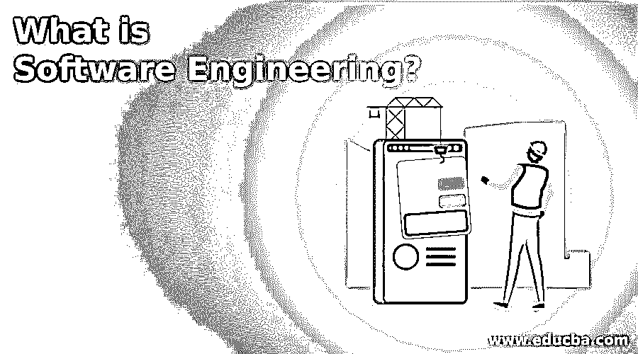

# 什么是软件工程？

> 原文：<https://www.educba.com/what-is-software-engineering/>

## 软件工程导论

与软件研究及其工作、部署和架构相关的工程流被称为软件工程。它有助于创建新软件，并将旧软件更新到系统中的新版本。该软件有助于开发技术，并与所有网络中的人保持良好的沟通。该软件有助于开发我们需要的应用程序。这些应用程序为我们提供了我们正在寻找的所有商品的评论，并帮助我们在自己家中舒适地选择所需的商品。

### 什么是软件工程？

*   我们将学习软件开发、应用程序更新、构建以及软件测试和编码的工程分支之一叫做软件工程。该分支解释了如何从头开始构建软件，以及如何针对各种需求部署软件。这些要求包括预订出租车、购买食品杂货、识别天气变化，以及在疫情期间追踪人们的联系人。软件工程需要设计、构建、结构化和测试。
*   软件工程直到 20 世纪 60 年代才出现。由于传统的更新，许多程序都失败了，人们发现很难依赖软件，因为它需要更多的时间和资源。这推动了对软件的详细研究和对系统的升级，从而保证软件的维护和安全性。
*   到了 20 世纪 80 年代，由于同领域工作人员提供的升级和维护，软件世界的问题得到了解决。更新和系统使人们信任软件世界，因为他们可以依赖系统，他们使用软件升级。
*   随着软件的增长，许多优势，如手机、笔记本电脑、云服务和许多应用程序进入画面，使我们的生活比以往任何时候都更容易。现代世界基本上是由不断发展的软件形成的，而软件的快速发展确保了我们可以通过正确有效地使用应用程序达到任何高度。
*   软件应得到适当维护，并针对软件所有者发布的所有更新进行更新。更新证明系统工作正常，例如，旧版本的支持将被删除。这使得软件在没有支持的情况下也能工作，因此恶意软件的攻击会破坏整个系统。

### 软件工程是做什么的？

*   计算机、操作系统、任何种类的游戏、应用程序、网络控制系统都是在软件工程的帮助下制造出来的。这是软件的大画面，如果我们深入观察细节，我们可以看到软件工程融入了所有的流程。
*   数学和逻辑思维是任何软件和知识的基础，这使得开发者编写代码。由工程师开发的软件程序的数量因各种流中所需的不同应用而异。新领域和专业化技术的变化并没有贬低软件工程这一职业，而是促使人们发明现代技术，使所有人的生活变得容易。
*   当与客户一起工作时，软件工程师将分析需求并努力满足他们的需求。整个过程包括设计、测试和开发。任何应用程序在开发之后都需要进行用户测试。此外，质量测试和生产前测试可用于确保软件在所有环境和所有用户中运行良好。
*   应用工程师和系统工程师是软件工程师，他们研究系统的不同活动并执行过程。此外，前端和后端工程师会到场检查用户界面和后端测试的应用程序。应用程序是由应用程序工程师根据用户需求开发的。这些应用程序要么面向企业，要么面向任何组织机构。此外，个人开发应用程序，并在一个团体中为一个共同的目的使用它。
*   在一个组织中，任何应用程序的创建、维护和发展都由系统工程师来处理。技术专长是系统工程师和网络工程师的必备条件，他们关注信息的流动和业务的增长。逻辑思维对软件工程师来说很重要，编程可以帮助他们调试和测试代码，从而测试应用程序。DevOps 工程师测试软件和应用程序的工作情况，并每天对其进行监控。

### 软件工程的重要性

*   软件工程已经成为社会的一部分，各行各业都在借助系统中的软件而努力。无论是研发、日常生活、跟踪还是天气预报，软件已经成为人类的一部分。随着新发明的出现，软件工程的重要性与日俱增。
*   复杂的问题迎刃而解，有了逻辑思维，任何问题都能迎刃而解。所有的编码语言都是用逻辑开发的，懂得一种语言的人也能很容易地理解其他语言。此外，软件的维护在业务中很重要，有知识的人应该处理同样的事情。
*   有道德的黑客帮助解密代码，将攻击转移到软件上，从而避免公司丢失重要信息。公众利益应该和客户利益一起考虑。应该遵循软件产品的标准，这有助于用户很好地了解产品。应该遵守诚信和声誉，不应该进行非法黑客活动来破坏公众的安宁。

### 结论

在软件工程的帮助下，机器变得更简单、更小。由于软件，所有人都变得对技术友好，并乐于成为现代世界的一部分。事实上，我们可以说，由于软件工程和技术专长，世界变得现代化了。任何软件工程师都有很大的前途。

<small>网页开发、编程语言、软件测试&其他</small>

### 推荐文章

这是一本关于什么是软件工程的指南？这里我们讨论软件工程做什么以及它各自的重要性。您也可以看看以下文章，了解更多信息–

1.  [软件工程中的凝聚力](https://www.educba.com/cohesion-in-software-engineering/)
2.  [软件设计原理](https://www.educba.com/software-design-principles/)
3.  [软件质量保证](https://www.educba.com/software-quality-assurance/)
4.  [软件测试原则](https://www.educba.com/software-testing-principles/)

