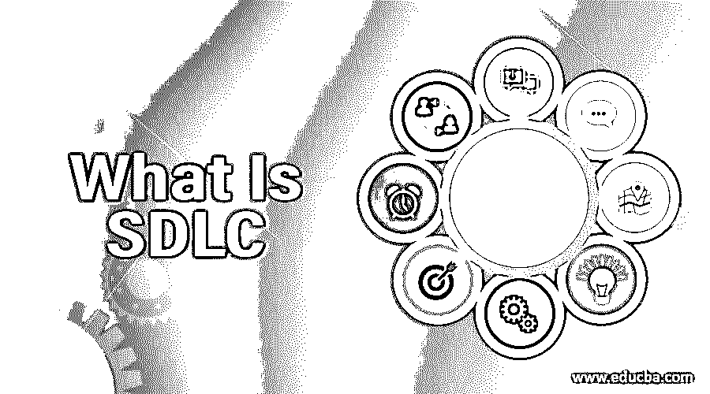
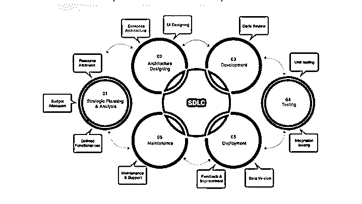
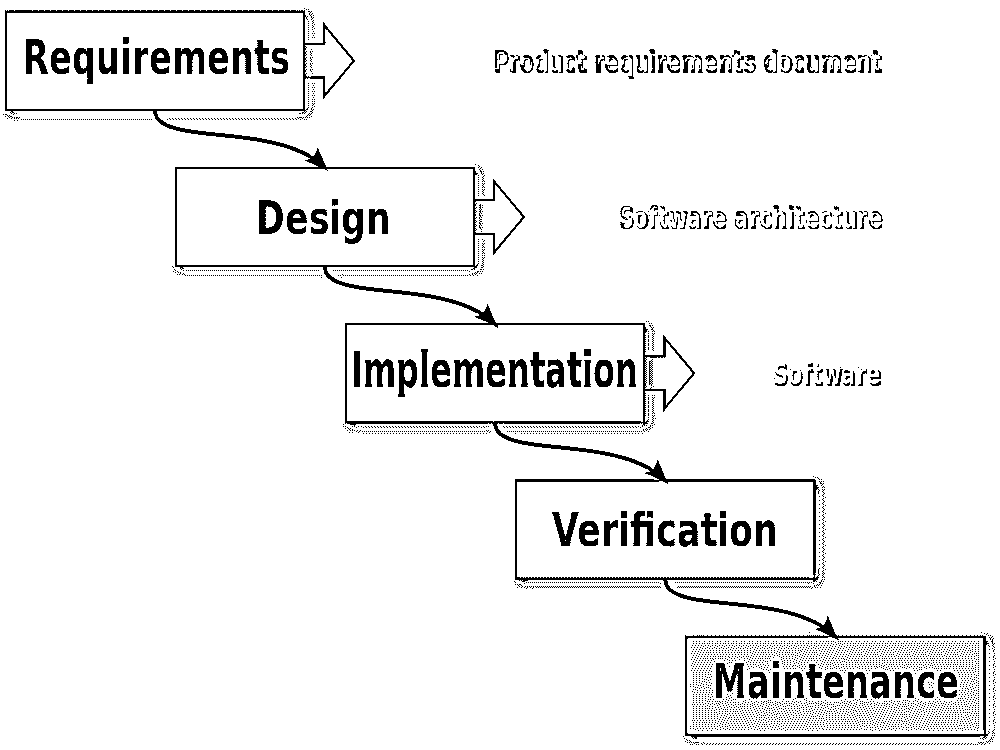
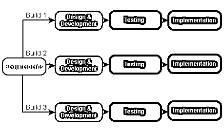
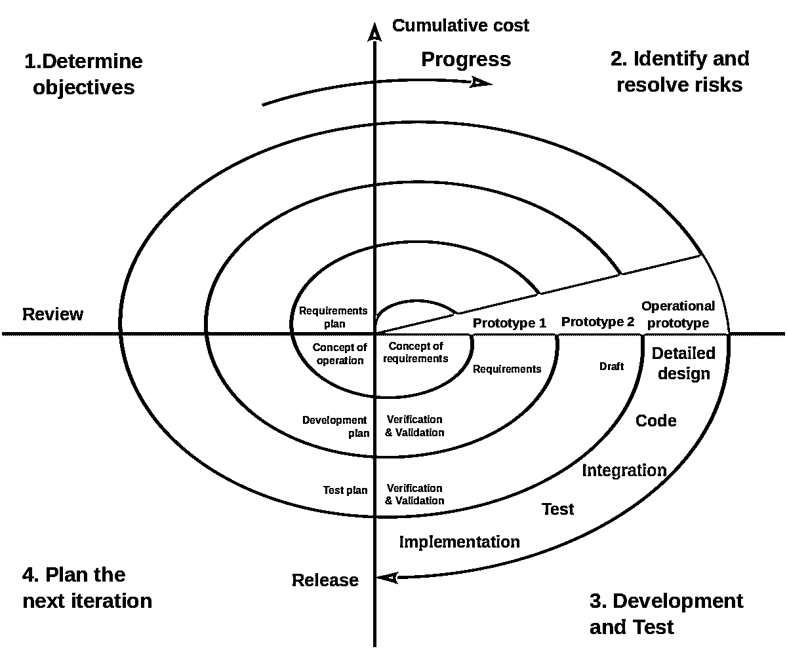
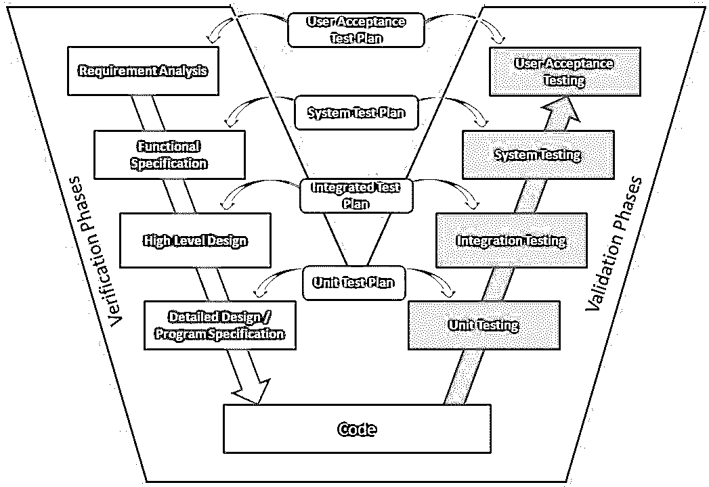

# 什么是 SDLC

> 原文：<https://www.educba.com/what-is-sdlc/>

## SDLC 简介

规划、创建、测试和部署软件的过程被称为软件开发生命周期或 SDLC。在软件开发过程的每一步中要执行的不同任务在 SDLC 中都有很好的解释。SDLC 的不同阶段是规划、需求、设计、开发、测试、部署和维护。各种 SDLC 模型是瀑布模型、螺旋模型、V 形模型、迭代模型、[大爆炸模型](https://www.educba.com/big-bang-model/)和敏捷模型。软件开发的每个部分都很容易评估，并帮助程序员使用 SDLC 阶段同时工作。这是一个需要遵循的过程，而不是一种技术。

<small>网页开发、编程语言、软件测试&其他</small>

### SDLC 中的阶段类型

软件生命周期有几个阶段，如下所示:

*   需求阶段
*   分析阶段
*   设计阶段
*   发展阶段
*   测试阶段
*   部署和维护阶段

    

#### 1.需求阶段

这是软件开发生命周期中的第一步，也是最基本的一步。它从收集顾客或客户的需求开始。在大多数组织中，这个角色由业务分析师来承担。业务分析师与顾客/客户互动，安排每日会议，在业务需求规范(或简单的业务规范)中记录需求，并将最终记录的需求移交给开发团队。业务分析师的责任是捕捉和记录每个细节，并确保每个人都清楚地理解客户的需求。

#### 2.分析阶段

一旦需求收集阶段完成，下一个任务就是分析需求并获得客户的批准。这是通过软件需求规范(SRS)来实现的，SRS 包括在需求收集阶段收集和开发的所有需求。这个阶段主要由项目经理、业务分析师和顾问来完成。

#### 3.设计阶段

一旦分析阶段结束，接下来就需要提出需要开发的产品的最准确、最健壮、最高效和最具成本效益的架构。通常，在此阶段会提出多个设计，并根据不同的参数(如健壮性、耐用性、时间表、成本效益等)选择最佳设计！不同的设计架构通常记录在设计文档规范或 DDS 中。

这个阶段包括两种设计方法:

*   **低层次设计:**该任务由高级开发人员执行，他们指定要开发的产品架构的每个模块的功能。
*   **概要设计:**该任务由架构师/高级架构师执行，他们设计将要开发的产品的不同的可能架构。

#### 4.发展阶段

在这个阶段，编程语言和不同框架的实际实现被用于产品的开发。在这个阶段，所有开发人员都参与其中。开发人员被期望遵循某些预定义的编码标准和指导方针；他们需要在项目的规定期限内完成项目模块。这个阶段也是软件开发生命周期中最长也是最关键的阶段之一。这个阶段被记录为源代码文档(SCD)。

#### 5.测试阶段

一旦开发阶段完成，下一步就是测试开发的软件。开发的软件被发送到测试团队，在那里他们对软件进行不同类型的彻底测试并寻找缺陷。如果发现任何缺陷，测试团队记录并记录文档，然后再次发送回开发团队以消除错误。这个角色由公司的软件测试人员和质量分析师负责。测试团队必须确保软件的每个组件都没有错误，并且按照预期工作。

#### 6.部署和维护阶段

测试阶段结束后，软件的第一个版本被部署并交付给客户使用。一旦客户开始使用开发的软件，就有了在测试阶段没有检测到的缺陷修复范围，就像一大群最终用户开始使用软件一样；可能有一些概率，少数边界情况可能已经错过。还可以用更新的版本和最新的安全补丁和技术来升级软件。最后，还可以通过在现有软件中添加更多功能来增强软件。

### 流行的 SDLC 模型

有许多不同的 SDLC 模型是为软件开发过程中的实现而设计的。

最重要和最受欢迎的是:

*   瀑布模型
*   迭代模型
*   螺旋模型
*   v 型车

#### 1.瀑布模型

在瀑布模型中，软件开发的整个过程被分成几个阶段，其中一个阶段的输出作为下一个阶段的输入。只有在前一阶段完成后，下一阶段才开始。

#### 2.迭代模型

这个模型从一个较小的需求集开始，它不需要完整的产品规范上下文来启动 SDLC 过程。这个过程是重复的，在 SDLC 过程的每一次迭代中，都会产生软件的更新版本。每次迭代可能在 2-6 周之间。在这种方法中，每次迭代开发一个单独的组件。这个模型还需要一个比瀑布模型更好的模式资源。

#### 3.螺旋模型

这个模型是瀑布模型和螺旋模型的结合，它以迭代的方式工作。基于项目涉及的风险，该模型指导团队采用一个或多个 SDLC 模型的元素，如瀑布或[迭代模型](https://www.educba.com/iterative-model/)。在这里，软件的生命周期被分成更小的部分，新的功能甚至可以在 SDLC 的后期添加到软件中。

#### 4.v 型车

v 模型基本上是瀑布模型的扩展，其中测试和开发阶段是并行计划的。一面由验证阶段组成，另一面由验证阶段组成，最后由编码加入。只有在前一个状态完成时，下一个状态才会开始。

### 推荐文章

这是关于什么是 SDLC 的指南。这里，我们分别用流行的 SDLC 模型讨论了各种类型的 SDLC。您也可以阅读以下文章，了解更多信息——

1.  [软件开发 vs 网页开发](https://www.educba.com/software-development-vs-web-development/)
2.  [缺陷生命周期](https://www.educba.com/defect-life-cycle/)
3.  [什么是软件开发？](https://www.educba.com/what-is-software-development/)
4.  [SDLC 方法](https://www.educba.com/sdlc-methodologies/)

