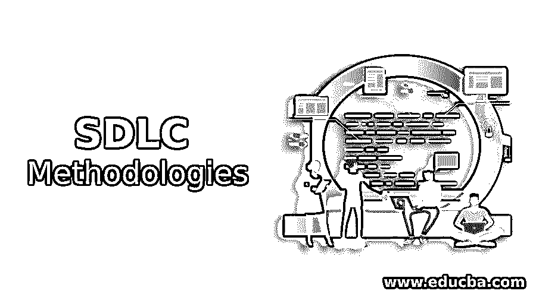
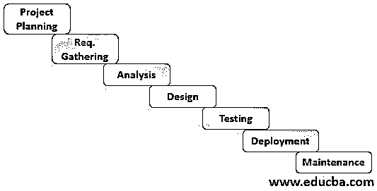
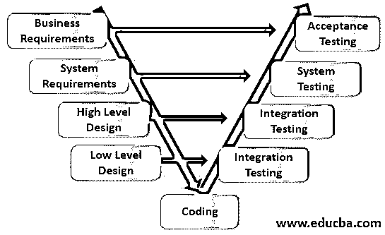
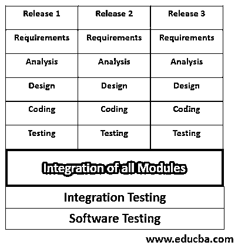

# SDLC 方法

> 原文：<https://www.educba.com/sdlc-methodologies/>

## SDLC 方法简介

SDLC 方法是软件行业遵循的标准程序或方法，用于描述定义、构建、实现和开发应用程序的方式，它遵循[软件开发生命周期(SDLC)流程](https://www.educba.com/what-is-sdlc/)。它也被称为设计软件的蓝图。根据项目的不同，我们选择合适的方法来开发它，它提升了软件的质量和软件开发过程。软件方法是软件工程的一部分，用于开发软件应用程序。它提供了开发应用程序的指南。

### 流行的 SDLC 方法

有几种类型的 SDLC 方法或模型，但这里我们讨论一些流行的 SDLC 方法，例如:

<small>网页开发、编程语言、软件测试&其他</small>

#### 1.鱼类模型

这是一个耗时且昂贵的 SDLC 模型。在这里，验证和确认由不同的团队并行完成。

它看起来像鱼，因此模型名称显示鱼模型。在此模型中，我们首先进入项目启动节点(PIN ),即签署服务水平协议以启动项目。然后从客户那里收集需求，并对其进行分析，以准备 SRS(软件需求规格)。在每一步中，我们都会对流程进行审核，即验证。之后，我们进行编码、模块集成、验收、发布和开发维护。在这个过程中，我们进行每个级别的测试，即验证。

**优点:**

*   它提供了高质量的软件产品。
*   它主要用于安全项目。

**缺点:**

*   开发产品是一个耗时的过程。
*   加工成本很高。

#### 2.瀑布模型

这是一个严格的模型，需求是固定的。因此它被称为序贯模型。在这里，在一个阶段完成之前，我们不能进行下一个阶段。

在这个模型中，在编码之后，测试的计划、准备和执行是可能的。因此，这是严格的，有一个测试的瓶颈活动。(测试时间更少)。

**优点:**

*   它是一个简单的直板模型。
*   很容易实现。

**缺点:**

*   项目开始时需要 100%的需求，以后不需要改变。
*   测试可能会成为瓶颈活动。
*   后期验证。

#### 3.v 型

它也被称为重叠模型。在这个模型中，我们测试准备和计划的每个阶段都是同时进行的，在编码之后，我们就开始执行。

**优点:**

*   它生产高质量的产品。
*   测试过程很早就开始了。

**缺点:**

*   项目开始时需要 100%的需求，以后不需要改变。
*   这是一个耗时且昂贵的过程。
*   后期验证。

#### 4.RAD 模型

它代表[快速应用开发](https://www.educba.com/rad-model/)。在瀑布和 V-model 中，需要一个周期的 SDLC 来完成整个项目，但是在这个模型中，需要多个周期的 SDLC 来完成整个项目。在这里，项目被分解为多个版本，对于每个版本，都有一个 SDLC 周期。所以也叫迭代模型。在每个版本中，需求的数量应该是相同的。在所有版本完成后，集成它并进行集成测试。一个模块或版本是完整的，然后向客户展示，放在一边，即没有版本。它克服了瀑布& V 型的所有问题。

**优点:**

*   在项目开始时，我们不需要 100%的需求。
*   测试不是瓶颈活动。
*   没有客户的后期验证。

**缺点:**

*   这是一个复杂的模型。
*   投资回报较晚，即客户无法使用该软件，即使在完成之前。

#### 5.增量模型

也被称为[螺旋模型](https://www.educba.com/what-is-spiral-model/)。在这种方法中，项目被分解成不同的版本，在每个版本结束时，我们向客户展示，让客户批准并发布软件产品的基本版本。在这种模型中，随着发布版本的增加，测试过程会变得复杂并耗费大量时间。所以它本质上是递增的。

| 要求 | 要求 | 要求 | 要求 |
| 分析 | 分析 | 分析 | 分析 |
| 设计 | 设计 | 设计 | 设计 |
| 编码 | 编码 | 编码 | 编码 |
| 测试 | 测试 | 测试 | 测试 |
| 发布版本 1.1 |
|  | 发布版本 1.2 |
|  |  | 发布版本 1.3 |
|  |  |  | Release  Version

One point four

 |

**优点:**

*   早期投资回报(ROI)。
*   客户端可以开始使用软件的基本版本。

**缺点:**

*   这是一个复杂的模型。
*   耗时的测试过程。
*   退化的风险更大(副作用)

#### 6.敏捷模型

如今，这种模型是软件组织开发应用程序的首选。它是迭代和增量模型的结合。每个版本都被分成不同的小部分，称为 sprint，每个 sprint 都有一个 SDLC 周期。在每个 sprint 中，需求的数量应该是不同的，在最后一个 sprint 中，我们集成了整个 sprint 并进行集成测试。每个冲刺都有完成的时间限制(2-4 周)。它也被称为自适应模型。

**优点:**

*   它可以频繁交付并满足客户或顾客。
*   持续关注可持续发展。
*   客户可以在开发的任何阶段更改或添加需求。
*   它处理自组织团队一起工作。
*   它有助于客户协作和应对变化。

**缺点:**

*   这是一种昂贵的型号。
*   对于一个小项目来说，没啥用。

### 结论

在本文中，我们简要讨论一些流行的 SDLC 方法。类似地，还有其他 SDLC 方法，如精益模型、DevOps 模型、[大爆炸模型](https://www.educba.com/big-bang-model/)等。选择合适的 SDLC 方法来开发软件应用程序是非常重要的。最流行的 SDLC 方法是[敏捷模型](https://www.educba.com/agile-model/)。

### 推荐文章

这是 SDLC 方法的指南。在这里，我们讨论对 SDLC 方法的介绍，如 Fish 模型、RAD 模型、瀑布模型等。有优点也有缺点。您也可以浏览我们推荐的其他文章，了解更多信息——

1.  [SDLC vs STLC](https://www.educba.com/sdlc-vs-stlc/)
2.  什么是敏捷测试？
3.  [SDLC 与敏捷](https://www.educba.com/sdlc-vs-agile/)
4.  [SDLC 面试问题](https://www.educba.com/sdlc-interview-questions/)

