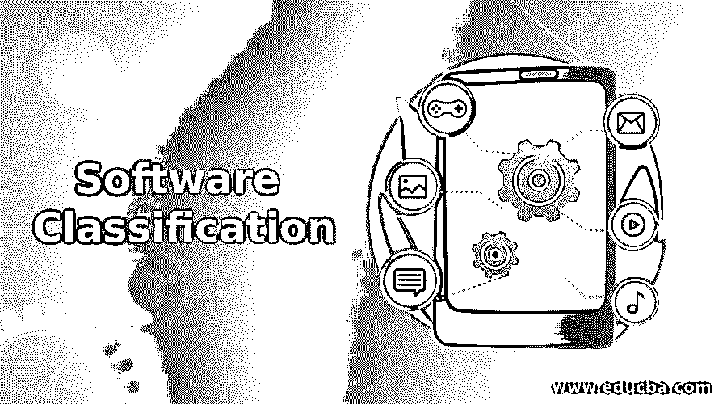

# 软件分类

> 原文：<https://www.educba.com/software-classification/>

## 软件分类介绍

软件是告诉计算机或硬件如何操作的代码或指令集。软件通常是通用的，但也可以是定制的。通用软件对市场开放，其规格由程序员设计。主要是为广阔的客户市场设计的。定制软件是其规格是根据特定公司或组织设计的软件。它不是对所有人开放的。主要是为特定的商业目的而设计的。软件主要分为七类——系统软件、应用软件、工程/科学软件、嵌入式软件、产品线软件、网络应用和人工智能软件。

### 软件分类

在这一节中，我们将详细讨论软件的各种分类。

<small>网页开发、编程语言、软件测试&其他</small>

#### 1.系统软件

它直接与计算机硬件交互。它主要涉及计算机系统的有效管理。它被用来开发新的系统程序，使用自举，我们可以使它们可移植。它依赖于机器。系统软件进一步分为三类——操作系统，作为用户和硬件之间的接口，为用户提供不同的服务。第二个是系统支持软件，它可以更有效地管理硬件。另一类是系统开发软件，为用户提供编程开发环境。

#### 2.应用软件

它旨在根据用户的要求解决用户的问题。应用软件可以是通用的，也可以是定制的。应用软件进一步分为两类——一类是通用软件，用于许多任务并提供许多功能。另一种是专用软件，它只为特定的目的而设计。例如，用户的程序。重点是应用程序，而不是计算机系统。它主要是用计算机作为工具来解决一些问题。

#### 3.工程/科学软件

它处理特定应用中的处理要求。该软件专门用于绘图、建模、绘图、载荷计算和工程分析，以及用于解释和决策的统计数据。比如 CAD(计算机辅助设计)、CAM(计算机辅助制造)、CAE(计算机辅助工程)。这些软件用于机械、电气、制图、工程和分析领域。它们运行在大型机、通用工作站和个人电脑上。

#### 4.嵌入式软件

该软件作为更大系统的一部分嵌入到硬件中，以控制其各种功能。这种类型的软件嵌入在系统的 ROM(只读存储器)中。例如，嵌入在微波炉或洗衣机中的键盘控制软件，其中需要对输入进行分析、决定并采取行动，以使产品以期望的方式运行。由于其性能，这些软件也被称为智能软件。

#### 5.产品线软件

这种类型的软件是指软件工程方法、工具和技术，用于使用通用的生产手段，从一组共享的软件资产中创建一组相似的软件系统。它是一套软件产品，具有共同的特征，但在某些方面又各不相同。例如，它们可能是为特定客户开发的，也可能是为嵌入式软件(Word 文档、电子表格、计算机图形、个人和商业应用程序)开发的

#### 6.网络应用

它是一种通过网络(如互联网或内联网)上的 web 浏览器访问的应用程序。它也是以浏览器支持语言编码的计算机软件应用程序，并且在普通网络浏览器上是可靠的，以使应用程序可执行。第一代 web 应用程序允许企业公开发布信息。因此，任何拥有网络浏览器和互联网接入的人都可以看到这些信息。第一代的问题是信息是静态的。第二代 web 应用程序允许用户通过 web 应用程序对数据库进行交互式查询。它的特点是在万维网上促进交流、信息共享、以用户为中心和协作。第三代比第二代应用更有用。结合第二代应用程序的查询和第一代应用程序的静态信息，第三代是组织在电子商务工作中的一个强大的业务工具。

#### 7.人工智能软件

该软件使用非数值算法，这些算法使用系统中生成的数据来解决复杂的问题，这些问题不适于问题解决程序，并且需要对问题进行特定的分析和解释才能解决。例如，人工神经网络、机器人、专家系统和计算机游戏。所有这些软件都可以在实时模式或离线模式下运行。这些软件程序可以免费共享，存储收费。

### 推荐文章

这是软件分类指南。在这里，我们还讨论了软件的介绍和各种分类以及详细的解释。您也可以看看以下文章，了解更多信息–

1.  [软件开发模型](https://www.educba.com/software-development-models/)
2.  [数据库管理软件](https://www.educba.com/database-management-software/)
3.  [软件审查](https://www.educba.com/software-review/)
4.  [软件维护类型](https://www.educba.com/software-maintenance-types/)

