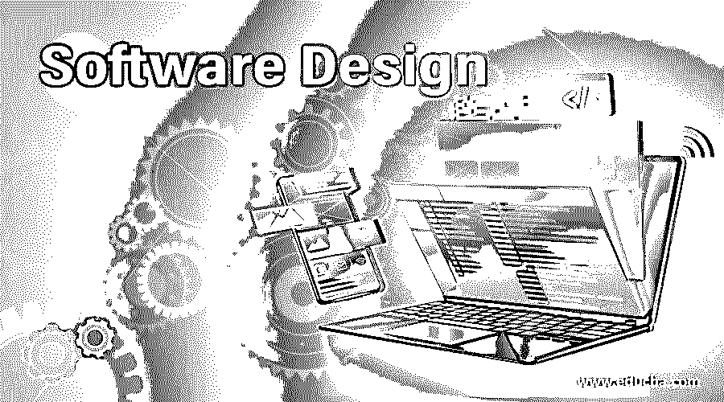

# 软件设计

> 原文：<https://www.educba.com/software-design/>

## 软件设计导论

在 [SDLC(软件设计生命周期)](https://www.educba.com/what-is-sdlc/)中，软件设计是一个必不可少的过程，也是软件开发的基本步骤之一。软件设计可以定义为设计模块并将用户的需求转化为合适的可执行形式的应用程序的过程。软件设计帮助编码员和程序员实现软件代码的应用和开发的原型，并在用户级别实现它们。软件设计允许注意力从问题转移到解决方案。软件设计是代理采取的行动过程，目的是创建步骤的规范工件，旨在实现某个目标，满足 SRS 中提到的使用旧组件的用户需求。通常给人的印象是一个问题解决者和策划者。

### 软件设计的目标

为了评估用户需求，我们以 SRS(软件需求规范)的名称记录它们，并进一步使用它来促进编码和实现。既然已经很好地记录了用户需求，我们就继续进行具体而详细的规划。下一步是软件设计，它促进待开发软件的直接实现和编码。

<small>网页开发、编程语言、软件测试&其他</small>

软件设计的目标列举如下:

*   根据使用类型跟踪各种类型的软件。
*   描述编码和设计之间的细微差别。
*   定义结构化编程的概念，找出漏洞并通过寻找解决方案来克服它们。
*   演示基本设计和进一步改进的计划。
*   显示可靠性、性能和维护。
*   在开始时检查测试模块。
*   开始设计和注释的手续。
*   能够清晰地想象未来的应用程序及其特性、功能、数据和工作流。
*   能够证实所开发的软件和所做的设计。
*   设计过程应该能够提供稳定性，传递价值，从而增加承诺满足用户特定要求的组织的可信度。

### 软件设计的功能

我们现在知道，软件设计是所有神奇应用的起点。一个人有想法和目标，这些想法和目标需要以应用程序开发的形式来实现。因此，在开始构建之前，需要在纸面上准备好基本架构以供实施。一个人应该能够把头脑中的想法编织到纸上。我们倾向于对创建软件和开始编码感到兴奋。因此，该架构将提供一个平稳的开发过程。

*   软件设计的第一步是反思构建软件设计的创造性过程。
*   需要端到端地收集一系列想法，并在前端保留目标。
*   然后进行信息处理。下一步是提出需求的解决方案，然后发送反馈。
*   下一步是完善设计。

这些步骤作为一个循环反复进行，它们可能会出现一次或多次，除非我们最终得到合适的设计。虽然软件设计是一个非常有创造性的过程，但是这个周期在不同的设计师和公司之间是不同的，类似于用户需求的变化，然而我们可能会惊讶地发现在设计过程中有一些相似之处。

### 软件设计的思路

现在我们将讨论软件设计过程的几个常见趋势，如下所示:

*   能够了解业务类型和软件环境。
*   描述对开发应用程序的驱动力的理解。
*   关注一系列固定的目标和可视化的最终结果。
*   能够创建一个清单，以及所需应用的可行性及其成本。
*   说明软件在给定预算内的使用和需求及其局限性。
*   体验用户的观点以及技术体验和组织偏好的兼容性。
*   未来的发展方法是根据公司的声誉和合作来改善范围，并以商业为利润。
*   使用白板和实时聊天等解决方案来满足用户的需求和要求。
*   提出解决方案并使用可视化工具进行说明。
*   能够收到关于解决方案的反馈。
*   展示与其他公司在提议的模型上的合作，并处理利润。
*   能够最终确定需求的解决方案。
*   完成交易并获得实施批准。
*   最后一个阶段是文档阶段，在这一阶段，人们想要开始软件的编码。
*   编码开始了，最后软件构建被设计团队显示为绿色信号。

从上面的步骤，我们可以清楚地看到，软件设计是一个创造性的过程，但它是最困难的任务之一，因为它将决定最终软件的未来。这是一个协作过程，因此每一步都需要大量的改进和反馈。

### 软件设计的优点和缺点

以下是软件设计的一些优点和缺点:

#### 优势

*   资源和业务流程的最佳利用。
*   新颖的模型和发明新设计的可能性。
*   它有助于关注和强调利润和业务。
*   解决方案的可靠性和可信度。
*   软件的独特性和适应性是有保证的。
*   兼容性和精英排他性是主要优势之一。

#### 不足之处

*   从设计本身预测结果的机会更少。
*   它需要太多的时间和承诺。
*   它还要求开发者和客户在设计的每一步进行实时讨论。
*   由于缺少文档，项目很容易偏离轨道。

### 结论

在 SDLC 中，软件设计是一个繁琐而复杂的步骤，在我们开始实际开发软件之前，它看起来似乎很简单。需求中应该有清晰的思路，想法应该被很好地记录，以便在性能和清晰性上保持一致。要开始发展并走上正轨，还必须创建清单。这导致了奇妙的设计。

### 推荐文章

这是软件设计指南。在这里，我们讨论了软件设计的目标和各种思路，以及它的工作原理、优点和缺点。您也可以看看以下文章，了解更多信息–

1.  [免费网页设计软件](https://www.educba.com/free-web-page-designing-software/)
2.  [UML 图软件](https://www.educba.com/uml-diagram-softwares/)
3.  什么是 SDET？
4.  [SDLC 方法](https://www.educba.com/sdlc-methodologies/)

