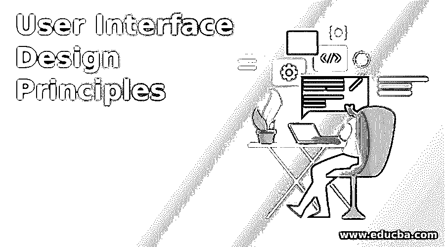

# 用户界面设计原则

> 原文：<https://www.educba.com/user-interface-design-principles/>

## 用户界面设计原则介绍

用户界面(UI)设计原则是设计软件应用的前端视图的方法/过程，客户或用户可以容易地与该前端视图交互/使用该软件应用，而没有任何危险。如果给定软件应用程序的 UI 视图有吸引力、易于使用、简单、可理解、响应迅速，那么该软件应用程序将是最有用的。简单地说，UI 设计原则为软件产品用户界面/视图提供了对外观和风格的关注，即它是一种提供最大可用性和最佳用户体验的进化方法。

### 不同的用户界面设计原则

随着软件应用的普及，软件产品的用户界面设计成为开发软件应用的基础，因此用户界面设计原则有助于提高软件应用的用户界面质量。这些原则主要涉及软件应用程序的图形用户界面(GUI)或命令行界面。用户界面应该清晰、有意义、易懂。UI 设计原则有多种。

<small>网页开发、编程语言、软件测试&其他</small>

下面给出了用户界面设计原则:

*   结构的概念
*   简单的概念
*   可见度的概念
*   反馈的概念
*   宽容的概念
*   可重用性的概念

让我们详细研究上述原则:

#### 1.结构的概念

这是设计处理整体 UI 架构的软件应用程序用户界面的初始阶段。它提供了软件应用程序的结构化数据，合并了应用程序相关数据，分离了不需要的东西。这个概念使得软件应用程序组织良好(有意义)、创新(技术开发)、可理解(软件应用程序的目的)和有用(满足特定标准)。

#### 2.简单的概念

该过程表明，软件应用程序用户界面的设计应该简单、持久、用户友好、用户可控制用户界面、可持续性、阐明复杂性、准确的吞吐量响应、最大可用性和用户语言。我们希望我们的用户在用户界面上犯错，证明我们的数据是正确的，不要开发繁忙的界面，并解释规则，这些规则是软件应用程序用户界面设计的最佳技巧。这将有助于减少完成用户界面上所有操作的任务数量，并保护软件应用程序中的用户数据。

#### 3.可见度的概念

UI 设计技术的概念包括软件应用程序用户界面的可见性。它主要处理图形用户界面，即对齐是否正确，拼写检查，标志或横幅的位置，一致性，易于导航的状态，用户界面的颜色和亮度，对用户没有犹豫。因此，界面的外观和感觉应该是完美的，清晰的，渐进的披露，透明和错误预防。我们应该重视 UI 的性能问题。

#### 4.反馈的概念

这个原理表明用户界面视图的增强依赖于反馈。它总是欢迎根据用户或客户的评论来改变或修改用户界面。因此，设计者总是分析过程、视图、任何模糊问题、错误、技术进步、条件变化，并使软件产品的用户界面更加用户友好。对用户来说，用户界面上的每一个动作都会返回一个有意义的、清晰的反应或反馈。

#### 5.宽容的概念

这是软件应用程序的用户界面设计的概念之一，它处理或影响应用程序的预算。用户界面设计者将设计出总是灵活和宽容的界面，从而减少用户界面修改的返工成本。对于应用程序的任何阶段，用户界面在某种意义上应该是可容忍的。

#### 6.可重用性的概念

这是用户界面设计的最后一项技术。设计者应该设计用户界面视图在软件应用程序中可重用的方式。一些内部或外部组件、组件的行为、应用程序的一致性应该在 it 内部重用。以便用户不应该在用户界面上记住应用程序的相关处理流程。它为用户提供了一些快捷键，以便于操作。

### 结论

在本文中，我们简要讨论了用户界面设计以及改进 UI 设计过程的相关技术。有多种方法可以改进软件应用程序的用户界面的设计过程。

用户界面设计主要处理图形用户界面(GUI)设计，它涉及到多个特征，如 UI 的图形、图标、窗口、菜单、字体大小、颜色、对齐、行间距等。这里我们选择一些特定的技术来设计软件应用程序的用户界面。

用户界面设计的主要思想是让用户感到舒适，这样用户就可以很容易地与软件产品进行交互。用户界面流程设计的口号是“最好的用户界面设计能吸引更多的顾客”。

### 推荐文章

这是一个用户界面设计原则的指南。在这里，我们讨论介绍和 6 个不同的用户界面设计原则。您也可以看看以下文章，了解更多信息–

1.  [动画原理](https://www.educba.com/principles-of-animation/)
2.  [什么是 UI 设计师？](https://www.educba.com/what-is-ui-designer/)
3.  [鱼模型](https://www.educba.com/fish-model/)
4.  [安卓用户界面](https://www.educba.com/android-user-interface/)

