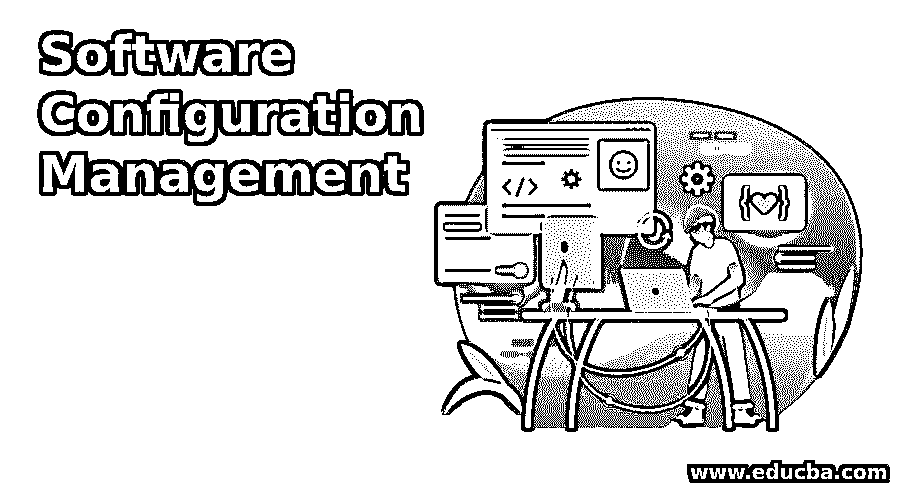

# 软件配置管理

> 原文：<https://www.educba.com/software-configuration-management/>

## 软件配置管理简介

软件配置管理(SCM)是软件工程的一个分支，它提供了一个更好的过程来处理、组织和控制软件项目开发生命周期中需求、代码、团队和其他元素的变化。SCM 主要处理高生产率的软件项目的版本选择、跟踪变更和版本控制，并最小化错误或风险因素。

### 为什么我们需要软件配置管理？

在软件项目开发中，选择它作为软件配置管理工具有以下优点。比如，

<small>网页开发、编程语言、软件测试&其他</small>

1.  跟踪和管理软件开发过程中的变更。
2.  它以最小的错误提高了软件应用程序的生产率。
3.  它在开发过程中提供了一个流畅的工作流程。
4.  易于与团队成员沟通，以开发质量更好的产品。
5.  跟踪团队中每个成员的项目工作流程状态。
6.  它通过考虑不同的版本控制来并行更新每个团队成员的代码。
7.  管理软件产品中不同的工具和开发过程。
8.  它用于管理应用程序内部的软件和硬件。
9.  它习惯于控制和管理缺陷、团队合作和过程。
10.  它根据应用程序的变化处理软件预算。

### 软件配置管理是如何工作的？

软件配置过程是软件开发生命周期过程中使用的工具，用于跟踪、更改和管理产品开发中的配置项(需求、代码、文档、缺陷、资源、预算、软件、硬件等)。项目经理、开发人员、配置经理、产品所有者和测试人员都参与到配置管理过程中。

它有多个过程来完成软件配置管理。比如:

*   规划和识别过程
*   版本控制过程或基线
*   变更控制过程
*   配置发布流程
*   配置审核流程
*   审查和状态报告流程

#### 1.规划和识别过程

这是 SCM 过程的初始阶段，为应用程序的开发制定适当的计划，并根据项目的范围确定配置项目。召开启动会议或开始会议并欢迎变更请求是该流程的基本标准。项目管理计划是该过程的输入，计划的批准是退出标准。

#### 2.版本控制过程或基线

版本控制或基线指示通过改变范围或需求或代码或软件环境来存储开发/配置的不同版本。这个过程提供了该软件产品的几个版本。

#### 3.变更控制过程

在这个过程中，客户创建的新变更请求改变软件产品上的一些配置，即当团队收到请求时，添加或删除或编辑配置项。根据变更请求的批准，应用程序将开发，请求将在状态下关闭。

#### 4.配置发布流程

此流程用于确保应用程序将按照项目计划进行开发，并按照范围测试/验证应用程序。软件相关文档和软件发行说明是提供软件应用程序工作版本的输入。

#### 5.配置审核流程

在此过程中，验证开发的软件产品是否符合基线。在这里，我们进行软件应用程序的功能需求审计和物理审计。

#### 6.审查和状态报告流程

它是对应用工作流、过程、配置项和变更请求等的技术审查，以生成软件开发生命周期过程中每个阶段的状态报告。在此过程中，我们会对应用程序进行多次审查，以开发一些与应用程序相关的文档，如用户手册、安装过程指南、注意事项、发布说明等。

### 供应链管理的优势和劣势

下面是优点和缺点

#### 优势

下面是提到的优点:

*   提高软件的生产效率，因为它控制和跟踪工作流或开发过程。
*   它欢迎变更管理，因此产品的风险会更小。
*   它用于对软件开发产品进行适当的监控和审计。
*   它将有助于增强软件开发生命周期过程。
*   这个过程提供了一个可靠的、有组织的、有成本效益的和低风险的软件开发应用程序。
*   它提供了高质量的软件产品。

#### 不足之处

以下是缺点:

*   它需要足够的资源和对软件配置管理工具的全面了解。
*   它需要更多的资源来配合小型行业的配置管理流程。
*   开发阶段需要高度配置的台式机/笔记本电脑。

### 结论

在本文中，我们简要讨论了软件配置管理过程，它有助于在软件开发生命周期中跟踪、管理和控制配置项的变更。自组织的团队(产品所有者、项目经理、开发人员、测试人员)正在参与 SCM 中的变更请求批准。有多种开源或授权软件配置管理工具，如 GIT、SVN (Subversion)、SaltStack、IBM 配置工具等。但 IT 行业大多使用开源软件配置管理工具 GIT 作为版本控制。

### 推荐文章

这是软件配置管理指南。这里我们讨论软件配置管理的介绍，为什么我们需要它，它是如何工作的。您也可以浏览我们的其他相关文章，了解更多信息——

1.  [软件质量保证](https://www.educba.com/software-quality-assurance/)
2.  [动态主机配置协议](https://www.educba.com/dynamic-host-configuration-protocol/)
3.  [软件配置管理工具](https://www.educba.com/software-configuration-management-tools/)
4.  [项目管理工具软件](https://www.educba.com/project-management-tools-software/)

