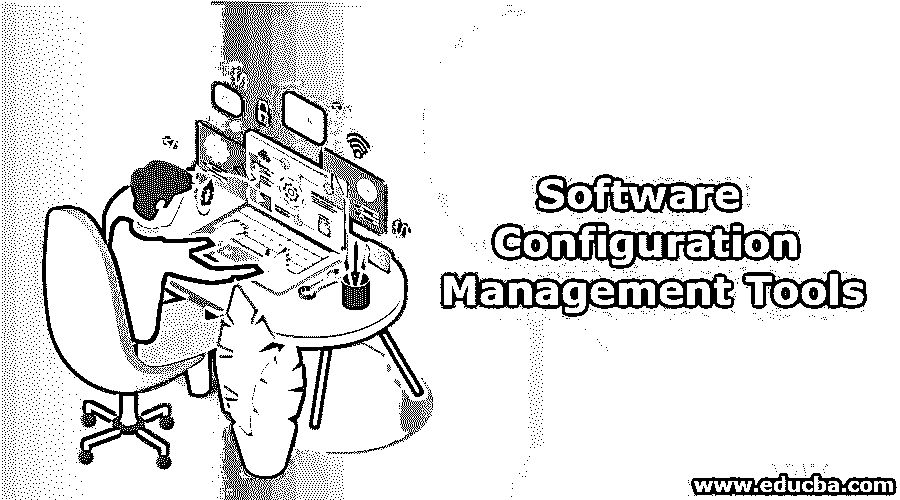
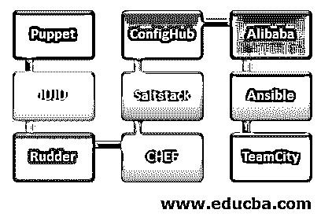

# 软件配置管理工具

> 原文：<https://www.educba.com/software-configuration-management-tools/>

## 软件配置管理工具简介

术语“配置管理”在 IT 行业中经常出现。一些公司希望 IT 服务能够以最高的效率不间断地提供。管理员需要结构化的服务器设计和管理方法来满足这些需求。理想情况下，配置管理工具将支持多种操作系统。这就是供应商开发配置管理工具来帮助服务器控制网络和锁定系统到最佳配置的原因。我们将看到软件配置管理工具，如下所示:

### 软件配置管理工具

以下是软件配置管理工具的示例:

<small>网页开发、编程语言、软件测试&其他</small>

#### 1.傀儡配置工具

puppet 是一个用于配置管理集中化和自动化的工具，它是一个开源的配置管理。它用于处理、部署和配置各种应用程序和服务。

**木偶配置工具的特点:**

*   它允许您完整地管理软件交付过程。
*   通过基于模型的自动化管理，您可以快速调整或解决紧急问题。
*   它帮助您使用首选的版本控制系统将基础设施作为代码来处理。
*   了解当前情况后，将仔细检查和实施每种配置，将结果与预期进行比较，并对所有资源采取适当的措施。

#### 2.JUJU 配置工具

Juju 是一个开源平台，强调消除新一代软件运行开销。Juju 提供诸如设置、集成、快速交付、缩放等功能。

**JUJU 配置工具的特点:**

*   它将提供提供信息的能力。
*   它帮助您用 charm 解决服务扩展的大部分复杂性。
*   通过使用该工具，您可以实现多个 Paas 平台。
*   该工具将允许您立即进行扩展和集成。

#### 3.方向舵

rudder 是一个持续设置的开源解决方案。该方法用于满足生产基础设施要求。这种多平台框架允许简化和管理开发过程。

**方向舵配置工具的特点:**

*   您可以使用 web 界面功能来控制节点和定义环境策略。
*   这允许您执行简单的管理任务，如配置或安装。
*   通过使用它，您可以动态地生成主机策略。
*   它会自动盘点硬件和软件。

#### 4.CHEF 配置工具

chef 是一个自动化框架，提供了一种基础设施配置和管理的方式。在这种方法中，基础设施作为代码意味着代码是执行的，而不是手动执行的。Ruby 和 DSL 是厨师用来设置的工具。

**Chef 配置工具的特点:**

*   主厨提供自动化专业知识，以降低您的风险并提高所有开发阶段的合规性。
*   配置各种基于 SaaS 云的服务，并整合来自第三方的 API 和应用进行云配置。
*   这有助于提高系统的可靠性，并创建更多完美的应用程序。
*   该经理正在采用推送模式，并提供了云的轻松采用。

#### 5.盐堆配置工具

另一种强大的配置形式是 SaltStack。它基于主客户配置模型或单中心模型。编程语言是基于 Python 的。SaltStack 中提供了 Push 和 SSH 方法来与客户进行通信。

**salt stack 配置工具的特性:**

*   Salt Cloud 兼容不同的云提供商，包括 Google Cloud、Amazon 的 web 服务以及其他服务。
*   您可以在安装过程中运行它，因为它是一个示例，非常容易使用。
*   提供盐内省会让你很容易看到盐里面发生的事情。

#### 6.配置中心

ConfigHub 帮助团队控制、保护和定制整个堆栈。对于给定的应用程序或分布式系统，这些工具允许您保存、管理和分发程序配置。

**config hub 的特性:**

*   这将消除错误和重复配置。
*   从一个地方，它将有助于配置所有控制
*   对于系统拓扑结构，它还具有动态建模功能。

#### 4.阿里巴巴配置工具

您应该集中程序配置管理。该平台加强了 DevOps、大数据和微服务的应用能力。

**阿里巴巴配置工具的特点:**

*   它将提供多级缓存，并保证 99.99%的服务器可用性。
*   这支持版本管理。
*   对于您的环境，它将提供实时配置

#### 5.Ansible 配置工具

适当的平台提供了简单的 IT 解决方案。它帮助您避免重复的任务，并激活开发团队进行战略性工作。

**ansi ble 配置工具的特点:**

*   在 inventor 中的任何主机或主机群上执行简单任务。
*   你可以处理安斯比尔塔的整个基础设施。
*   使用自动提醒来提醒您的自动化状态。

#### 6.团队城市配置工具

TeamCity 是一个持续喷射大脑开源应用平台。TeamCity 提供了多达 100 种配置，并运营着一个无限的建筑。

**team city 配置工具的特点:**

*   它帮助您维护一个健康和安全的 CI 服务器，即使没有构建工作。
*   提高每个项目的代码标准。

### 结论

总之，根据需求研究和选择最适合你公司的工具是非常重要的，因为有许多配置管理软件。我希望这篇文章对你有所帮助。

### 推荐文章

这是软件配置管理工具指南。在这里，我们讨论软件配置管理工具及其不同特性的介绍。您也可以浏览我们推荐的其他文章，了解更多信息——

1.  [软件配置管理](https://www.educba.com/software-configuration-management/)
2.  [软件质量保证](https://www.educba.com/software-quality-assurance/)
3.  [软件工程面试问题](https://www.educba.com/software-engineering-interview-questions/)
4.  [软件工程中的凝聚力](https://www.educba.com/cohesion-in-software-engineering/)

