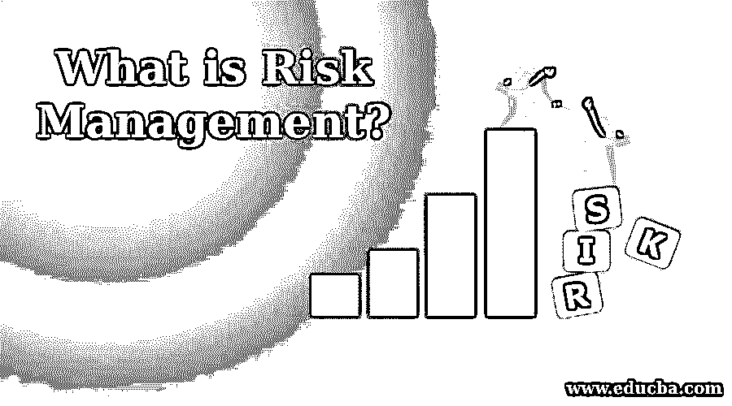
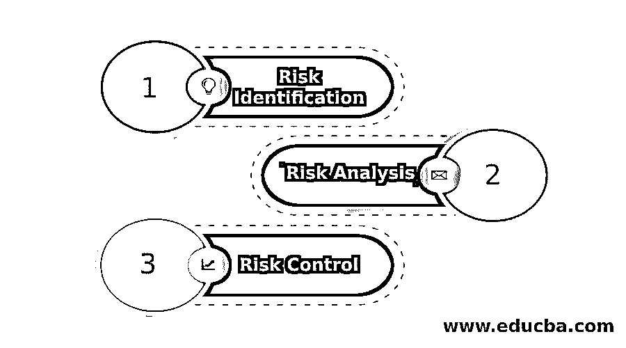

# 什么是风险管理？

> 原文：<https://www.educba.com/what-is-risk-management/>

## 风险管理简介

在软件开发过程中，有许多因素需要记住。每个行业都有一定的风险，软件行业也是如此。意识到风险是不够的。项目经理还必须准备好应对某些紧急情况。这就是风险管理的由来。风险是指可能发生并导致损失或威胁项目进度的事情。为了避免这种损失，我们创建了一个“风险管理”计划。

### 什么是风险管理？

风险管理是在软件开发期间和之前识别、分析和控制风险的过程。让我们彻底理解这些术语:

<small>网页开发、编程语言、软件测试&其他</small>

#### 1.风险辨认

这是风险管理的第一步。它是在项目开发中识别风险的过程。它还包括记录这些风险及其特征。

这个过程是持续的，贯穿于项目开发的始终。随着项目的进展，我们对它有了更好的了解。我们可以探索和识别更多未发现或隐藏的风险。这一阶段有助于应对两种类型的风险:

1.  **产品风险**:因功能性或无法满足用户期望而产生的风险。
2.  **项目风险**:风险，指任何可能发生并影响项目进度的意外事件。

像业务经理、项目经理、测试经理和客户这样的高级管理人员执行这个过程。他们协作并集体讨论项目风险的想法，并创建风险文档。

#### 2.风险分析

风险已经确定，现在是分析过程的时候了。在这一阶段，我们分析风险并确定其优先级。即，如果发生任何已识别的风险，会有什么后果？在此基础上，对这些风险进行分类。如果出现任何风险，会有什么影响？基于它，严重性被识别。严重性可以是“高”、“中”或“低”。这也有助于确定风险的优先级。

#### 3.风险控制

在这一阶段，我们试图根据风险的类别和优先级来控制和减轻风险。这分为三个部分:

*   **风险管理规划:**它包括处理已识别风险的适当和有效的规划。
*   **风险解决:**这包括消除或解决已识别的风险。
*   **风险监控:**这包括监控解决问题的进度并采取适当的措施

### 为什么风险管理很重要？

**1。**预防胜于治疗。提前了解风险并制定应急计划有助于提前做好准备。这有助于降低对项目进度和最终成本的影响。

**2。**考虑一个软件行业的小例子。今天我们都在网上跑步。万一有一天租赁线因为任何原因断了呢。后备计划是什么？日常工作将如何继续。作为一个组织，这些都是你无法控制的问题。对于这种情况，你应该有一个后备计划。

**3。**因此，没有互联网是确定的风险。当你分析它时，你会知道这是一个“高”优先级和主要风险。这将在成本和生产率方面影响你的业务。现在，你解决风险的步骤是什么？有备用租赁线路吗？好主意，对吧？如何从这种情况中恢复取决于组织。说到底，都是名誉和金钱的问题。如果你不能交付，你就不能在市场上运行。

**4。**风险管理与项目开发同样重要。如果组织不能预防或处理风险，那么它很可能会消失。风险存在于每一种商业中。根据一项针对信息技术项目的名为“混沌报告”的研究，得出了以下结论:

*   39%的项目按时按预算完成
*   43%的项目面临挑战
*   18%在部署前取消，以总结风险管理的优势:
*   它确保了项目的顺利完成
*   它通过节省开支来增加收入
*   它给人信心，给人一种超越其他行业的竞争优势
*   这也有助于探索新的机会
*   这有助于避免一场大灾难

### 风险管理的例子

以下是风险管理计划的示例:

其中:可能性:这表示风险发生的可能性。

| **可能性** | **描述符** | **描述** |
| 英语字母表中第一个字母 | 几乎可以肯定 | Expected to occur in most

情况

 |
| 英语字母表的第 2 个字母 | 可能的 | Will probably occur in most情况 |
| 英语字母表中第三个字母 | 温和的 | 应该在某个时候发生 |
| 英语字母表中第四个字母 | 不太可能的 | 可能会在某个时候发生 |
| 英语字母表中第五个字母 | 罕见的 | May occur only in exceptional环境。 |

**后果:**这表示可能发生的风险的影响

| **级别** | **描述符** | **描述** |
| One | 不重要的 | 低财务损失 |
| Two | 较小的 | 中等财务损失 |
| Three | 温和的 | 高额财务损失 |
| Four | 重要的 | Major financial loss并且可以在市场上建立声誉 |
| Five | 灾难的 | The system is unable to meet user requirements, bad user经验，巨大的经济损失 |

| **可能性** | **后果** |
|  | One | Two | Three | Four | Five |
| 英语字母表中第一个字母 | 英语字母表的第 19 个字母 | 英语字母表的第 19 个字母 | 英语字母表中第八个字母 | 英语字母表中第八个字母 | 英语字母表中第八个字母 |
| 英语字母表的第 2 个字母 | 英语字母表中第十三个字母 | 英语字母表的第 19 个字母 | 英语字母表的第 19 个字母 | 英语字母表中第八个字母 | 英语字母表中第八个字母 |
| 英语字母表中第三个字母 | 英语字母表中第十二个字母 | 英语字母表中第十三个字母 | 英语字母表的第 19 个字母 | 英语字母表中第八个字母 | 英语字母表中第八个字母 |
| 英语字母表中第四个字母 | 英语字母表中第十二个字母 | 英语字母表中第十二个字母 | 英语字母表中第十三个字母 | 英语字母表的第 19 个字母 | 英语字母表中第八个字母 |
| 英语字母表中第五个字母 | 英语字母表中第十二个字母 | 英语字母表中第十二个字母 | 英语字母表中第十三个字母 | 英语字母表的第 19 个字母 | 英语字母表的第 19 个字母 |

高层需要高风险、详细的研究和管理规划。

**S:** 重大风险；需要高级管理层的关注。

**M:** 中度风险；必须明确管理责任。

**L:** 低风险；按常规程序管理。

| **风险——什么和如何发生** | **后果** | **可能性** | **现有控件** | **后果** **评级** | **可能性等级** | **风险等级** | **风险优先级** |
| 需求没有明确定义 | 建成的系统是失败的 | 可能的 | Scheduling interviews with the customer, Continuous feedback from顾客 | Five | 英语字母表的第 2 个字母 | 高的 | One |
| 数据库连接丢失 | User is unable to access the网站 | 罕见的 | 激活故障转移组 | Five | 英语字母表中第五个字母 | 有意义的 | Two |

### 结论

一个好的项目经理知道风险会发生。当你开始计划一个项目时，下一件进入你脑海的事情是什么可能出错？手边有缓解策略，你就能避免大麻烦。

### 推荐文章

这是一个什么是风险管理的指南？.在这里，我们讨论风险管理的介绍，为什么它是重要的，以及它的各种例子。您也可以浏览我们推荐的其他文章，了解更多信息——

1.  [JavaScript 数学函数](https://www.educba.com/javascript-math-functions/)
2.  [Java 编译器](https://www.educba.com/java-compilers/)
3.  [Java 中的合并排序](https://www.educba.com/merge-sort-in-java/)
4.  [安卓架构](https://www.educba.com/android-architecture/)

