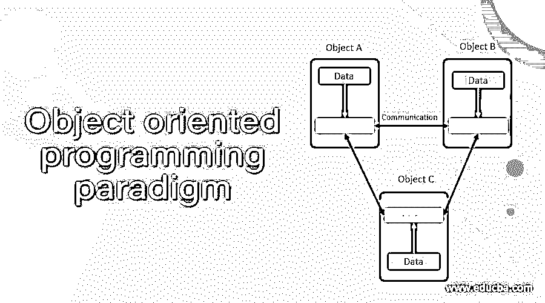

# 面向对象编程范例

> 原文：<https://www.educba.com/object-oriented-programming-paradigm/>

## 面向对象编程范例介绍

发明面向对象方法背后的主要必要性是消除过程方法中遇到的缺点。编程范例对象将数据视为程序开发中的一个元素，并牢牢地保存它，而不是允许它在系统中自由移动。它将数据与对其进行操作的函数联系起来，隐藏并保护数据免受外部函数的意外更新。面向对象的编程范式允许将系统分解成许多称为对象的实体，然后将属性和功能与这些对象联系起来。一个对象的属性只能由与该对象相关联的函数访问，但是一个对象的函数可以使用访问说明符在相同的情况下访问其他对象的函数。

### 为什么我们需要面向对象的编程范例？

面向对象的编程范式方法使我们能够创建一组对象，这些对象一起工作以产生比使用传统技术产生的软件更容易理解并对它们的问题域建模。使用面向对象编程范例生成的软件更容易适应不断变化的需求，更容易维护，创建功能模块，促进更好的设计，更健壮，并有效地执行所需的工作。

<small>网页开发、编程语言、软件测试&其他</small>

由于以下原因，面向对象技术比传统技术更有效。

*   更高层次的抽象:自顶向下的方法支持功能层次的抽象，而面向对象的方法支持对象层次的抽象。
*   不同软件开发阶段之间的无缝转换:它对所有阶段使用相同的语言，这降低了复杂性和冗余性，使得软件开发清晰而健壮。
*   良好的编程实践:类的子例程和属性紧密结合在一起。
*   提高可重用性:它支持继承，因为类可以相互构建。因此，只需要设计和编码类之间的差异和增强。所有以前的功能保持不变，可以不加改变地使用。

### 面向对象编程范例的基本概念

*   **对象**:对象只不过是真实或抽象的项目，包含定义对象的数据和可以操作该信息的方法。因此，对象是数据和方法的组合。
*   **类**:类是一组具有相同属性和行为以及相同类型的关系和语义的对象。一旦定义了一个类，我们就可以创建任意数量的属于你的类的对象。对象是类的变量。每个对象都与创建它们的类型类的数据相关联；这个类是相似类型的对象的集合。
*   封装:封装是将数据和功能打包成一个单元的过程。这是该课程最显著的特点。外部世界无法访问数据，只有包装在类中的函数才能访问它。它提供了数据对象和程序之间的接口。
*   **抽象**:抽象代表本质特征。它不代表背景细节和解释。类使用抽象的概念，并定义抽象属性的列表，如姓名、年龄、性别等。，对这些属性进行操作。它们封装了对象的所有基本属性。
*   继承:继承是一个类扩展另一个类的属性，包括额外的方法和变量。原来的类叫超类，超出属性的类叫子类。由于子类包含了超类的所有数据，所以它更加具体。
*   多态性:在极客的术语中，多态性意味着能够采用多种形式。一个操作在不同的实例中可能表现出不同的行为。行为取决于操作所用的数据类型。
*   **消息传递**:面向对象系统由相互通信的对象集合组成。对象通过发送和接收数据来相互通信，就像人们相互传递消息一样。对象的消息是执行方法的请求，因此将调用接收对象中生成所需结果的方法。

### 面向对象编程范式的特征

*   程序被分成称为对象的简单元素
*   重点是属性和功能，而不是过程。
*   数据对外部函数是隐藏的。
*   函数对对象的属性进行操作。
*   对象可以通过称为消息传递的功能相互通信。
*   在 oop 设计中遵循自底向上的方法

### 结论

之所以称之为面向对象，是因为这种方法看到的东西是对象真实世界的一部分。在本文中，我们讨论了面向对象编程范例的基本概念。希望对你有帮助。

### 推荐文章

这是面向对象编程范例的指南。这里我们讨论为什么我们需要面向对象编程范例以及基本概念和特性。您也可以看看以下文章，了解更多信息–

1.  [Python 是面向对象的吗](https://www.educba.com/is-python-object-oriented/)
2.  [Javascript 是面向对象的吗](https://www.educba.com/is-javascript-object-oriented/)
3.  [Java 面向对象编程](https://www.educba.com/object-oriented-programming-in-java/)
4.  [Python 中的对象](https://www.educba.com/object-in-python/)

