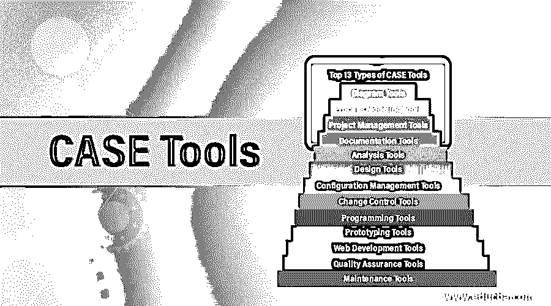

# 案例工具

> 原文：<https://www.educba.com/case-tools/>

## 案例工具简介

自动化软件开发生命周期活动并由项目经理、工程师和分析师用来构建软件系统的应用程序集被称为 CASE 工具，并且软件开发周期阶段可以使用几种工具来简化，例如设计、分析、项目管理、数据库管理、文档等。并且这些工具的使用加速了项目开发以获得期望的结果。

### CASE 工具的组件

有几个组件是基于它们在软件开发生命周期的不同阶段的用途。它们是:

<small>网页开发、编程语言、软件测试&其他</small>

*   **中央存储库:**工具需要一个中央存储库作为集成和一致信息的公共来源。由产品规格、文件要求、图表和报告以及管理信息组成的中央存储位置是中央存储库。中央存储库还充当数据字典。
*   **Upper:** 软件开发生命周期的不同阶段的计划、分析和设计可以使用 upper case 来执行。
*   **小写:**可以使用小写来执行实现、测试和维护。
*   **集成:**从收集测试和文档需求开始，软件开发生命周期的所有阶段都可以使用集成工具来执行。

具有相似功能、流程活动并基于其与其他不同工具的集成能力的可以被分组在一起。这适用于软件开发生命周期的所有阶段。

### 前 13 种案例工具

有几种类型的工具可用。

它们是:

#### 1.图表工具

系统的组件、数据流、各种软件组件之间的控制流以及系统的结构可以使用图表工具以图形形式表示。

**示例:**可以使用流程图制作工具创建最先进的流程图。

#### 2.过程建模

可以使用用于软件开发的过程建模工具来创建软件过程模型。管理者可以使用过程建模工具选择过程模型，或者根据软件产品的需求进行修改。

**例子:** EPF 作曲家。

#### 3.项目管理

使用项目管理工具可以完成项目的规划、成本和工作量的估计、项目的时间安排和资源的规划。软件项目管理人员必须严格遵循项目执行的所有步骤。可以使用项目管理工具在整个组织中实时存储和共享项目信息。

**示例:** Creative Pro Office、trac project、Basecamp 等。

#### 4.文档工具

在软件过程开始之前，软件项目的文档必须开始。该文档必须涵盖所有软件开发生命周期阶段以及软件开发阶段的完成。文档由文档工具为技术用户和最终用户生成。开发团队中的内部专业人员，他们查阅系统维护手册、参考维护手册、培训手册、安装手册等。让技术用户。最终用户文档中描述了系统的功能以及系统如何工作。

**示例:** Doxygen、adobe robohelp、DrExplain 等。

#### 5.分析

需求收集、不一致性检查、图表不准确、数据冗余等。可以通过分析来检查。

**示例:**用于需求分析的有 Accept 360、伴奏、casecomplete 等。可以使用 visible analyst 进行全面分析。

#### 6.设计

软件的块结构可以由软件设计者使用设计工具来设计，这些设计工具又使用细化技术被分解成更小的模块。每个模块的细节和模块之间的互连可以用这个来完成。

**举例:**动画软件设计。

#### 7.配置管理工具

每当发布一个版本的软件实例时，配置管理工具都会处理以下内容:

*   修订和版本管理
*   基线的配置管理
*   变更控制管理

借助于配置管理，可以完成自动跟踪、版本管理和发布管理。

**示例:** Git、Accu Rev 等。

#### 8.变更控制

变更控制是配置管理一部分。在修正基线之后或者在软件的第一次发布之后，软件中发生的变更由变更控制工具来处理。跟踪变更、管理文件、管理代码等。可以使用变更控制实现自动化。可以通过使用变更控制来实施组织的变更策略。

#### 9.编程；编排

集成开发环境、内置模块库、仿真等编程环境都包含在编程工具中。这些都有助于软件产品的开发，包括模拟和测试功能。

**示例:** Cscope 用于在 C，Eclipse 中搜索代码。

#### 10.样机研究

要构建的软件产品的模拟版本在软件中称为原型。产品的外观和感觉由原型提供，实际产品的几个方面可以使用原型进行模拟。图形库包含在原型工具中。独立于硬件的用户界面和设计可以使用原型来创建。快速原型可以使用基于现有信息的原型来构建。可以使用原型工具来模拟软件原型。

**示例:**实体模型构建器、Serena 原型作曲器等。

#### 11.Web 开发

像表格，文本，脚本，图形等网页。可以使用 web 开发工具进行设计。使用 web development 可以预览正在开发的网页，以查看完成后的外观。

**示例:**土坯边缘检查、基础 3、支架等。

#### 12.质量保证

可以使用质量保证工具来监控用于软件开发的工程过程和方法，以确保质量符合组织的标准。配置变更控制和软件测试工具属于 QA 工具的范畴。

**例子:** SoapTest，Jmeter，AppsWatch 等。

#### 13.维护

如果软件产品交付后有任何修改，可以通过软件维护工具来完成。在软件开发生命周期的维护阶段，使用自动记录日志、错误报告、自动生成错误标签和根本原因分析的技术来帮助软件组织。

**示例:** Bugzilla 用于跟踪缺陷等。

### 推荐文章

这是 CASE 工具指南。这里我们详细讨论几种可用的组件、类型。您也可以浏览我们的其他相关文章，了解更多信息——

1.  [SDLC 方法](https://www.educba.com/sdlc-methodologies/)
2.  [Kubernetes 工具](https://www.educba.com/kubernetes-tools/)
3.  [测试覆盖工具](https://www.educba.com/test-coverage-tools/)

