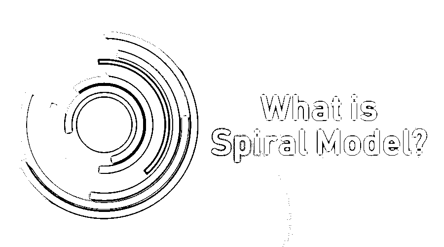
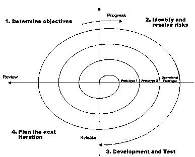

# 什么是螺旋模型？

> 原文：<https://www.educba.com/what-is-spiral-model/>

## 螺旋模型简介

螺旋模型是软件开发生命周期模型中的一种，它是由迭代模型和瀑布模型结合而成的，在这种模型中，产品从一个小的需求集开始统计，并通过这个小产品的开发来满足指定的需求，在需要频繁发布更多版本时使用。基于额外的需求，额外的功能将被添加到产品中，直到产品准备好进入生产阶段。

**螺旋模型是瀑布模型、增量模型和原型模型的组合。**

<small>网页开发、编程语言、软件测试&其他</small>

*   如今，许多软件行业正在着眼于一个更大的图景。他们正在计划他们的每一步。根据大量的经验，他们最终会得出这样的结论。将这些作为下一步行动的议程。
*   以前的商业世界是稳定的。在早期，对技术的改变并不频繁。当市场瞬息万变时，我们经历了一些困难。瀑布模型不足以克服这些困难。
*   对于真正以客户为中心的项目，我们需要一种灵活的方式。这是由螺旋模型完成的。这是解决我们问题的最好方法。
*   项目涉众发现这种方法非常适合不同的领域和不同的项目规模。

### 什么是螺旋模型？

*   螺旋是建立在两个模型之上的，即[瀑布模型](https://www.educba.com/waterfall-model/)和[迭代模型](https://www.educba.com/iterative-model/)。如果你不知道这些模型，我建议你先看看那些模型。
*   Barry Boehm 于 1986 年首次提出的螺旋模型。当我们学习这个模型时，它会相应地进化。
*   简单地解释一下，螺旋模型是这样一种模型，在每个阶段之后，它都要经过测试，我们犯的错误会得到处理。
*   它是 SDLC(软件开发生命周期模型)的主要部分。螺旋模型分为不同的阶段。这些阶段是软件开发的一小部分。
*   在每个部分的结尾，每个阶段都要进行测试。这些阶段没有固定的计数。因项目而异。
*   螺旋模型的每个阶段都以设计目标开始，以客户评审结束。
*   所以这种方法以增量系列的方式开发产品。每个阶段都被激活的任务区域的数量。

**每一阶段又分为以下四个部分:**

1.  确定目标
2.  识别并解决风险
3.  开发和测试
4.  规划下一次迭代

此外，看看下面的图片有更多的了解。

**螺旋模型**

### 使用螺旋模型

这就是风险导向的增量螺旋模型

1.  **确定目标(识别):**这个阶段从收集所有需求开始。随着我们的产品越来越进化，这个阶段检查系统需求。这里收集了两种类型的需求。一个是 BRS(业务需求规范)，一个是 SRS(系统需求规范)。

2.  **识别并解决风险因素:**在早期识别风险。仅在此阶段解决问题。如果这里出现了风险，就讨论并实施一个替代解决方案。此外，原型已经在这个阶段生产出来。

3.  **开发与测试:**这是该型号的主要阶段。产品的开发和测试在这个阶段完成。软件开发后也进行了测试。

4.  **下一次迭代规划:**这里开始下一次迭代。

### 优点和缺点

以下是优点和缺点:

#### 优势

以下是优点:

1.  这是一个循环模型。它以螺旋形状工作，就像瀑布模型一样，这是一个线性模型。
2.  这是一个风险驱动的模型。
3.  他们使用原型制作
4.  与瀑布模型相比，这种模型非常灵活
5.  它需要文档来维护
6.  大型项目正以一种战略性的方式得到处理。
7.  我们控制了所有的阶段。
8.  根据客户的需求，我们可以进行更改并付诸实施。
9.  软件生产所需的时间可能比预计的要少。
10.  最小化风险因素。
11.  最终用户有机会提前看到系统。
12.  它本质上是迭代的。

#### 不足之处

以下是缺点:

1.  螺旋模型最大的缺点是它没有任何标准文档作为指导。
2.  没有限制。它可以无限延伸。
3.  这对小规模项目没有好处。
4.  它需要风险分析专家。
5.  它是昂贵的。

### 为什么我们使用螺旋模型？

*   特别是在一个大项目中，我们会考虑螺旋模型。
*   这给了我们直接从顾客那里获得反馈的空间。
*   当一个长期项目正在运行，并且由于经济优先权的改变，承诺是不可行的。
*   我们使用螺旋模型，因为它具有成本效益。与瀑布模型相比，开发速度更快。此外，功能正在以系统的方式增加。
*   这种螺旋模型的主要好处是风险管理。这一风险分析阶段将我们从未来的并发症中解救出来。

### 结论:

它关注风险管理和意识，这是任何软件开发生命周期的关键部分。它提供了让客户参与每一次迭代的便利。这有助于克服现有系统的缺点。有了这种模式，随着时间的推移，我们可以更成功地获得客户满意度。

### 推荐文章

这是一个什么是螺旋模型的指南？.在这里，我们讨论了螺旋模型所需的技能、优点和缺点。您也可以浏览我们推荐的其他文章，了解更多信息——

1.  什么是敏捷和 Scrum？
2.  [什么是 Laravel 框架？](https://www.educba.com/what-is-laravel-framework/)
3.  [什么是 SQL Server？](https://www.educba.com/what-is-sql-server/)
4.  [增量模式](https://www.educba.com/incremental-model/)

