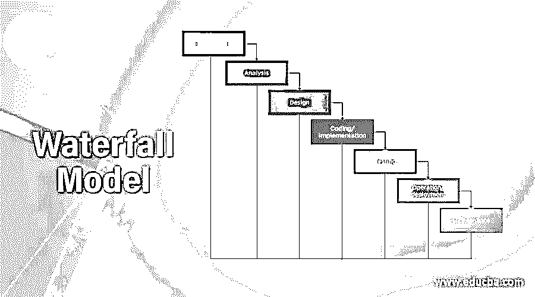
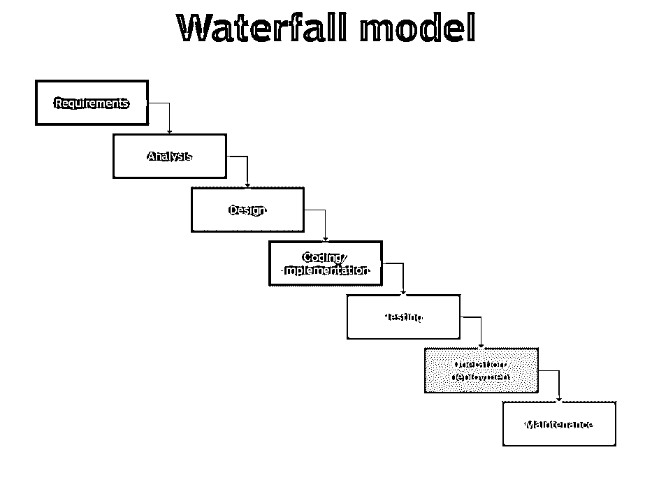

# 瀑布模型

> 原文：<https://www.educba.com/waterfall-model/>

## 瀑布模型介绍

瀑布模型是最早的软件开发模型之一，在这种模型中，任务是按顺序执行的，从具有可行性的顶层开始，通过具有实现的各种任务向下流到真实环境中。需求流入设计，设计流入构建或实现，最后流入测试。由于测试过程发生在模型的末尾，让反馈沿着瀑布向上传递是一个挑战。

要使用瀑布模型，我们需要了解基于内部和外部因素的应用方法，如下所示:

<small>网页开发、编程语言、软件测试&其他</small>

*   在应用程序中没有模糊的要求。
*   产品定义的稳定性。
*   这是技术理解。
*   它不是动态的。
*   具有适当专业知识的大量资源可用于支持该产品。
*   极短长度的项目。
*   良好的文档，明确和固定的要求。

从瀑布模型的历史开始，我想说瀑布模型的第一个样本是由 Winston w Royce 在 1970 年的一篇文章中介绍的。从那时起，瀑布模型指出，只有当前面的阶段被完全测试、评审和验证时，才应该切换到另一个阶段。它强调阶段步骤的逻辑进展。它的功能类似于悬崖边上流动的水。

这种软件开发方法被命名为瀑布，因为它以向下的方式从一个阶段系统地开发到另一个阶段。自从 Winston W. Royce 在 1970 年首次发布以来，瀑布模型已经在软件开发领域得到了广泛的应用。在软件开发过程周期中，编程模型用于规划开发应用程序的各个阶段。一个这样的模型是瀑布模型。

### 瀑布模型的阶段

下面给出了瀑布模型的阶段:

通过上面的信息图表，我们可以了解到瀑布模型共有 7 个设计和开发软件周期阶段，如下所示:

1.  要求
2.  分析
3.  设计
4.  编码/实现
5.  测试
6.  操作/部署
7.  维护

因此，我们可以看到瀑布模型自上而下的工作层次，一个阶段完成了全面的验证，然后切换到另一个阶段，包括概念、启动、分析、设计、构建、测试、生产/实施和维护等阶段流程。为了更简单地了解瀑布模型，我们需要通过它的工作模型来深入理解它的过程。在开始知识的深层阶段之前，需要理解一个主要的先决条件阶段。是关于软件产品的可行性研究。它处理项目需求的财务和技术方面。这个阶段处理基于分析的优点和缺点来修正度量。这样就选择了最佳解决方案。

**该类别的热门课程**

[一体化软件开发包(600 多门课程，50 多个项目)](https://www.educba.com/software-development/courses/software-development-course/?btnz=edu-blg-inline-banner1)

[600 多个在线课程| 3000 多个小时|可验证的证书|终身访问](https://www.educba.com/software-development/courses/software-development-course/?btnz=edu-blg-inline-banner1)

[4.6 (3，144 个评分)](https://www.educba.com/software-development/courses/software-development-course/?btnz=edu-blg-inline-banner1)

[课程价格](https://www.educba.com/software-development/courses/software-development-course/?btnz=edu-blg-inline-banner1)

[₹7999₹125000T3】](https://www.educba.com/software-development/courses/software-development-course/?btnz=edu-blg-inline-banner1)

[**查看课程**](https://www.educba.com/software-development/courses/software-development-course/?btnz=edu-blg-inline-banner1)

相关课程

[软件测试培训(9 门课程，2 个项目)](https://www.educba.com/software-development/courses/software-testing-course/?btnz=edu-blg-inline-banner1) [网络安全培训(10 门课程，3 个项目)](https://www.educba.com/software-development/courses/cyber-security-course/?btnz=edu-blg-inline-banner1)

#### 1.要求

具体来说，我们需要知道和理解我们必须设计什么，我们必须开发什么，它的过程，它的功能是什么，等等。它为正在制造的产品提供输入材料；因此，即将到来的产品被研究、定稿和标记。它也给我们扩展来决定产品的硬件或软件需求，这些需求将在所有阶段被设计、开发和捕获。

#### 2.分析

它导致设计模型、模式和业务规则。

这一要求不仅分为两部分:

*   **需求收集和分析:**首先，从客户那里收集产品开发的所有信息和需求，并进行处理以供分析。这一部分的主要作用是消除与软件产品开发相关的不完整性和不一致性。
*   **需求规格:**然后，上面分析的需求被记录在 SRS(软件需求规格)文档中。它充当客户和 SRS 开发团队之间的桥梁。未来的任何争议只能通过本 SRS 文档来管理和解决。

#### 3.设计

第一阶段完成并验证后，这是下一个最重要的阶段，因为它用于系统设计。它有助于为产品设计指定[软件和硬件](https://www.educba.com/hardware-vs-software/)要求。它还有助于系统设计的整体架构。所以在这个阶段主要研究和验证需求规格说明书。它也有助于将 SRS 文档转化为软件产品的功能设计和开发。因此，我们可以说，在设计阶段，人们为软件开发项目制定总体架构。

#### 4.履行

随着系统设计得到充分验证，实施阶段将连续进行。在这个阶段，系统设计的输入被采用，它首先在称为单元的小程序中被开发，这些小程序在即将到来的阶段被测试和实现。实施阶段的每一个单元都要经过开发，并测试其全部功能，也称为[单元测试](https://www.educba.com/Unit-Testing/)。所以在这个阶段，系统设计被转换成具有全功能程序模块的源代码。它包括软件的开发、验证和集成。

#### 5.集成和测试

早期阶段的每个单元设计和开发都是从实现阶段开始的，实现阶段被集成到一个模块或系统中，用于各种测试，如负载测试、负载测试等。，在测试每个单元后。测试环境会进行持续的软件检查，以确定设计或代码中是否有任何流程或错误。进行测试是为了维护软件的稳定性和可行性，以便客户在生产过程中不会遇到任何干扰或错误。因此，在这一阶段，整个系统将在实施后针对任何故障和失败进行彻底测试。

系统测试包括三种不同类型的活动，如下所示:

*   **Alpha (α)测试:**开发团队完成的测试。
*   测试:这是由友好的客户和用户团队完成的测试。
*   **验收测试:**在 [alpha 测试和 beta 测试](https://www.educba.com/alpha-and-beta-testing/)之后完成。这是在客户交货后完成的。在客户执行测试之后，决定该软件是可接受的还是被拒绝的。所以在这个阶段，调试 bug 就完成了。

#### 6.系统/操作的部署

一旦非功能性、功能性、alpha 和 beta 测试完成，软件产品就被部署到用户或客户系统或发布到市场。部署阶段包括整个系统到用户或客户环境的安装、迁移和支持。

#### 7.维护

这是瀑布工作流模型中最后但也是最重要的阶段。此步骤在安装后立即进行，包括对产品或系统进行适当的修改，或者增强、更改或修改与系统相关的性能问题相关的属性。它的主要作用是提高系统的性能，使软件输出的结果最准确。

在维护阶段提出的这些变更主要与客户或用户在安装和测试阶段后进行的初始修改有关，包括在系统实际使用过程中发现的缺陷或客户提出的要求。因此，为客户提供了对开发产品的及时和有计划的维护和支持。你会惊讶地发现，与维护阶段相比，软件产品的设计和开发阶段所付出的努力只有 60%。

下面给出了三种类型的维护:

*   **纠正性维护:**在设计开发阶段，有些错误没有被发现；只有当客户使用它们时，才会考虑它们。这只是纠正性维护，这意味着纠正开发阶段没有发现的问题或错误。
*   **完善维护:**这种维护是应客户要求进行的，以增加和增强系统或软件的功能。
*   **适应性维护:**切换系统环境所需的维护，通常需要将现有系统移植到新的环境或计算机或系统，或者可能是新的操作系统。这一阶段非常重要，因为它会带来更好的系统性能。

所以在上面的讨论中，我们对瀑布模型的每个阶段都有了全面的了解。因此，我们可以说，与机械行业相比，瀑布模型在软件领域非常重要，因为每个阶段都有其自身的重要性，从而导致更高效和更稳定的软件。

### 瀑布模型的优缺点

下面给出了提到的优点和缺点:

#### 优势:

*   它允许部门化和控制。
*   可以为开发的每个阶段设定一个时间表，并且一个产品可以一个接一个地通过开发过程模型阶段。
*   由于它经历了易于理解和解释的阶段，它克服了许多问题，使它非常容易使用。
*   由于工作流模型的刚性，它非常容易管理，因为瀑布模型中的每个阶段都有特定的评审和交付过程。
*   瀑布模型适用于需求非常容易理解的小型项目。
*   时间表可以为每个开发阶段设置最后期限，产品可以一个接一个地通过开发过程模型阶段。
*   明确定义的阶段。
*   众所周知的里程碑。
*   容易安排任务。
*   过程和结果都有很好的记录。
*   强化好习惯:设计前定义。
*   编码前设计。
*   该模型适用于较小的项目和需求得到很好理解的项目。

#### 缺点:

*   对于复杂的面向对象的项目来说，这不是一个好的模型。
*   不适合需求处于中度到高度变更风险的项目。
*   估计开发过程每个阶段的时间和成本是很困难的。
*   对于复杂的面向对象的项目来说，这不是一个好的模型。
*   直到生命周期的后期才生产出可工作的软件。
*   不能适应不断变化的需求。
*   很难按阶段来衡量进展。
*   高风险和不确定性。
*   对于长期和正在进行的项目来说，这是一个糟糕的模型。
*   在生命周期中调整范围可能会结束项目。
*   没有反馈路径。
*   没有相位重叠。
*   难以适应变更请求。
*   这种流程模型的风险和不确定性很高。

### 瀑布模型用在哪里？

现在，在包围了所有的场景之后，我们来到了我们想要知道在哪里使用瀑布模型的点。

*   瀑布模型主要用于国防工程；需求是明确的，因为在进入开发阶段之前，他们对它进行了很好的分析。
*   这也可以用于迁移项目，在这些项目中，需求是相同的，只是平台或语言可能会有所不同。

### 结论

因此，总的来说，我们可以说，与大型项目相比，瀑布模型最适合小型软件开发项目，因为在小型项目中使用瀑布模型更容易进行设计、开发和实现。毕竟，在这个模型中，在进入下一个阶段时，需要完成前面的所有阶段。因此，在大型项目中，由于模型庞大，问题和错误会频繁出现。每次，如果通过瀑布模型实现，测试阶段将继续，这将导致软件的优化和准确性降低。

### 推荐文章

这是一个瀑布模型的指南。这里我们已经讨论了瀑布模型的阶段、优点和缺点。您也可以浏览我们推荐的其他文章，了解更多信息——

1.  [什么是自举？](https://www.educba.com/what-is-bootstrap/)
2.  [什么是 Unix？](https://www.educba.com/what-is-unix/)
3.  [阿尔法测试](https://www.educba.com/alpha-testing/)
4.  [阿尔法和贝塔测试](https://www.educba.com/alpha-and-beta-testing/)

