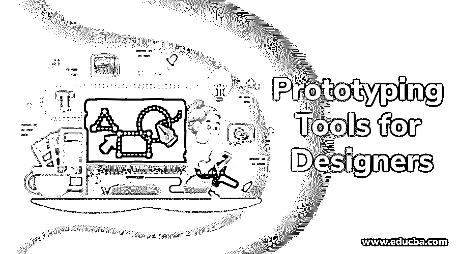

# 面向设计师的原型工具

> 原文：<https://www.educba.com/prototyping-tools/>

## 设计原型工具介绍

你一定想拥有一个自己的漂亮而有吸引力的网站，有大量的用户访问并坚持使用你的网站。但是，一个有前途的用户群不可能一蹴而就。它集体需要长时间的艰苦和聪明的工作，通过一系列的想法、概念化、激烈的开发过程和试验来实现最终产品。它包括设计和重新设计您的产品，除非并直到达到所需的参数。[网页设计是一个高级领域](https://www.educba.com/web-designing-tools/ "A Beginners Guide to Web Designing")，为了达到预期的效果，需要使用大量的工具。然而，最终的设计不是一朝一夕可以实现的。用户应该知道产品会是什么样子，所以他们需要一些试验或测试来了解他们对最终产品的期望，这就是原型的用处。你以前听说过这个术语吗？你知道原型是什么吗？原型基本上是一种模拟演练，导致最终产品的评估。在本文中，我们将学习原型工具。

当我们谈论原型时，我们需要知道原型绝不是最终的设计。它只是一系列可能不具有高精度或高保真度的设计。我们必须明白，最终产品是最终形成最终设计或产品的各种原型的复制品。这的确是一件令人兴奋、耗费精力和成本的事情，但是原型制作挽救了局面，因为它确保了网页设计是完美的，用户友好的设计更受欢迎。原型给任何网页设计注入了生命和色彩，它也给我们机会来测试设计或应用的可行性和责任性。它还有助于建立不同层次的用户交互会话。原型软件的主要目的是确保最终产品的有效性和一致性。它确保你得到的产品的最终原型符合你的期望。

<small>网页开发、编程语言、软件测试&其他</small>

有许多工具和技术可以帮助构建原型。设计师可以自行决定使用任何工具来设计他们的网站或应用程序。但是通常认为使用低保真度原型比高保真度原型更好，因为低保真度原型花费的时间和精力更少。除此之外，选择正确的原型工具还有许多决定性的因素。根据原型的目标、受众的范围以及各种其他原因，您倾向于选择不同的原型工具和技术。

### 设计师的 17 大原型工具

原型是一种设计哲学。除非你没有原型，否则你无法测试你的产品。直到你最终完成设计并测试它，这意味着如果你的最终设计出了问题，你必须重复设计的整个原型制作过程，以防你没有使用原型。因此，我们建议你应该总是制作原型，不时地测试它们，然后为你的网站或应用程序建立一个最终的设计。

以下是基于结果导向的更值得推荐的设计工具:

#### 1.Mockplus R

如今，Mockplus RP 已经成为 UX 设计师最喜欢的在线原型制作工具之一。该工具为多个团队成员提供了协作能力，使他们能够彼此同步，并确保所有的设计人员都在同一页面上。对于初学者来说，这也是一个用户友好的工具。由于它有大量的 UI 工具包和现成的模板，您不需要从头开始构建项目原型。最精彩的部分？Mockplus RP 可以做低、中、高保真，帮助设计师更高效的原型制作。如果你是这个行业的新手，这个工具值得一试。

#### 2.AXURE

Axure 是当今网页设计师的最爱之一。它是高级原型项目中最常用的原型工具之一。这是最快的线框和原型制作一代，回报很快。它允许我们创建母版页，添加交互，还可以使用小部件库中的某些现成组件。这个工具还有许多其他功能，包括添加颜色、导入图像、渐变以及改变设计中每个对象的透明度。在设计界面时，它允许完全的灵活性。Axure 最令人兴奋的特性之一是它能够生成丰富的 HTML 原型。然而，有一点使它成为第二选择，那就是它只能在 Windows 上运行，不能在 Mac 上运行，而且价格相当高。但是，如果你是 Windows 用户，并且注重质量，你必须试一试。

#### 3.巴尔萨米克

Balsamiq 是另一个在当今网页设计师中很有名的快速原型工具。它在 Adobe AIR 上运行。它允许设计师创建高质量的草图，如果你不擅长创建手绘草图，这是一个相当好的功能。用户界面库中有多达 500 个图标可供选择。它还允许我们添加基本的交互，并与您的团队共享原型。UI 库中也有各种现成的项目。它可以让你创建低保真度的模型。它还介绍了 BMML，让我们出口你的线框。首先，还有各种交互式屏幕元素。如果你是一个不太擅长画草图的设计师，那么 Balsamiq 就是你的救星。

#### 4.Keynote 和 PowerPoint

这些是当今市场上使用最广泛、最简单的原型工具。这两者都可以有效地用于创建产品线框和原型。这两个大家都挺熟悉的，用这些不需要太多创作能力。然而，keynote 和 PowerPoint 都需要第三方扩展或模板才能以这种方式使用，如 keynotopia 和 power mockup。这两个都是高保真原型工具。如果你是一个初学者，只是有关于设计的基本知识，那么你必须从这些工具开始。

#### 5.Moqups

Moqups 是在线原型开发工具中的一个简单免费的工具。它是一个 HTML5 Web 应用程序。它帮助我们通过使用各种符号、按钮等快速创建网站和应用程序的页面。它有一个免费版本，有 31 个组件，如图形，图标，iPhone 模型等。它还提供了处理多个项目并与您的团队共享它们的机会，可以将现成的项目导出为 pdf 文件，还可以创建母版页。这是一个低到中等保真度的选项，但与其他线框工具相比，它的交互性很高。你还在等什么？开始吧！

#### 6.贾丝廷娜

这个工具创建于 2008 年。这是一个高保真的原型制作软件，可以直接下载到电脑上，而不是在线工作，因此你可以离线使用，也可以不使用任何工具。它的布局类似于 Adobe creative 程序，但更为简化。它还允许我们使用 UI 库中的项目并创建母版页。一个优点是能够使用附加模块和现成的模块。Justinmind 使用起来很简单。如果你还没用过，今天就试试吧。

#### 7.UXPin

这是一个由波兰团队设计的直观原型工具。它是一个强大的原型工具。它有助于创建快速和美丽的原型。它是一个高保真的工具。它有助于以非常简单的方式创建线框。您可以使用 UI 库中的许多现成组件。它还允许您与团队成员共享您的工作，并实时发表评论。还有智能参考线可用于测量元素之间的实际距离。

图像也可以用这个工具编辑。最终设计也可以转换成 pdf 文件。使用这个工具，让你的网站创造奇迹！

#### 8.铅笔

这是一个免费的 Firefox 插件，可以帮助设计者创建线框和原型。它有助于快速制作高保真模型。但是我们需要为 Pencil 创建视觉设计元素，因为它是基于拖放预先制作的图形元素。不要想太多；今天就创建你的模型网站。

#### 9.Adobe Flash

除了所有的原型制作工具之外，Adobe flash 有助于快速制作交互式原型，但不能用于线框制作。然而，通过使用某些库对象和绘图工具，制作交互式原型变得更加容易。它更适合于再现某些中间状态，这是其他工具所缺乏的。最近，Adobe 为开发人员和设计人员推出了一种新工具。这个工具叫做 Catalyst，据报道它也是比 Axure 更好的工具。这是像你这样的设计师必须尝试的。

#### 10.草图

勾画出你的想法是迄今为止最具成本效益和最简单的原型制作选择。虽然它没有提供一个工作原型，但是它给了你一个机会来可视化你的想法，解决你的逻辑问题等等。这是一个低保真度的选择。画草图是开始的好方法。还有一些草图工具，比如 UI 模板，它为你提供了草图板和模板，帮助你以更简单的方式手动复制元素、图标和按钮。

#### 11.视觉

从所有的原型工具来看，它也非常简单和直观。你只需要上传 png 或 PSD 格式的项目，然后添加热点，将它们转换成交互式原型。这个工具还可以让你与你的团队合作，并接受评论。这个工具也是有成本效益的。

#### 12.奇迹

它让你为网站和移动应用程序创建原型。你只需要上传 psd、png、jpg 或 gif 格式的文件，或者点击草图的图片。在这里，您可以将静态图片转换为可点击的、交互式的原型，带有大量的动画和手势。这个工具是免费的。

#### 13.复写的副本

这是一个非常漂亮的线框方式。在这个工具中，我们只能在模型风格的浏览器窗口中看到一个网格。然后在鼠标的帮助下开始绘制元素，然后出现控件供您开始操作。这是一种在低至中等保真度选项上创建线框的非常有效和简单的方法。

#### 14.皮多科

它有助于为网站和移动应用程序创建可点击的线框、模型和交互式原型。它介于中等保真度和高保真度之间。

#### 15.智能绘图

它并不完全是一个专用的线框和原型应用程序，但这并不意味着我们不能使用它。与 Axure 相比，我们可以预期功能会减少。它有一个标准的模板套件和一些自动生成功能。它允许您向页面添加简单的元素，并生成 pdf 作为最终输出，它仅适用于 windows。

#### 16.超文本标记语言

用 HTML 开发原型需要技巧。它有助于节省时间和金钱。通过使用各种 jQuery 插件，可以表示大多数接口。质子化的功能也是可用的。

#### 17.安特类型

它是 Mac 原型应用的领导者。它有助于创建响应网站，原型移动应用程序，甚至一些软件。它有各种设备的模板，有 400 个现成的小工具。它提供了创建高保真原型的工具。也有互动的功能可用。您的项目也可以导出为矢量或基于像素的图形，并可以生成 CSS 代码。

最后，我要说原型软件是非常强大的。它有助于你有效清晰地传达设计。它帮助你原型化设计想法，测试它们，并从用户那里获得实时反馈。原型软件让你把你的想法付诸实际测试，你可以看到设计是如何进行的。这有助于你获得最好的网站设计。它让你的想象力在你面前休息，并赋予它实际的形状，从而确保你的客户群触及你的期望和超越的顶点。你还在等什么？起来，马上开始！你可以创造奇迹。

### 推荐文章

这是一个为设计师设计原型工具的指南。在这里，我们讨论了 16 个最好的设计工具，基于它们对结果的定位，我们更推荐它们。您也可以看看以下文章——

1.  [Ping 监控工具](https://www.educba.com/ping-monitor-tools/)
2.  [数据字典工具](https://www.educba.com/data-dictionary-tools/)
3.  [安卓应用开发工具](https://www.educba.com/android-apps-development-tools/)
4.  [网络开发工具](https://www.educba.com/top-10-web-development-tools/)

