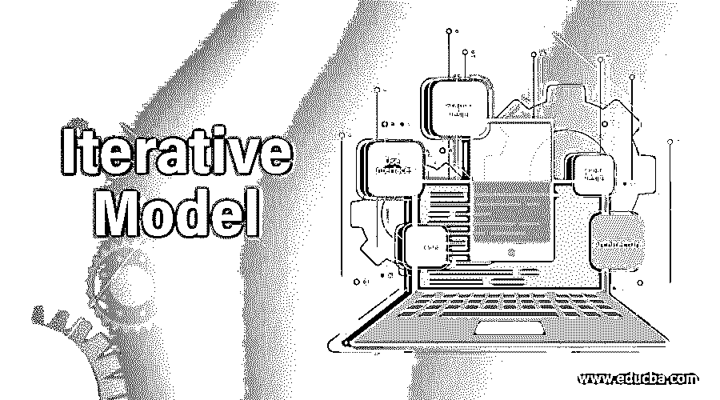

# 迭代模型

> 原文：<https://www.educba.com/iterative-model/>

## 什么是迭代模型？

迭代模型也被称为[增量模型](https://www.educba.com/incremental-model/)，其中特定的项目或软件被分解成大量的迭代，其中每个迭代是一个完整的开发循环，导致可执行产品或软件的发布。开发中的最终产品的子集，它从一次迭代发展到另一次迭代，成为最终的产品或软件。原型，Rational 统一过程(RUP)，敏捷开发，快速应用程序开发都是迭代模型的例子。

### 迭代模型

SDLC ( [软件开发生命周期](https://www.educba.com/what-is-sdlc/))非常庞大，包含大量的测试和开发活动、技术、方法、工具等。它包括密集的大纲和管理，计算和安排。正是遵循软件工程师们的每一次[努力](https://www.educba.com/careers-as-a-software-engineer/)，应用程序或软件才得以顺利创建。迭代模型也是 SDLC 的一个组件。

<small>网页开发、编程语言、软件测试&其他</small>

一个软件开发生命周期的特定执行，集中于主要的、不复杂的执行，然后逐渐增加最终系统的更高的复杂度和更广泛的特征设置。简而言之，迭代模型中的开发是一种将大型应用程序的软件开发分解成较短部分的方式。

迭代模型生命周期的模型并不是从完整的规定开始的。特别是在模型中，当被分析以识别后来的规范时，开发通过指定和执行软件的唯一组件开始。此外，在迭代模型中，迭代的过程从简单地执行少量的软件需求开始，迭代地改进开发的变体，直到整个系统被执行并准备好重新分配。每一个迭代的模型发布都是在一个特定的确定的时间周期内开发的，这个时间周期被称为迭代。

此外，迭代集中在特定的规范集合上。每个周期都以一个被使用的系统结束，例如，一个可实现的发布中的一个特定的迭代结果。迭代模型能够获得先前的阶段，其中分别进行改变。产品的最终结果在 SDLC(软件开发的生命周期)结束时恢复。通常，迭代模型中的开发与累积开发结合使用，在累积开发中，软件开发的[扩展周期被划分为更短的部分，这些部分是在彼此之上创建的。](https://www.educba.com/what-is-software-development/)

此后，在随后的大纲中使用迭代模型:

*   可以确定和理解整个系统的规格。
*   重要的规范被确定，而很少的功能和需要的改进随着开发过程的过程出现。
*   在服务于项目的同时，开发团队将利用并不断获取最新的技术。
*   这在未来可能会有所改变，前提是很少有巨大的风险特征和目的。具有所需能力的资源是不可访问的，并且被安排为基于特定迭代的合同来使用。

迭代模型的过程是循环的，不像传统模型那样专注于开发过程的渐进阶段。在这整个过程中，只完成了初步的规划，较少的阶段被重复，每一个循环都很复杂，逐渐增强和软件迭代。

### 迭代模型设计的例子

下面是一些例子:

#### 1.用户界面

电影公司需要一个用于设备跟踪、服装和道具的定制系统。包含的业务部分对于基于技术的项目的渲染规范来说是不寻常的。为了避免开发人员连续工作一个月并构建客户会拒绝的东西的通常情况，使用了迭代大纲策略。在一周内，开发者和用户坐在一起两次，讨论通过最近的系统。消费者体验产品并创建新的规范，这些规范严格区分优先顺序，减少了工作日。以这种方式，该系统看起来是有益的并且易于使用。

#### 2.装帧设计艺术

广告公司的创意部门有两周的时间为客户制作广告印刷品。他们有一个建议要在几天内提交给客户。随着截止日期的临近，他们会提前检查一系列重复出现的客户响应，并确信它会执行并得到客户的肯定。

#### 3.体系结构

一家建筑公司迅速制作模型和建筑动画，以呈现给客户。这使得客户参与进来，并且更有可能为一个特定的项目选择公司。

#### 4.营销

一个电子商务时尚网站 nevermore 开始重新设计以取代一个旧网站。另一方面，UI(用户界面)不断地被争议、改变和完善。跟踪指标并与变更相关联。企业的发展是建立在行业不可比拟的实践基础上的。

#### 5.城市设计

一个城镇帮助社区建立十年计划，作为政策和策略。同时，它继续执行；城市设计师在小范围内尝试一些东西，并在以项目的方式推进一切之前收集反馈。例如，一个特定的街道设计可以在一个地方尝试一年，然后再进一步利用。

### 优势

在 SDLC(软件开发生命周期)中执行迭代模型之前，必须认识到它的好处。该模型的显著优点是，它在软件开发过程的前面阶段执行，允许开发人员和测试人员尽可能快地确定设计或功能缺陷，这允许他们在预算不足的情况下采取恢复措施。这些模型的其他优势或改进包括:

*   在软件开发生命周期中，很少能预先创造出可雇佣的能力。
*   它有效地适应了项目和客户永远变化的需求。
*   是最适合敏捷公司的[。](https://www.educba.com/what-is-agile/)
*   它被进一步有效地定价以改变迭代模型中的规格范围。
*   可以组织一致的开发。
*   检查和排除故障，而较少的迭代是简单的。
*   通过迭代识别和修复危险，并且可以简单地处理每一次迭代。
*   在迭代模型中，简明的时间消耗在记录上，而扩展的时间用于概述。

当向消费者展示产品的设计和轮廓以获得反馈时，每个人都获得了值得信赖的消费者评价。

### 不足之处

虽然迭代模型非常有优势，但是也有一些缺点和不足，所以迭代的每个阶段都是严格的，没有重叠。此外，可能会出现系统结构或大纲问题，因为在整个生命周期的开始阶段并没有收集到所有的必要条件。迭代模型的其他缺点如下:

*   可能需要更多的资源。
*   即使改造的价格较低，也不一定适合改造的规格。
*   需要额外的管理认可。
*   它不适合较短的项目。
*   能力考试需要非常熟练的资源。
*   项目进展在很大程度上依赖于风险评估阶段。
*   确定逐渐增加可能整个系统的解释。

### 结论

软件的开发伴随着大量的过程和技术。它需要模型、另一个外部组件和工具来实现胜利的成就。迭代模型开发的技术之一允许有效地进行小规模的软件开发。这是敏捷开发技术中的主要实践之一，在敏捷开发技术中，随着项目随着规范的发展，动作是重复的。

### 推荐文章

这是迭代模型的指南。这里我们讨论了一些基本概念的定义，例子，迭代模型的优点和缺点。您也可以浏览我们推荐的其他文章，了解更多信息——

1.  [JavaScript 是什么？](https://www.educba.com/what-is-javascript/)
2.  什么是 Django？
3.  [什么是 SQL Developer？](https://www.educba.com/what-is-sql-developer/)
4.  [什么是 Azure？](https://www.educba.com/what-is-azure/)

