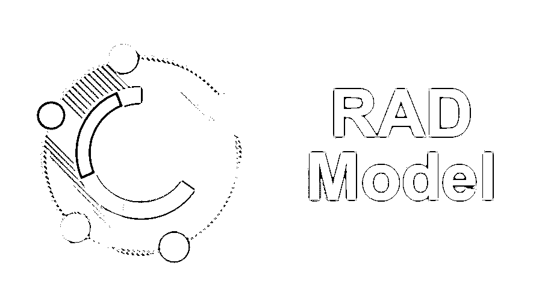

# RAD 模型

> 原文：<https://www.educba.com/rad-model/>

## RAD 模型介绍

RAD 模型代表快速应用程序开发模型，是功能和后续集成的并行开发，其中每个组件或功能都是并行开发的，就像它们是小型项目一样。组件的开发是有时间限制的，交付，然后组装成一个工作原型。这种方法或模型允许组件或产品的快速变化和开发，通过向客户提供产品的早期可见性来鼓励积极的客户反馈。

在接下来的章节中，我们将讨论和解释更多关于快速应用程序开发模型或 RAD 模型的内容。

<small>网页开发、编程语言、软件测试&其他</small>

像其他的软件开发模型一样，RAD 也没有强调几个阶段。这些阶段列举如下:

*   要求
*   设计
*   履行
*   试验
*   维护

但是在我们讨论下一个话题之前，我们想关注最关键的一点，那就是“如何决定哪种软件开发生命周期模型是最好的？”.

### 如何为我们的项目选择最佳的 SDLC 模型？

非常重要的是要注意，选择 SDLC 模型不仅是足够的。挑选和实践的 SDLC 模型应该完全满足我们的所有需求。没有适合所有情况的单一 SDLC 模型。每种模式都有自己的优缺点。因此，在选择和遵循任何 SDLC 模型之前，应该对其进行适当的分析和测试；只是应该提前实践。

回到我们的主题，让我们一步一步地讨论其他一些事情:

### 什么是 RAD 模型？

到目前为止，您应该已经猜到了 RAD 模型。快速应用模型或 RAD 模型是一种实践性很强的软件开发模型。

RAD 模型是一种典型的增量模型，在这种模型中，小块的多个开发被同时挑选和开发，以实现更大的图景。此外，[增量模型被处理](https://www.educba.com/incremental-model/)，其中要开发的主要特性被分成更小的、可行的块。这些块然后被单独开发。

典型的 RAD 模型可分为以下五个阶段:

*   规划和需求分析。
*   设计项目架构。
*   开发和编程。
*   测试。
*   部署和维护。

**1。规划和需求分析–**这个阶段是最关键的阶段之一。在这里，初始需求被适当地收集和分析。请记住，正确理解需求是非常必要的，这样构建的最终产品才能满足预期。

**2。设计项目架构–**一旦收集了需求，下一个焦点就是项目架构开发。项目架构应该足够灵活，能够轻松地容纳新添加的文件和文件夹。

**3。开发和编程—**一旦架构设计完成，下一个主要任务就是开发项目。这一步包括编写大量代码，以便获得产品的可行状态。

**4。测试**–测试阶段包括对开发的产品进行测试。有一个团队参与开发产品的适当测试。

**5。部署和维护–**一旦测试完成，就可以将产品部署到服务器上。一个已部署的项目通常需要维护，可能还需要添加一些额外的特性。

### RAD 模型的优缺点

下面是提到的优点和缺点:

#### 优势:

*   产品的快速发展。
*   可重用小组件的开发。
*   开发过程中的重复审查。
*   因此，尽管没有增加更大的模块，但是在初始级别集成可重用组件节省了精力。
*   建设性的反馈。

#### 缺点:

*   在初始阶段需要大量的工作来收集所有的需求。
*   建模技能有很多依赖性。
*   不适合低预算项目。

### 何时使用 RAD 模型？

如前所述，如果我们有以下要求，RAD 模型是合适的:

*   当需要在短时间内开发产品时。
*   如果有大量的开发人员，可以同时开发多个组件。这些小的、独立的、单独的组件被集成以制造更大的模块。
*   如果有可用的资源，世卫组织可以在初始阶段收集所有需求。

为了更清楚地理解当前主题，我们想讨论一下何时应该使用螺旋模型，以便更清楚地区分这两个**。另外，选择什么时候挑选什么也很有帮助。**

### 为什么我们使用螺旋模型？

螺旋模型遵循风险驱动的软件开发模型。基于独特的风险模式，该模型帮助团队遵循或集成不同的模型或过程。

### 例子

RAD 模型的几个典型使用案例是:

一个典型的用例可以是任何需要初始需求收集、开发、测试以及随后的部署和维护的产品的开发。

### 结论

对于 SDLC 来说，遵循其中一个模型来正确开发软件是非常重要的。每种模式都有自己的优缺点。更重要的是选择一个 SDLC 模型来遵循它的最佳实践，以满足需求。在进一步处理和实践之前，无论是遵循瀑布模型、螺旋模型、V 形模型、RAD 模型还是任何其他典型模型，都应该进行适当的分析。一个好的 SDLC 模型将在许多方面帮助开发过程。它将节省人力和资源，从而更好、更快地开发组件。

### 推荐文章

这是 RAD 模型的指南。这里我们已经讨论了 RAD 模型的阶段、优点和缺点。您也可以浏览我们推荐的其他文章，了解更多信息——

1.  [软件开发人员的职业生涯](https://www.educba.com/career-as-a-software-developers/)
2.  [原型模型](https://www.educba.com/Prototype-Model/)
3.  [什么是软件开发？](https://www.educba.com/what-is-software-development/)
4.  [什么是 CLI](https://www.educba.com/What-Is-CLI/)

