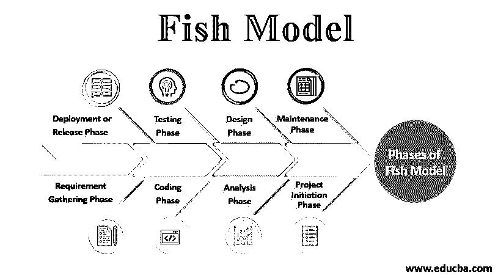
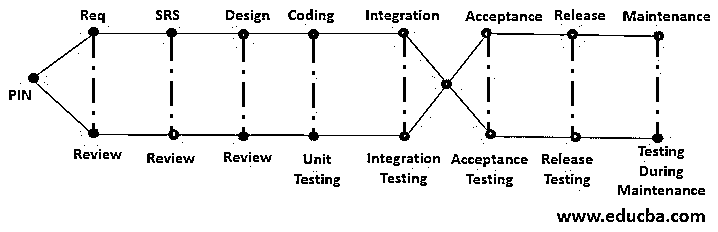

# 鱼类模型

> 原文：<https://www.educba.com/fish-model/>

## 鱼类模型简介

Fish 模型是一种软件开发方法，其中验证(评审)和确认(测试)在模型的每个阶段由独立的团队并行完成。这个模型的结构看起来像一条鱼，因此得名鱼模型。这是一个耗时且昂贵的模型。可以放心的是，在模型的每一步，验证和确认都是由独立的团队并行执行的。

### 鱼类模型框图

Fish 模型的框图如下:

<small>网页开发、编程语言、软件测试&其他</small>

### 鱼类模型的阶段

它是一种 SDLC 方法，涵盖了软件开发生命周期过程的所有阶段。所有阶段都与验证和确认过程相关，以完成应用程序的开发。这些阶段是:

#### 1.项目启动阶段

这是 Fish 模型的第一阶段，即项目启动节点(PIN)或合同签署。在这里，客户和组织之间将签署服务水平协议(SLA ),以便开始工作。

#### 2.需求收集阶段

在此阶段，业务分析师(BA)将从客户处收集所有需求，以准备业务需求规范(BRS)文档，并将分配一个平行的独立团队来审核该文档。

#### 3.分析阶段

无论从客户那里收集到什么样的需求，系统架构师(SA)都将对其进行分析，以准备 SRS(软件需求规范)或 FRD(功能需求文档),该阶段的审查也将由单独的团队进行。

#### 4.设计阶段

技术负责人或技术架构师将使用这些分析的需求来设计项目原型，并准备技术设计文档(TDD)。在这个阶段，高层次设计和低层次设计都会发生。同样，审查将由单独的团队完成。

#### 5.编码阶段

开发人员使用不同的技术(如 java 或。net 或 python 等。)开发应用程序并并行测试软件的各个可执行部分称为单元测试。由开发人员开发的单元，将所有单元组合起来称为集成，测试单元之间的接口和交互称为集成测试。由独立的测试团队在证明环境中对开发的应用程序进行端到端的测试称为软件测试。

它是由客户从业务角度对应用程序进行的测试，以获得发布的信心，并且它符合目的，被称为验收测试或用户验收测试(UAT)。它有两种类型，如:

*   Alpha 测试:它被称为业务验收测试或工厂级测试，由客户在开发组织现场完成。
*   **Beta 测试:**它被称为产品验证测试或现场测试，由客户在软件使用地完成。

对于一些特定的项目，我们需要测试一个以上的系统组合，被称为系统集成测试(SIT)。例如:银行 IRCTC 应用程序。

#### 6.部署或发布阶段

完成所有类型的测试后，应用程序就可以部署或发布了。在此阶段，由客户完成的发布前测试称为发布测试。

#### 7.维护阶段

在发布应用程序后，如果对应用程序的代码或技术或环境进行任何更改，即所谓的维护，相关的测试过程称为维护测试。这是由测试团队完成的。在这个阶段，我们进行影响分析。

**注:**

*   开发高质量的软件是一种 SDLC 模式。
*   这是为了更安全的项目，也是更昂贵的。
*   验证(质量保证(QA)):它是面向过程的，以防止缺陷和改进开发过程，因此设计评审是其中的一部分。它在没有程序执行的情况下执行。
*   验证(质量控制(QC)):发现缺陷和提高产品质量是面向产品的，因此产品测试是其中的一部分。它随着程序的执行而执行。
*   这种模式主要是质量保证和质量控制的并行组合。
*   这个模型在每个模型的末尾生成两个报告，一个用于验证，一个用于验证。

### 鱼类模型的优缺点

下面是 Fish 模型的优点和缺点:

#### 优势

*   很容易实现。
*   该模型的每个阶段都由一个独立的团队测试应用程序的完整性和正确性，因此它提供了一个高质量的软件产品。
*   它提供了应用程序的完整文档。
*   它主要用于安全和复杂的项目。

#### 不足之处

*   在该模型中，审查和测试从项目启动节点开始到维护阶段，由于这个原因，fish 模型是一种昂贵的开发方法。
*   同样，开发产品也是一个耗时的过程。
*   这种模式不适合小型项目。
*   这是一个昂贵的模型，所以开发失败会造成很大的损害和损失。
*   风险在初始阶段没有被识别，无法预防。
*   我们不能在过程中间改变要求。

### 结论

在本文中，我们专门讨论了一种叫做 Fish 模型的 SDLC 方法。我们过去常常把一个大项目开发成一个高风险、高质量的项目。现在，一些软件行业使用这种模型来开发软件产品，比如医疗保健行业。本文还提供了 Fish 模型的优点和缺点。对于任何项目，如果质量是一个非常重要的参数，那么选择这个模型。这种软件开发模型看起来像瀑布模型，但是，它涉及验证和确认过程的连续或同时部署。

### 推荐文章

这是一个鱼类模型指南。这里我们讨论 Fish 模型的各个阶段，如项目启动阶段、需求收集阶段、分析阶段等。有优点也有缺点。您也可以浏览我们推荐的其他文章，了解更多信息——

1.  什么是敏捷测试？
2.  [SDLC 与敏捷](https://www.educba.com/sdlc-vs-agile/)
3.  [增量模式](https://www.educba.com/incremental-model/)
4.  [多维数据模型](https://www.educba.com/multidimensional-data-model/)

