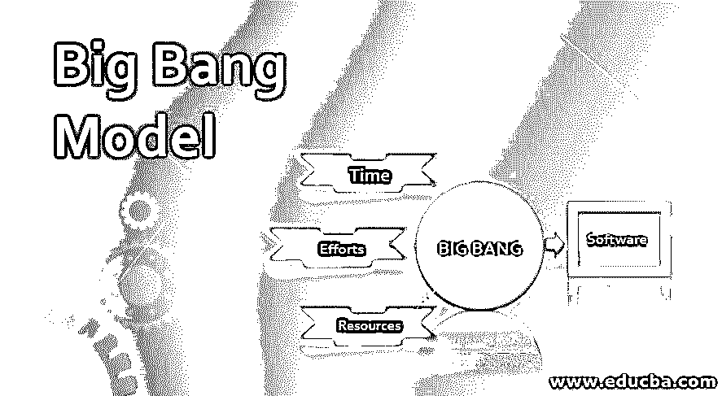
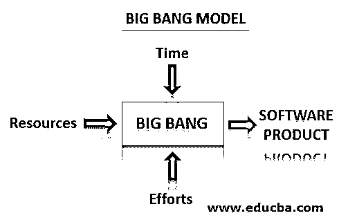

# 大爆炸模型

> 原文：<https://www.educba.com/big-bang-model/>

## 什么是大爆炸模型？

大爆炸模型是[软件开发生命周期](https://www.educba.com/what-is-sdlc/)中最简单的模型。它需要更少的规划、大量的编码或编程以及大量的资金。模型名称显示大爆炸，因为它是由大爆炸理论的启发。根据这一理论，科学家们说，在大爆炸之后，许多星系、行星和恒星逐渐形成。同样，我们将时间、努力、资源、资金结合起来，然后我们就能获得最好的软件产品。

### 大爆炸模型框图

大波段模型的框图如下:

<small>网页开发、编程语言、软件测试&其他</small>

在这种模式中，我们不遵循任何特定的流程或程序，但需要一点规划。在这种模式中，我们通过使用时间、精力和资源来开发软件，但是产品可能满足也可能不满足每个客户(顾客)的需求。这个模型实际上并不适合大型软件开发或者复杂的项目，因为它是一个高风险的模型，但是对于临时的和实验性的或者小型的软件，我们可以使用这个模型。通常，这种模式适用于开发团队非常小的小型项目，即一两个开发人员一起构建一个软件应用程序或只是作为一个虚拟项目，对于学术或学习或实践项目也很有用。对于需求不明确或不被理解，并且没有发布日期的软件产品来说，这是一个很好的模型。

**注:**

*   SDLC 是项目管理中使用的一种模型，用于提供成功开发软件应用程序或产品的步骤。
*   SDLC 代表软件开发生命周期。
*   开发软件最糟糕的模型之一是大爆炸模型。它不用于软件行业，但对于学习或实验项目目的很有用。
*   它没有过程或程序，但几乎没有开发所需的规划。
*   客户要求不明确或不清楚。
*   不需要满足客户的要求。
*   不提产品的发布日期。

### **生活大爆炸模式的优缺点**

以下几点解释了相同的优缺点:

#### **优势**

*   这是一个简单的模型&易于实现。这是一个实现起来非常简单的模型，因为不需要软件开发生命周期过程步骤。
*   它需要更少的计划。不需要大的分析和规划，开始编码就行了。所以不需要计划、分析、文档、高层设计等。
*   它需要更少的资源。这种模式更适用于小型软件开发项目，在这些项目中，1 到 2 个开发人员一起工作来构建一个产品，或者只是作为一个虚拟项目。
*   它适用于小型项目。因为不需要劳动力，也不需要 SDLC 流程步骤，所以它只处理小项目。
*   性价比很高。在软件开发中实现这种模式，需要较少的资源，较少的开发人员，较少的管理成本，所以是划算的。
*   易于管理。启动项目不需要任何入库程序。所以这种模式很容易管理。这对于低风险系数的小项目来说很好。
*   它对项目没有时间限制，对开发人员来说非常灵活:对于软件产品来说，没有发布日期，开发人员开发产品的压力也较小。
*   它培养出优秀的开发人员，即全栈开发人员:这种模式有助于为新人或学生开发不同技术的软件编码技能。

#### **缺点**

*   它不适合大型或复杂的项目。作为一个高风险的模型，所以我们不能用它来开发一个大的或复杂的项目。
*   这是一个极其危险的模式。由于在软件开发过程中较少的计划和不需要遵循 SDLC 过程步骤，所以该模型是一个有风险的模型。
*   它在本质上具有不确定性。软件产品的存在可能用于商业目的，也可能不用于商业目的，或者产品的持久性较差，因此它在本质上具有不确定性。
*   这是一种便宜的型号。这种模式提供的投资回报率(ROI)较低，因为该产品没有在全球市场上使用。
*   对于长期和正在进行的项目来说，这是最糟糕的模型。对于一个长期或大型项目，我们需要多个步骤，如服务水平协议、规划、准备、分析、测试、执行等，而在大爆炸模型中没有这些步骤。因此，对于一个大项目来说，这是最糟糕的模式。

### 结论—**大爆炸模型**

在本文中，我们特别讨论了 SDLC 大爆炸模型之一。通过它我们开发了一个学习或大学水平的小项目。对于软件行业来说，开发一个大项目作为一个高风险的模型是不合适的。如今，所有的软件行业都使用敏捷模型来开发软件产品。本文还提供了大爆炸模型的利弊，最后，如果你问什么是大爆炸模型的最佳例子？那么最好的答案就是“黑客马拉松”,即开发者或学生在短时间内开发一个工作软件的平台或 codefest 或事件。

### 推荐文章

这是一个大爆炸模型的指南。这里我们讨论什么是大爆炸模型？以及框图和优缺点。您也可以浏览我们的其他相关文章，了解更多信息——

1.  [网页开发软件](https://www.educba.com/web-development-software/)
2.  [软件测试原则](https://www.educba.com/software-testing-principles/)
3.  [软件开发 vs 网页开发](https://www.educba.com/software-development-vs-web-development/)
4.  [DevOps 自动化](https://www.educba.com/devops-automation/)

