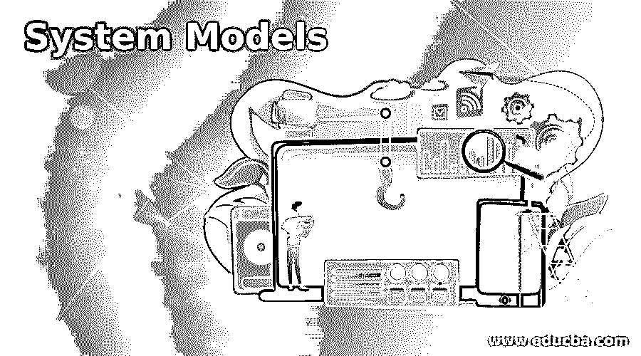

# 系统模型

> 原文：<https://www.educba.com/system-models/>

## 系统模型介绍

模型对于更好地理解项目是必要的。它们代表了软件转换的信息、实现这种转换的功能、用户需要的特性以及转换发生时系统的行为。有各种系统模型，如分析模型、系统模型、上下文模型、行为模型、数据模型和对象模型。

### 各种系统模型

下面给出了各种系统模型:

<small>网页开发、编程语言、软件测试&其他</small>

#### 1.分析模型

分析模型通过在三个不同的领域描述软件来表示用户需求:信息领域、功能领域和行为领域。这个模型是多维的。如果在分析模型中还存在任何缺陷，那么在最终构建的产品中将会发现错误。设计建模阶段依赖于分析模型。分析模型使用图表形式和文本来描述要构建的软件的数据、功能和行为的要求。

大多数情况下，它是由软件工程师、系统分析师、建模师或项目经理设计的。这个模型从用户端描述问题。描述问题的本质时没有考虑解决方案将如何实现，而实现细节表明本质将如何实现。

#### 2.设计模型

设计模型提供了系统的多样性和不同的视图，就像房子的建筑设计图一样。不同的方法如数据驱动、模式驱动或面向对象的方法被用于构建设计模型。所有这些方法都使用一套设计原则来设计模型。设计必须可追溯到分析模型。用户界面应该首先考虑用户。始终考虑要构建的系统的体系结构。专注于数据的设计。组件级设计应该展示功能独立性。用户和内部都必须设计。组件应该是松散耦合的。

#### 3.上下文模型

上下文模型用于指定系统的边界。它代表了整个系统。当我们要设计一个情境模型的时候，我们应该知道答案，什么过程构成了一个系统？社会和组织问题可能会影响系统边界定位的决策。该模型显示了系统及其与其他系统的关系。

#### 4.行为模型

行为模型描述系统的整体行为。为了表示系统行为，有两种模型，一种是数据处理模型，即 DFD(数据流模型)，另一种是状态机模型，即状态图。

**数据流程图:**

它用于建模系统数据处理，也称为功能模型，因为它是定义范围内企业功能的图形表示。它显示了数据的端到端处理。它采用系统的输入-过程-输出视图。它可以很容易地转换成软件，因为它们只是表示数据对象的流程。这个图使软件工程师能够同时开发信息域和功能域的模型。数据处理模型是结构化分析中的核心建模活动。

#### 5.状态机模型

状态是存在的方式或状态。状态图是一种动态模型，它显示了对象在其生命周期中为响应某个事件而经历的状态变化。它用于帮助开发人员更好地理解系统特定领域的复杂功能。它描述了系统响应外部和内部事件的动态行为。同样，它使用各种符号来表示功能，如初始状态、最终状态、状态、转换、事件、动作、历史位置、信号、状态内的动作、自转换。

#### 6.数据模型

分析建模从数据建模开始。软件工程师定义系统所需的所有数据对象。它用于描述系统处理的数据的逻辑结构。ER(实体关系属性模型)是一种数据模型，它描述了系统中的实体、它们的属性以及实体之间的关系。数据建模的元素有助于提供适当的信息来理解问题。

这个数据建模概念被称为基数。ER 图由每个实体或数据对象所需的信息组成，它还显示对象之间的关系。它以表格的形式显示数据的结构。这些对象之间存在三种类型的关系-一对一关系、一对多关系和多对多关系。

#### 7.对象模型

对象模型由以前的属性以及告诉我们如何访问这些属性的过程和方法组成。类建模的目标是描述对象。对象是对应用程序具有意义的概念、抽象或事物。对象模型显示单个对象及其之间的关系。它有助于记录测试用例和讨论示例。了解资源的未覆盖规则定义及其关系非常有用。对象图之所以有价值，是因为它们支持通过对来自问题域的示例建模来调查需求。

### 推荐文章

这是系统模型指南。为了更好地理解，我们在这里讨论介绍和各种系统模型。您也可以看看以下文章，了解更多信息–

1.  [软件开发模型](https://www.educba.com/software-development-models/)
2.  [操作系统中的多线程](https://www.educba.com/multithreading-in-operating-system/)
3.  [什么是系统设计？](https://www.educba.com/what-is-system-design/)
4.  [Indesign 的替代方案](https://www.educba.com/alternative-to-indesign/)

