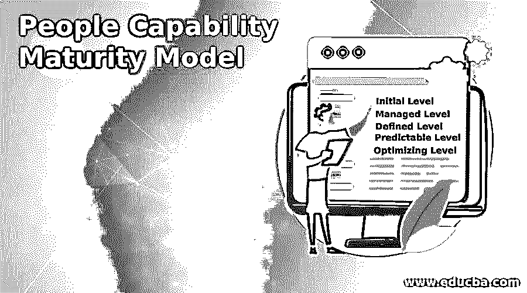

# 人员能力成熟度模型

> 原文：<https://www.educba.com/people-capability-maturity-model/>

## 人员能力成熟度模型简介

下面的文章提供了人员能力成熟度模型的概要。PCMM(人员能力成熟模型)是一种工具，组织使用它来发现与为组织工作的人员相关的关键问题。PCCM 框架主要关注公司的人力资产，发现与人相关的问题。PCMM 工具有助于提高人们的知识、技能和积极性，从而为组织带来更好的工作绩效。人员能力成熟模型框架管理所有与人员相关的流程。

### 什么是 PCMM？

*   PCMM 是一个工作框架，用于组织定义成熟度结构，以提高和发展组织内工作人员的技能。
*   PCMM 框架定义了从开始初始阶段(包括不一致的业务活动)到完成成熟阶段(包括适当的技能开发和工作实践以使组织受益)的完整路径。
*   使用 PCMM 框架，组织可以从他们的业务活动中受益，并找到他们在开展工作活动时在组织中面临的关键人员问题。
*   该框架指导组织开发人员的技能集、知识集，并解决所有[人员]问题，以改善组织的业务活动。
*   PCMM 框架包括实现目标的五个阶段:初始层、管理层、定义层、可预测层和优化层。
*   所有这些级别都有助于组织实现其预期目标，并在市场上与其他组织竞争。

### PCMM 的方法

在 PCMM 框架中，五种方法有助于知识集、技能集的持续改进，有效方法的开发，以及为组织的利益改善人们的心态。这五种方法是五个成熟度等级，它们有自己的重要性，用于定义能力和在组织内开发能力。

<small>网页开发、编程语言、软件测试&其他</small>

5 个 PCMM 成熟度等级定义如下:

#### 1.初始能级

这个阶段处理不一致的管理。在这个阶段，没有定义的过程区域。在这个层次上，组织过程是仪式化的和不一致的。过程是杂乱无章的，因为它们没有被适当地定义和记录，并且组织的成长依赖于个人的努力。由于未正确定义，流程也不在可重复阶段。一个组织的人拥有技能，但他们不知道如何为组织恰当地使用这些技能，他们对组织的情感依恋也较少。这是工作组织中出现流程不一致的主要原因。

#### 2.管理级别

这个阶段处理人员管理的实际过程。在这一阶段，管理者在发展员工实践中起着至关重要的作用。他们遵循不同的做法，如经营业绩，人员配备，调整薪酬，以维持纪律和获得管理水平。所有这些活动都是由经理反复执行来完成的，这对组织可能是有益的。

组织设定了某些目标，为组织工作的每个人都需要达到这些目标，并以最高的效率工作。所有这些实践都是在单位级别上完成的，组织处理绩效和技能集，以开发人员的这种能力。所有包含在 PCMM 框架管理层次中的过程领域是组织内的培训发展、工作环境、绩效管理、人员配备、薪酬和沟通协调。

#### 3.定义的级别

定义的层次是 PCMM 框架的第三阶段，这个阶段处理称为能力管理的过程。这一阶段的目的是发展组织中的能力技能，使其能够很好地工作，从而使组织能够与其他组织竞争，以获得更好的业务活动。组织在维持适当的劳动力方面发挥作用，以便能够获得能力并在组织内开展适当的业务活动。

员工能力包括战略性员工能力和改进的员工能力。在战略性劳动力能力中，它包括对现在和未来的商业活动都有益的活动。劳动力能力的提高对组织是有益的，因为它对于组织的商业活动中涉及的技能集合和实践的改进是重要的。在这个层次上，适当文档的组织定义了标准，并集成了实现其业务目标的过程。

#### 4.可预测水平

可预测的水平是 PCMM 框架的第四阶段。在这个层次上，组织处理在早期阶段开发的能力，以便能够实现其工作需求。在这个层次上，组织开发了足够的技能集来处理业务活动的绩效并管理组织内的工作能力。

随着能力的发展，组织可以预测能力和工作能力，就像能力方法在早期阶段所做的那样。容量预测将有助于组织，并有助于组织内更好的业务活动。

#### 5.优化水平

优化层是 PCMM 框架的最后一个阶段。在这个阶段，整个组织更加关注组织中业务活动的持续改进。持续改进，它可以使工作组和个人都受益，并保持组织内的工作效率。在这个阶段，组织查看所有其他阶段的结果，以便可以在业务活动中进行改进，这对组织是有益的。

### 结论–人员能力成熟度模型

PCMM 框架在所有类型的组织中都扮演着重要的角色。该系统有助于发现关键的人的问题，并帮助实现组织的既定目标和目的。它有助于维护工作环境，这有助于有效地执行业务活动，并有利于整个组织。

### 推荐文章

这是人员能力成熟度模型的指南。在这里我们讨论介绍，什么是 PCMM？和方法。您也可以看看以下文章，了解更多信息–

1.  [软件开发模型](https://www.educba.com/software-development-models/)
2.  [角的 ng 模型](https://www.educba.com/angularjs-ng-model/)
3.  [Laravel 型号](https://www.educba.com/laravel-models/)
4.  [什么是软件开发？](https://www.educba.com/what-is-software-development/)

