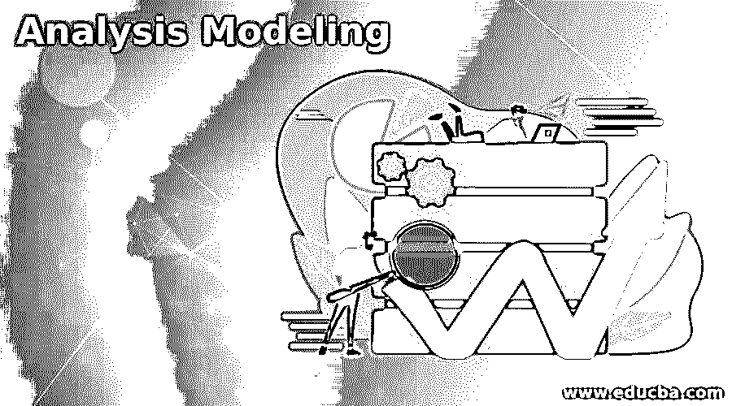

# 分析建模

> 原文：<https://www.educba.com/analysis-modeling/>

## 分析建模简介

模型代表了软件转换的信息，支持这种转换的功能，用户期望的特性，以及转换发生时系统的行为。分析建模通过在三个不同的领域描述软件来表示用户的需求:信息领域、功能领域和行为领域。分析模型是由软件工程师或者建模师或者系统分析师或者项目经理[设计的。为了描述需求，它使用图表形式和文本。](https://www.educba.com/careers-as-a-software-engineer/)

### 分析模型的原理

原则对于建立有效的分析模型是必要的。

<small>网页开发、编程语言、软件测试&其他</small>

*   **表示信息域:**信息域表示从最终用户或外部系统和设备流入系统的数据流，通过用户界面或网络接口流出系统的数据流，以及收集和组织永久需要的数据对象的数据存储。
*   **代表软件功能:**软件功能负责系统中的数据流。它还支持那些用户可见的功能，这些功能对最终用户是有益的。它们还会影响内部和外部系统元素。
*   **表示软件行为:**软件行为表示软件与外部环境交互的方式。用户提供的输入、外部系统提供的控制数据以及通过网络收集的监控数据会导致软件以不确定的方式运行。
*   **上述三种表示的划分:**描述信息、行为和功能的模型应该以分层的方式进行划分，以获得系统的详细视图。这对难以解决的复杂问题很有帮助。一个大的复杂问题被分成子问题，直到每个子问题相对容易理解。这个概念被称为划分，是分析建模的关键任务。
*   **从本质走向实现:**分析建模从用户的角度描述问题。描述问题的本质时没有考虑解决方案将如何实现，而实现细节表明本质将如何实现。

### 分析模型的经验法则

Arlow 和 Neustadt 为分析建模创建了经验法则。

这些规则如下:

*   该模型应该关注业务领域中可见的需求。
*   分析模型的每个元素都应该添加到所有需求中，并提供对系统信息领域功能和行为的洞察。
*   在软件的设计过程之后，一些功能和非功能模型需要更多的时间来设计。
*   它保证了分析模型为所有股票持有人提供价值。
*   将整个系统的耦合降至最低。表示类和函数之间的关系很重要。各职能部门之间的相互联系非常紧密，因此需要努力减少这种相互联系。
*   它使模型尽可能简单。

### 分析建模方法

下面是提到的方法:

*   **情境分析:**是展现系统的情境或环境的外部视点。
*   **结构化分析:**是展现系统或数据架构的结构化观点。它涉及像实体关系图这样的数据模型。它考虑数据和将数据转换成称为数据对象的独立实体的过程。数据对象定义属性和关系。这个过程告诉我们如何操作和转换数据。它还表示数据对象的流程。
*   **行为分析:**表现系统行为的是行为视点。软件工程师选择一种方法:最好的软件需求和通向软件设计的最有效的桥梁。分析模型导出建模元素。每个元素的规格可能因项目而异。
*   **面向对象分析:**它侧重于类的定义。它提供了面向对象的设计方法，如 UML 和统一过程分析。它执行类的协作来满足用户的需求。

### 分析建模的要素

以下是提到的要素:

*   **数据字典:**数据字典是系统模型中使用的所有名称的列表；包括对实体、它们的属性和关系的描述。
*   **数据流图:**数据流图对系统的数据处理进行建模。
*   **状态转移图:**表示动态模型，表示对象在其生命周期内为响应某一事件而经历的状态变化。
*   **实体关系图:**由每个实体或数据对象所需的信息组成，显示对象之间的关系。它以表格的形式显示数据的结构。
*   **数据对象描述:**表示一个实体的复合信息，以便软件理解。

### 分析建模的重要性

下面给出了提到的重要性:

*   分析模型是多维的。
*   设计建模阶段完全依赖于分析模型。
*   如果在分析模型中存在任何缺陷，那么在最终构建的产品中就会发现错误。

### 特征

下面给出了分析建模的特征:

*   很好理解。
*   提供 3C，即正确性、完整性和一致性。
*   直截了当的复习。

### 推荐文章

这是一个分析建模指南。这里我们讨论介绍、原则、经验法则、方法、要素、重要性和特征。您也可以看看以下文章，了解更多信息–

1.  [什么是静态分析](https://www.educba.com/what-is-static-analysis/)
2.  [静态分析工具](https://www.educba.com/static-analysis-tools/)
3.  [统计分析类型](https://www.educba.com/statistical-analysis-types/)
4.  [网络分析工具](https://www.educba.com/network-analysis-tools/)

