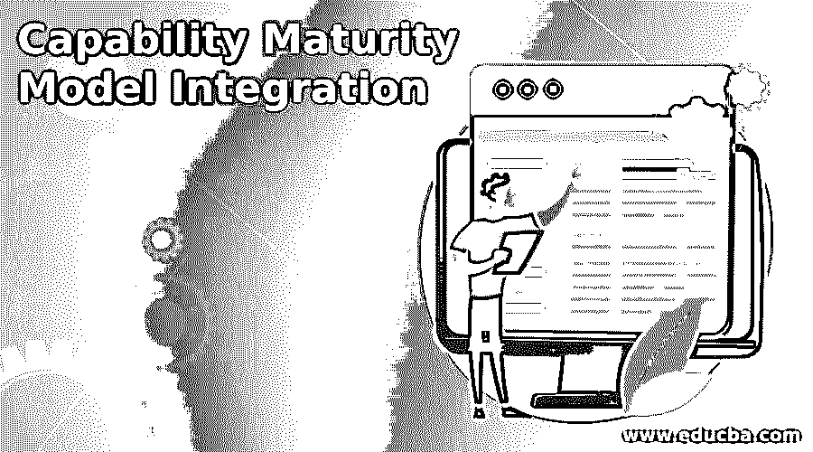

# 能力成熟度模型集成

> 原文：<https://www.educba.com/capability-maturity-model-integration/>

## 能力成熟度模型集成简介

能力成熟度模型是在软件过程改进框架中应用的成熟度模型。能力成熟度模型是一种用于质量保证的特定方法。能力成熟度模型集成(CMMI)用于在组织中实施质量保证。它描述了一个从临时的、不成熟的过程到成熟的规范过程的进化改进路径，描述了有效软件过程的关键要素。

能力成熟度模型集成包括软件开发和维护的规划、工程和管理的关键实践，有助于提高组织满足成本、进度、功能和产品质量目标的能力。它有助于判断组织软件开发过程的成熟度，并将其与行业的实践状态进行比较。

<small>网页开发、编程语言、软件测试&其他</small>

### 能力成熟度模型集成的级别

在能力成熟度模型集成中，有 5 个层次的过程成熟度。

*   第一级初始:软件过程的特点是临时的和混乱的。定义的过程很少，成功通常取决于个人的努力。
*   第二级可重复:建立基本的项目管理流程，以跟踪成本、进度和功能。然后，相同的过程被用于在具有类似应用的项目上重复先前的成功。
*   第三级定义:管理和工程活动的软件开发过程被记录并集成到组织的标准软件开发过程中。所有项目都使用组织标准软件过程的经过批准的定制版本来开发和维护软件。
*   第四级管理:收集软件过程和产品质量的详细度量。软件过程和产品都被理解和控制。
*   **第五级优化:**持续的流程改进是通过流程的持续反馈和灌输创新理念和技术来完成的。

在这个层次上，整个组织关注于以前项目的连续数量反馈，这些反馈用于改进项目管理。这个层次的软件过程可以被描述为持续改进他们项目的过程性能。改进是通过对现有流程的增量增强和使用新技术和方法的创新来实现的。

### 关键流程领域

上述级别被分解为几个关键流程领域，如下所示:

*   **流程变更管理:**识别不良原因，防止不良再次发生。
*   **技术变革管理:**识别有益的新技术，并以有序的方式整合它们。
*   **缺陷预防:**持续改进流程，以提高质量生产率，从而降低开发进度和成本。

### 过程领域活动

*   建立软件过程改进计划，激励组织成员改进组织的过程。
*   负责组织软件过程活动的小组也控制着软件过程改进活动。
*   组织根据文档过程开发和维护改进软件过程的计划。
*   对应于软件过程改进计划执行软件过程改进活动。
*   组织的成员加入团队，为指定的过程领域改进软件过程。
*   安装软件过程改进是为了在将它们引入正常实践之前确定它们的好处和有效性。
*   维护软件过程改进活动的记录。
*   软件工程师根据事件驱动的软件过程改进活动的状态和结果接收反馈。

### 过程分析和建模

*   流程分析是研究现有流程，了解流程不同部分之间的关系，并与其他流程一起进行分析。
*   它是关于记录开发过程的。
*   有不同的流程模型。现有的过程模型和过程标准。
*   总是建议从现有模型开始过程分析。
*   这是深入分析流程片段而不是一次性分析整个流程的最佳技术。

### 能力成熟度模型集成的缺点

*   能力成熟度模型集成没有描述如何创建一个有效的软件开发组织。
*   它度量的特征实际上很难在组织中实现。

### 结论

产品质量取决于工艺。如果过程薄弱，就会导致产品质量差。除非产品中的缺陷或错误被消除，否则无法保证产品的质量。质量保证是验证或确认产品和服务是否符合顾客体验的过程。能力成熟度模型集成用于实现这种质量保证。在这里我们已经看到了这些概念及其过程。

### 推荐文章

这是能力成熟度模型集成的指南。在这里，我们讨论介绍、级别、关键过程领域、过程领域活动、分析和建模、缺陷。您也可以看看以下文章，了解更多信息–

1.  [优质车型](https://www.educba.com/course/quality-models-training/)
2.  [软件开发模型](https://www.educba.com/software-development-models/)
3.  [软件工程中的设计建模](https://www.educba.com/design-modeling-in-software-engineering/)
4.  [什么是 API 集成？](https://www.educba.com/what-is-api-integration/)

