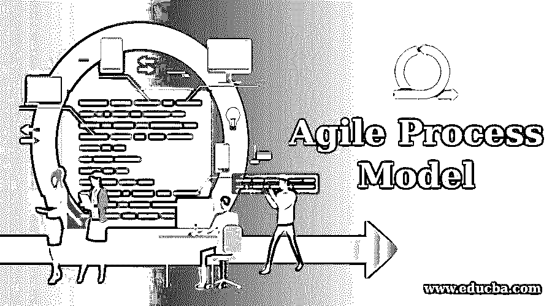

# 敏捷过程模型

> 原文：<https://www.educba.com/agile-process-model/>

## 敏捷流程模型简介

在 IT 组织中，当软件被开发时，它的开发过程就与一种方法相关联。有各种各样的模型可以用来开发软件。著名的包括瀑布模型、敏捷过程模型、RAD 模型、原型模型、极限编程方法等。模型的选择取决于许多因素，如交付所需的时间、资金、软件的重要性、团队的技能、客户参与等。传统上，许多组织在他们的开发过程中使用瀑布模型，但是这种模型有更多的缺点。这种瀑布模型是刚性的，不能容易地接受变化，而且它需要大量的文档。为了克服这样的缺点，敏捷过程模型被引入，它更关注于交付工作软件。敏捷可以很容易地适应变化，并在交付软件方面显示出巨大的成果。这就是它在 it 开发人员和组织中如此受欢迎的原因

### 敏捷过程模型的阶段

敏捷模型鼓励在软件开发生命周期 SDLC 中实践开发和测试的连续迭代。在这里，开发和测试活动一起执行，以便更好地跟踪缺陷。这是瀑布模型的主要缺点之一。

<small>网页开发、编程语言、软件测试&其他</small>

敏捷流程模型如下:

*   混乱
*   极限编程
*   适应性软件开发
*   DSDM 动态系统开发模型
*   透明的
*   特性驱动开发

让我们来看看每一个阶段所涉及的内容:

#### 1.混乱

团队应该有适当的沟通，每个成员都不应该有任何开销。工作需要分担，必须并行完成。该流程可适应业务和技术挑战。

scrum 中的阶段模式有:

*   **Backlog:** 以故事的形式列出需求，按降序排列优先级。
*   **Sprints:** 这个基本的工作单元需要实现 backlog 需求包。
*   Scrum 会议:每天至少需要 15 分钟的站立时间，这样 sprint 数据包中的任何障碍都可以被清除。
*   **评审和演示:**将会有评审和演示，这样工作包就可以被跟踪，如果有任何变化，也可以被跟踪。

#### 2.极限编程

极限编程 XP 在需求经常变化的地方非常有用，这些变化可以很容易地被合并。它基于面向对象的方法。它遵循产品在其开发生命周期中的短期发布。

该模型的每次迭代都有以下阶段:

*   **迭代计划:**在这个阶段，需求被理解并被起草为故事和子任务。
*   **设计:**这个阶段负责设计实现。
*   **编码或实现:**需求被编码。
*   测试:对实现进行严格的缺陷测试。

#### 3.适应性软件开发

在这种方法中，一组个体试图获得一个主要问题的解决方案，这对于特定的个体代理来说可能是困难的。更加强调群体沟通和适应性协作。

阶段包括:

*   **推测:**获取复杂需求。
*   **合作:**要求共同工作以获得期望的结果。
*   **学习:**团队必须增强他们的知识，解决复杂的需求是很好的学习。学习可以来自技术回顾、回顾会议。

#### 4.DSDM 动态系统开发模型

DSDM 是一种快速应用程序开发方法，有严格的交付时间表。DSDM 最重要的活动是用户积极参与，团队成员被允许做决定。频繁发布新闻稿是 DSDM 的特点之一。

DSDM 的发展框架阶段如下

*   获得完整的需求细节和约束，并将进行可行性研究。
*   对于商业研究，理解软件的功能需求。
*   设计和构建迭代。
*   履行

#### 5.透明的

这是一个敏捷软件开发模型，它关注团队中的人和他们的工作，而不是过程和工具。Crystal model 坚信，人的技能、团队合作以及他们之间的沟通对产品成果非常重要。

水晶方法如下。

*   **清除:**针对小而低的临界努力。
*   **橙色:**用于中等规模的关键项目。
*   **橙网:**典型的电子商务。

#### 6.特性驱动开发

顾名思义，FDD 通过关注“特性”的迭代来管理软件开发过程。这些特性可能是产品特性，但也可能类似于 sprint 中的用户故事

项目生命周期的 FDD 模型如下:

*   开发一个整体模型
*   建立认为必要的功能列表
*   根据特征进行计划
*   按特征设计
*   通过功能构建或实现。

### 敏捷测试和方法

敏捷测试是敏捷开发过程的核心之一，不像瀑布模型那样，开发和测试是线性和连续的。但是在敏捷开发中，测试是同时进行的。

敏捷的测试方法有:

*   **行为驱动的开发 BDD** :在 BDD 中，测试人员、开发人员和所需的业务分析人员将交流并创建集中交流的测试场景，这样就不会有任何遗漏。这些场景是以特定的格式捕获的。BDD 的思想是创建场景，构建最初会失败的测试，并构建可以与测试场景一致的软件功能。
*   **验收测试驱动开发(ATDD)** :在这里，客户、开发人员和测试人员将定义、接受并执行测试。客户带来问题，编码人员将解决问题，测试人员将测试实现是否符合客户的要求。
*   **探索性测试:**这里测试设计和测试执行一起进行。这种类型的测试更侧重于工作软件的测试。
*   **基于会话的测试:**与探索性测试有相似之处，但它的主要焦点是确保软件得到完整和全面的测试。

### 我们什么时候使用敏捷模型？

敏捷模型在以下情况下是有益的:

*   当有频繁的变更需要实施时。
*   当焦点更多地放在开发工作软件而不是文档上时。
*   当计划不严格，业务场景不稳定时。

#### 敏捷模型的优点和缺点

以下是敏捷流程模型的优点和缺点:

**优点:**

*   由于他们经常参与，因此客户满意度较高。
*   测试与开发同时进行，因此可以更好地依赖软件。
*   评审和 emo 确保开发的软件遵循标准。
*   工作软件开发频繁。
*   变化很容易被理解和适应。
*   也欢迎后期修改。
*   更加重视沟通和团队合作。

**缺点:**

*   对工作需求的估计有时可能会出错，因为它对计划的压力很小。
*   对文档的关注较少，因此有时可能会出现糟糕的文档。
*   对于大型项目和频繁变更的地方，偏离轨道的可能性更大。

### 推荐文章

这是一个敏捷过程模型的指南。在这里，我们讨论了敏捷过程模型的简要概述及其不同阶段和优缺点。您也可以浏览我们推荐的其他文章，了解更多信息——

1.  [SDLC 与 STLC–最大差异&对比](https://www.educba.com/sdlc-vs-stlc/)
2.  什么是敏捷测试？| 7 大原则&的好处
3.  [SDLC 与敏捷|主要差异](https://www.educba.com/sdlc-vs-agile/)
4.  [十大 DLC 面试问题&答案](https://www.educba.com/sdlc-interview-questions/)

