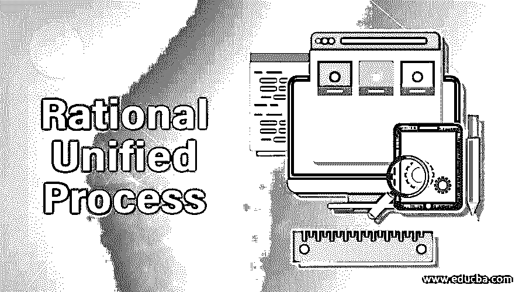
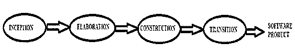

# 理性统一过程

> 原文：<https://www.educba.com/rational-unified-process/>

## Rational 统一过程介绍

Rational 统一过程(RUP)是一个软件开发过程。Rational 软件公司开发它；现在，它从 2003 年开始成为 IBM 的一部分。它控制开发过程并产生高质量的软件产品。它只不过是软件开发过程的模型。这个开发过程包括多个阶段，如业务建模或规划、分析和设计、实现或编码、测试和部署等。

### Rational 统一过程的工作流

该流程经过六个主要工作流程和三个支持工作流程:

<small>网页开发、编程语言、软件测试&其他</small>

**主要工作流程:**

*   业务建模(规划)
*   需求收集
*   分析和设计
*   编码
*   测试
*   部署

**支持工作流:**

*   项目管理
*   配置和变更管理
*   环境管理

Rational 统一过程是用于描述谁、什么、何时以及如何进行开发过程的构建块的组合。

这四个构件是:

*   **(角色)【谁】:**它显示了谁是开发软件产品的责任人。它可能是一个人或一群人作为一个团队一起工作。
*   **(工作产品)**‘什么’:表示将要生产什么。显示软件产品的行为和类型。
*   **(工作流)**“何时”:表示生产软件产品的活动流程图。
*   **(Tasks)【如何】**:它描述了发展将如何发生，即分配给角色执行的工作单元，并提供有意义的结果。

### Rational 统一过程中涉及的阶段

完成 RUP 进程需要四个阶段，每个阶段都有特定的目的。

*   初始阶段
*   精化阶段
*   建设阶段
*   过渡阶段

#### 1.初始阶段

这是发展过程的初始阶段。在此阶段，将确定项目的基本思想和结构以准备业务套件，即团队将决定项目的目的、成功标准、估计成本、风险评估、预定时间和完成项目所需的资源等。这就像是对项目的评估。该项目可能会被取消或考虑取决于它是否未能通过以下标准。

初始阶段的结论是:

*   它提供了一个带有多个参数的通用远景项目计划文档。
*   我们通过最初的项目模型获得项目范围。
*   带有财务分析的初始业务套件。
*   具有不同阶段和商业模式的项目计划。
*   需求理解。
*   实际支出与计划支出。
*   实际支出与计划支出。

#### 2.精化阶段

这是开发过程的第二阶段。在此阶段，分析项目的需求和必要的体系结构，即审查问题，制定项目计划和架构师，并从项目中消除高风险元素。这是四个阶段中最关键的阶段。实际开发和[编码将在接下来的阶段取代](https://www.educba.com/what-is-coding/)。

精化阶段的结论是:

*   它提供了一个包含功能性和非功能性需求的完整项目模型。
*   它提供了完整的软件架构描述。
*   它提供了项目的稳定性，就像产品的远景&产品的架构是否稳定？
*   同样，项目计划会批准还是不批准？
*   实际资源成本相对于计划资源成本是否可接受？

#### 3.建设阶段

这是开发过程的第三阶段。在这个阶段，项目被开发和完成。在这里，所有的特性都被开发并集成到产品中，即软件被成功地设计、编写和测试。因此开发产品将是可部署的产品。它衡量产品的完整性。

施工阶段的结论是:

*   集成在不同模块上的软件产品。
*   它提供了用户手册。
*   产品发布是否稳定？
*   它是否符合客户的要求？
*   实际资源成本相对于计划资源成本是否可接受？

#### 4.过渡阶段

这是开发过程的最后阶段。在这个阶段，软件被发布并交付给公众或客户。根据最终用户的反馈，产品将被更新或改变。这是部署的过程。

过渡阶段的结论是:

*   这是一种“beta 测试”,根据用户的期望来验证产品。
*   它提供最终用户满意与否。
*   所有类型的用户培训手册。

**Note: **It is a development methodology that provides the best way to create software products in the IT industry. Nowadays, the most preferred agile model of SDLC ([Software Development Life Cycle](https://www.educba.com/what-is-sdlc/)) which is derived from the Rational Unified Process (RUP). i.e. a simplified version of it. It is an iterative software development process. Its goal is to deliver a high-quality product that the customer actually wants. It helps prevent resources from being wasted and reduces unexpected development costs.

### Rational 统一过程的优点和缺点

以下是一些优点和缺点:

#### 优势

*   它允许我们根据客户或顾客的需求，在项目的开发生命周期中处理不断变化的需求，也就是说，它欢迎变化。
*   它支持软件产品的增量构建。
*   它提供了软件产品的适当文档。
*   这有助于有效利用资源。
*   它有助于在流程生命周期的早期识别问题。
*   它改善了过程控制和风险管理。
*   它提高了团队的生产力。
*   它有助于降低意外的开发成本。

#### 不足之处

*   这是一个实施起来很复杂的模型，因为它有多个工作流程阶段。
*   对于组织来说，实施小型团队或项目是具有挑战性的。
*   它应该是高度以个人或团队的结果为导向的。
*   它强调在整个软件开发过程中模块的集成，所以这在测试阶段制造了麻烦。

### 结论

本文讨论了 Rational 统一过程(RUP ),这是一个软件开发的迭代过程。它涉及管理需求、基于组件的架构、软件模型、风险控制、欢迎变更和软件质量。

### 推荐文章

这是一个 Rational 统一过程的指南。在这里，我们讨论 Rational 统一过程中涉及的介绍和阶段。您也可以看看以下文章，了解更多信息–

1.  [什么是软件开发？](https://www.educba.com/what-is-software-development/)
2.  [网页开发软件](https://www.educba.com/web-development-software/)
3.  [敏捷生命周期](https://www.educba.com/agile-lifecycle/)
4.  [什么是 SDLC](https://www.educba.com/what-is-sdlc/)

