# StarUML 下载

> 原文：<https://www.educba.com/staruml-download/>

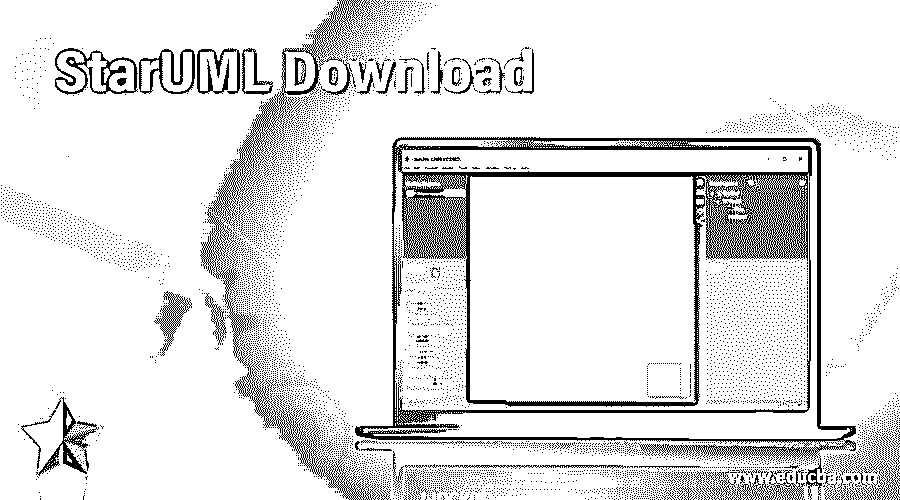

## StarUML 下载简介

StarUML 是一个支持 UML 的软件建模平台，其中使用了模型驱动的体系结构，可以为功能和扩展定制系统环境，从而可以提高系统中使用的产品的生产率和质量，并通过管理和修改系统来下载 StarUML，以适应系统要求，并在与软件开发工具集成的帮助下创建独立于平台的模型。

### StarUML 的先决条件

安装 StarUML 的系统最低要求如下所述

<small>网页开发、编程语言、软件测试&其他</small>

*   StarUML 的安装应使用英特尔奔腾 233MHz 或更高版本的处理器。处理器对于任何软件的安装都很重要，因为它满足应用程序的要求。应用程序的处理速度和扩展取决于处理器。较高版本有助于软件自动更新其较高版本，并将工具与软件应用程序集成。
*   系统中需要 Microsoft Internet Explorer 5.0or 或更高版本的浏览器，以便可以通过浏览器进行更新。只有通过系统中的浏览器，才能方便地更新应用程序和下载模板。
*   系统的内部内存至少应为 128 MB RAM，建议使用 256 MB RAM。软件的安装在系统的内部存储器中，因此对于任何安装应用程序的系统来说，RAM 应该更多。
*   要定制应用程序和安装模板，需要 110 MB 硬盘空间(建议 150MB 空间)。然而，由于该应用程序不需要太多的内存和硬盘空间，因此安装 StarUML 应用程序很容易。硬盘空间要求是最基本的要求，获得硬盘空间非常容易。
*   建议系统使用分辨率更高的显示器，这样可以很容易地看到所绘制的图表，并根据用户的喜好进行修改。1024×768 是推荐的显示器尺寸，这样可以完全精确地看到图表。此外，在应用程序中绘制图表需要鼠标或任何定点设备。需要这个指点设备来修改和更改图表。它并不总是需要通过改变系统要求来修改大小，但可以在鼠标的帮助下调整大小。
*   作为安装软件的基本要求，还需要 CD-ROM 驱动器。

### 如何安装 StarUML？

1.  StarUML 可以从 http://staruml.io/download.下载。选择适合您系统的操作系统版本，然后单击下载按钮。我的是 Windows，而且是为 Windows OS 做的。该文件的大小为 127 MB。

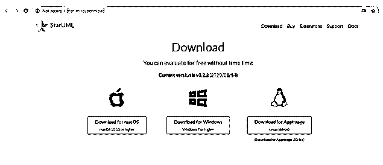

2.  运行。exe 文件。

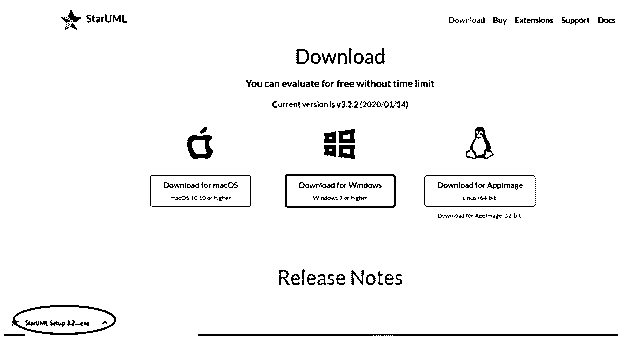

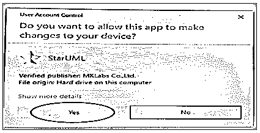

3.  安装后，您可以在桌面屏幕上看到 StarUML 图标。

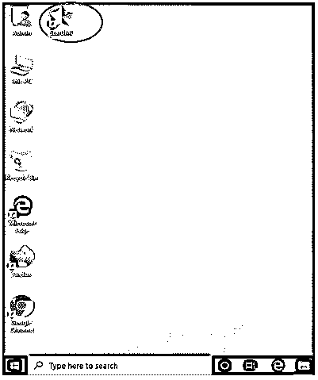

4.  该软件将直接打开，它会要求立即购买选项或评估选项。点击评估。

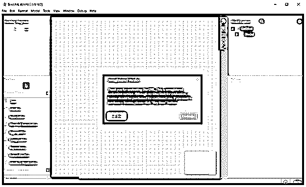

5.  对于评估版本，屏幕显示如下。

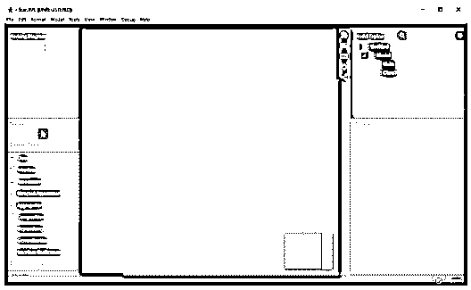

6.  如果您检查 c 盘，您可以在程序文件位置看到 StarUML 文件夹。

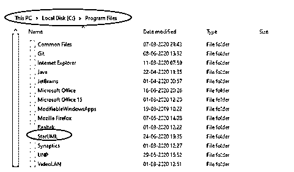

7.  如果你想卸载程序，或者进入控制面板，或者进入 StarUML 文件夹，点击卸载应用程序文件。

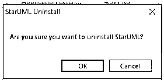

单击确定，该程序将被卸载。

8.  如果你想试着用 StarUML 创建一个类，下面解释一个演示。
9.  拖放类到屏幕上，一个新的类就形成了。双击 class1，我们可以重命名模型中的类名。

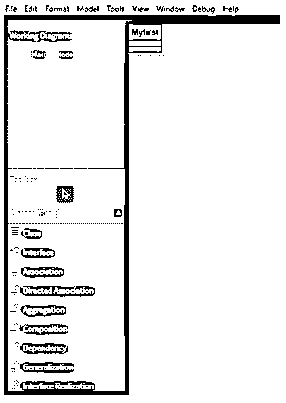

10.  从文件选项中，选择模板，然后 StarUML 的模板版本可以在系统中使用。我们可以在应用程序中创建一对一、一对多或多对多，并将图表存储在系统中。

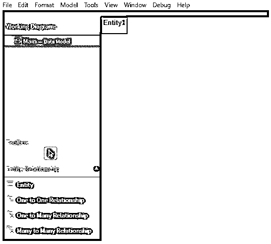

11.  有一些依赖项要和 StarUML 包一起安装。在安装软件包的系统的 CLI 中运行命令 sudo apt-get install -f。
12.  单击帮助按钮，您将看到文档选项。在文档的帮助下，你可以学习并成为 StarUML 的专家。

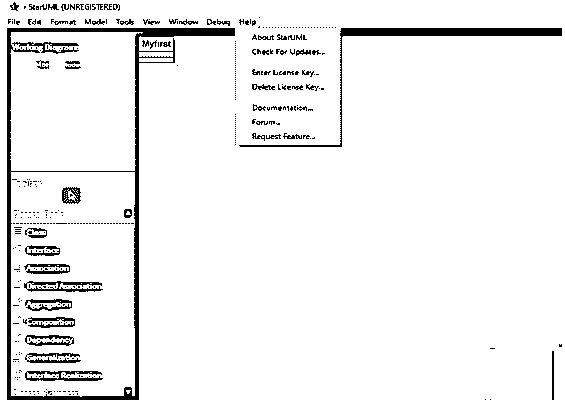

13.  StarUML 中的工具有助于了解系统中的需求，并应用设计模式，以便进行正确的分析来理解和修改图。这些工具是开源的，对于更高的需求，可以从不同应用程序的软件供应商那里购买工具。

### StarUML 下载的优缺点

下面是提到的优点和缺点:

*   没有其他工具可以为用户提供这种定制来绘制图表。它在应用程序中提供定制变量，以修改软件的开发方法或正在构建的平台或正在使用的语言。这些修改有助于用户在使用应用程序时感到舒适。
*   可以在应用程序中轻松创建平台无关的模型。或者，如果需要，可以创建特定于平台的模型，并根据用户的需要生成代码。
*   StarUML 中的所有功能都以 XML 格式管理。这个 XML 解析器有助于通过易读的结构有效地修改代码。由于 XML 在世界范围内广泛使用，任何人都可以使用解析器，将代码格式更改为他们知道的语言。这有助于他们根据自己的需要使用应用程序和模板。
*   StarUML 的主要缺点是用户不能在其他操作系统中使用该应用程序。它只适用于 Windows 应用程序。此外，UML 的更新不支持 StarUML，因为它只支持 UML 2.0。
*   系统中导出的图表不支持 SVG 格式，因此应用程序只能在支持的格式中使用。

所有的关键功能，包括下载，安装要求与数字解释在这里。虽然对于初学者来说，从 StarUML 开始看起来很复杂，但它可以帮助用户根据自己的喜好绘制图表，并根据需要更改平台。

### 推荐文章

这是一个 StarUML 下载指南。在这里，我们讨论如何安装 StarUML 的最低要求的系统安装以及优点和缺点。您也可以看看以下文章，了解更多信息–

1.  [星形网络拓扑](https://www.educba.com/star-network-topology/)
2.  [UML 依赖关系](https://www.educba.com/uml-dependency/)
3.  [什么是星型模式？](https://www.educba.com/what-is-star-schema/)
4.  [UML 活动图](https://www.educba.com/uml-activity-diagram/)

