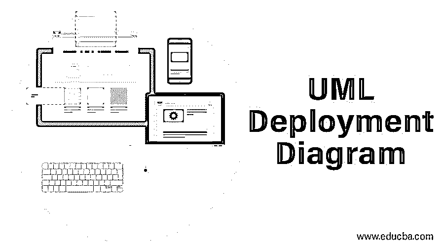
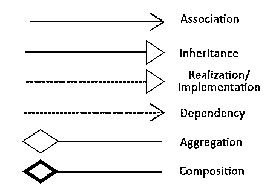
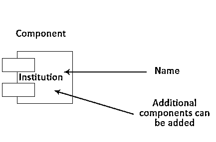
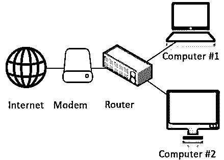

# UML 部署图

> 原文：<https://www.educba.com/uml-deployment-diagram/>

## UML 部署图简介

UML 部署图是 UML 图的一种类型，用于定义特定产品执行软件的硬件要求；基本上，它将软件设计需求映射到执行软件设计的物理系统，并可视化软件如何与硬件交互以完成测试执行。为了设计部署图，使用了节点、组件、工件和接口符号。

### 部署图的目的

现在让我们讨论一下部署图的目的。

<small>网页开发、编程语言、软件测试&其他</small>

部署图中的术语“部署”本身指定了该图的角色。它用于描述实际部署软件组件的硬件组件。UML 通常用于描述系统的软件工件。然而，UML 部署图是 UML 图的一个特例，它主要强调系统的硬件拓扑(这里，拓扑意味着布局)。

#### 部署图的主要用途

*   来表示系统的硬件拓扑。
*   表示不同的硬件组件如何相互连接，以及这些硬件组件如何用于部署软件组件。

### 符号和组件

让我们首先了解我们将经常使用的两个基本术语(符号和组件)。

#### 标志

UML 部署图符号代表一个节点、对象、节点实例、组件实例(这里的组件实例是指组件的复制品或副本)、接口等。这些符号帮助我们为文档创建准确的图表。

一个类似的图像可以参考

#### 成分

组件代表软件所在的不同硬件节点。

注意，是符号连接了不同的组件，并帮助我们制作一个好的 UML 部署图。

### 如何绘制部署图？

这是本文最重要的部分之一，因为我们将讨论如何绘制部署图。部署图中最重要的组件是节点。节点只是用于部署应用程序的物理硬件。因此，高效且良好的部署图非常重要，因为它涵盖了以下重要方面。这些重要方面如下:

*   可维护性:设计的系统应该易于维护。
*   可移植性:系统应该以一种易于实现新变化的方式来设计。
*   性能:系统应该具有高性能。
*   可伸缩性:系统应该足够灵活，以便于扩展。

在制作部署图之前，必须确定并正确理解两个重要的工件，这两个重要的工件是节点以及这些节点是如何互连的。

让我们用一个简单的例子来理解这一点。

**例子**

让我们准备一个简单的部署图，它由以下组件组成。

1.  服务器。
2.  调制解调器。
3.  [路由器。](https://www.educba.com/what-is-router/)
4.  手机、打印机等用户节点。

假设这个示例是一个基于 web 的简单应用程序，它托管在一个使用参与服务器的集群环境中。像 mobile 这样的用户节点将通过调制解调器和路由器使用互联网连接我们的应用程序。

一个简单的部署图考虑了上述所有要点。

现在，我们可以假设我们可以制作一个简单的部署图。让我们讨论下一个话题，在哪里可以使用部署图。

### 在哪里使用 UML 部署图？

系统工程师主要消耗部署图。这些图有助于我们描述物理组件，如涉及的硬件、参与节点、它们的分布以及它们如何相互连接。部署图可以假定为软件组件所在的硬件组件。

#### 部署图可用于以下情况:

*   可视化系统的硬件拓扑。
*   来表示系统的硬件细节。
*   来表示分布式应用程序的硬件细节。
*   &更多…

### 结论

UML 部署图非常重要，因为它帮助我们形象化，并帮助我们更好地理解整个系统。一个简单而有效的 UML 部署图极大地帮助我们制作一个可视化的图表，展示这些硬件组件是如何相互链接的，每个硬件组件之间的关系，以及软件是如何驻留在这些硬件组件中的。此外，还有其他类型的 UML 图，理解它们对于有效地构建系统也很重要。

### 推荐文章

这是一个 UML 部署图指南。在这里我们讨论部署图的目的，如何绘制部署图，在哪里使用 UML，符号，以及带有图的组件。您也可以浏览我们的其他相关文章，了解更多信息-

1.  [UML 用例图](https://www.educba.com/uml-use-case-diagram/)
2.  [UML 图的类型](https://www.educba.com/types-of-uml-diagrams/)
3.  [UML 图软件](https://www.educba.com/uml-diagram-softwares/)
4.  [UML 组件图](https://www.educba.com/uml-component-diagram/)

