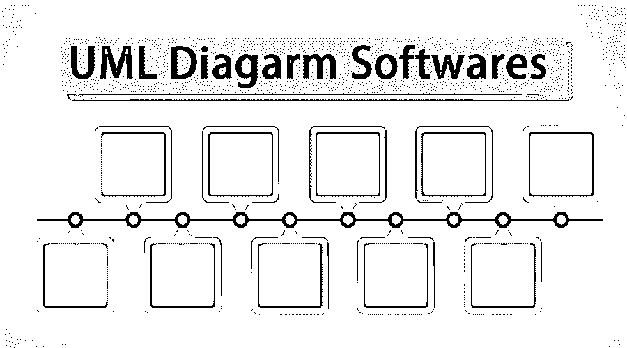
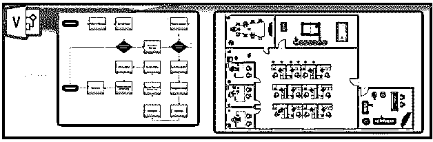
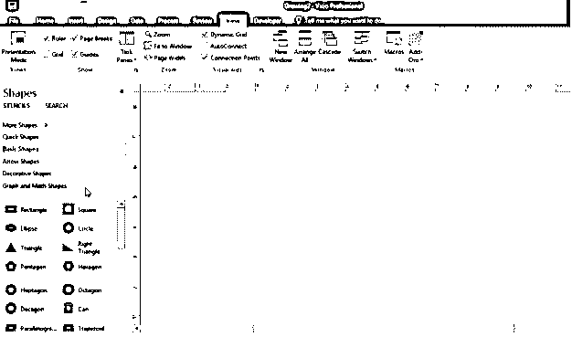
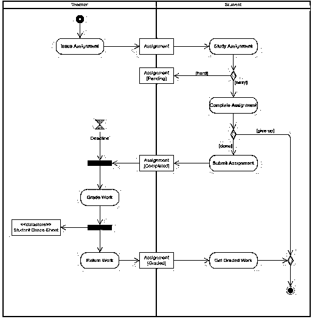
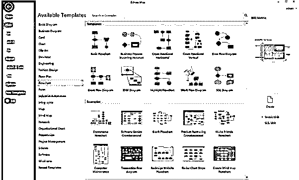

# UML 图表软件

> 原文：<https://www.educba.com/uml-diagram-softwares/>

## UML 图软件介绍

UML 图主要应用于需求获取和需求研究中的 UML 建模方法。UML 绘图软件使您能够生成 UML 图，仅此而已，尽管 UML 建模工具有助于维护您的建模工件，以及实现各种图中组件的重用。一些 UML 建模工具提供了高级的建模特性，如模型修改、报告生成、代码架构等等。UML 图软件将集成您当前开发环境中的精华，从而提高您的生产力。

### 不同的 UML 图软件

下面给出了不同的 UML 图软件:

<small>网页开发、编程语言、软件测试&其他</small>

#### 1.矢量图绘制软件

Microsoft Visio 是一个应用程序，允许您创建视觉上与众不同的专业图表，可用于各种设置、主题和专业。这是一个工具，它让你可以用一个精致而专业的外观来传达复杂的信息或概念。

Visio 背后的想法是提供标准化的工具，使您能够使用称为形状的基本构建块轻松地组合绘图或图表。这种图表制作方法使任何人都有可能通过将形状组合在一起来创建令人惊叹的图表。Visio 创建所有类型的 UML 图，如 UML 活动、UML 协作、UML 类、 [UML 部署](https://www.educba.com/uml-deployment-diagram/)、UML 用例、 [UML 组件](https://www.educba.com/uml-component-diagram/)、UML 序列、UML 状态图等。

在 Visio 中，形状可以是简单的基本形状，也可以是非常复杂的形状，并且可以包含大量的数据。Visio 功能丰富，您甚至可以创建和导入自己的形状，如徽标或图像。通常，图表将使用特定类型的形状，在 Visio 中，这些形状被分组到称为模具的类别中。模具是预定义的形状组，用于轻松创建 UML 图。

在许多类型的 UML 图中，连接线是将一个形状连接到另一个形状的线条和箭头。连接线用于将您的形状连接在一起，以确保步骤、想法或过程按照正确的顺序进行。该应用程序允许最终用户通过导入的源代码创建 UML 图，并通过数据连接将当前数据与它们结合起来。Visio 最终用户还可以创建几个附加的图表类别，包括流程图、甘特图、网络图、组织结构图等等。

#### 2.视觉范式

Visual Paradigm 提供免费和商业版。社区版完全免费，有无限数量的图表、项目大小和形状。创建所有类型的 UML 图还创建 ER 图、ITIL 图、流程图、组织原理图、平面图等等。

尽管如此，视觉范例在线快速发布是一个绝对免费的绘图应用程序；这继续强调了各种好处以及将帮助大多数人的有效工具。

快速、迅速地绘制出令人惊叹的专业图表。以下是一些重要的特征:

*   **惊人的素描:**开始使用不同的格式选择，包括形状以及，连接器颜色，超过 50+连接器类别，背景颜色，RTF 标题，字体选择，阴影效果，等等。
*   **用户友好:**通过拖拽&来生成和附加形状。连接器被链接以形成边缘，并且不能被单独搁置。(与许多其他应用相反)。
*   立即开始所有预先制定的计划主题。提供了许多主题。
*   定位信息可以帮助您的放置形状完美。
*   方便地将文本、注释、外部图片和网络链接添加到图表中。
*   位于云中，适用于所有操作系统，如 Windows、Mac OS、Linux，并支持所有网络浏览器。
*   细节形状将文本内容列表立即重塑为计划。
*   方便地打印以及导出为不同的格式(PNG、JPG、SVG、GIF 和 PDF)。
*   多页支持。
*   将所有图像存储在 Google Drive 中。

#### 3.埃德劳

Edraw UML 图软件很容易生成带有预定义图标的相当专业的 UML 图。拖放式用户界面非常容易关注。他们有网格线以及智能指南，以帮助您对齐，以及，设计图表以及最少的工作。通过多种导出选项(包括 Visio、PDF、Word、PPT、SVG、JPG、Html 等)来显示性能非常简单。以及云的特性允许团队努力。

低价的跨平台 UML 应用程序。

想象一下，如果你知道它们的独特之处，你会更加喜欢它。

*   提供了一万多个预装的传单图标，组合成不同的类型，让最终用户帮助你拖放和修改。
*   一个一体化的应用程序，能够建立远远超过 260 个绘图类别。
*   最终用户应该使用嵌入式草图应用程序来设计他们的形状，并保护其长期使用。
*   最终用户可以免费享受整个生命周期的更新，同时购买生命周期许可证。
*   不断增加的专业构建的 UML 主题和案例可以让最终用户快速开始绘制草图。

#### 4.阿尔古姆

ArgoUML 无疑可能是最著名的桌面开源免费 UML 应用程序。即使它不再被管理，大量的建模者使用这个为小任务设计的程序。这是一个著名的基本 UML 软件图免费软件。应用程序可以是独立于平台的。以及最低需求通常是 Java 5。ArgoUML 方便了所有的图类型 UML 版本 1.4 和 UML 概要文件。这个软件还提供了一些吸引人的形状，这些形状不是 UML 常见的部分。如果您正在使用这些类型的形状，您可能会明显偏离您的 UML 标准。因此，确保不会导致任何理解上的复杂情况。您可以使用 OCL(对象约束语言)将有限的细节分配到一个样式中。

ArgoUML 的主要特性:

*   所有类型的 UML 图都是 1.4 版，将支持布局。
*   强烈使用 UML 常规。
*   独立于平台，如 Java 1.5 及以上版本。
*   XMI (XML 元数据交换)支持。
*   导出图表，如 GIF，PNG，PS，EPS，PGML 和 SVG。

市场上有几种可用的 UML 图软件，大部分是昂贵和专业的，大部分是开源和免费的。所以这取决于你选择我们项目的哪个需求。

UML 图软件列表如下:

*   UMLet
*   BOUML
*   StarUML
*   UML Modeller
*   概念图
*   纸莎草
*   Oracle JDeveloper

### 结论

UML 图软件可以被描述为通用符号，以便您对应用程序建模。如果所有这些效应都被广泛验证，那么在开发过程的每一个阶段都可以更加精确地确定其规模。该计数可以由环境应用提供。[软件工程师可能](https://www.educba.com/careers-as-a-software-engineer/)通过对应用程序建模以及跟踪通信来直接衡量；这个人可以忽略行动层面的策略。

### 推荐文章

这是一个 UML 图软件的指南。这里我们详细讨论不同的 UML 图软件及其重要特性。您也可以浏览我们推荐的其他文章，了解更多信息——

1.  [类图](https://www.educba.com/class-diagram/)
2.  [什么是 DBMS？](https://www.educba.com/what-is-dbms/)
3.  [Ubuntu 的使用](https://www.educba.com/uses-of-ubuntu/)
4.  [UML 交互图](https://www.educba.com/uml-interaction-diagrams/)

