# UML 对象图

> 原文：<https://www.educba.com/uml-object-diagram/>

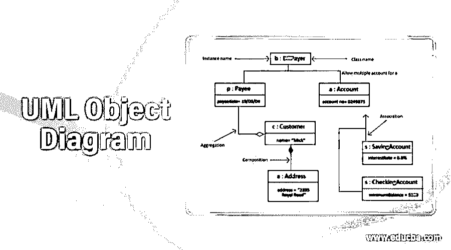

## UML 对象图简介

UML 对象图表示一个类图在特定时刻的一个特定实例。一旦直观地显示出来，你会看到类图的大量相似之处。对象图更喜欢将对象及其关联的集合呈现为一个实例。

### UML 中的对象图是什么？

对象图关注对象集合的属性以及这些对象如何相互对齐。例如，让我们看看下面的对象图:

<small>网页开发、编程语言、软件测试&其他</small>

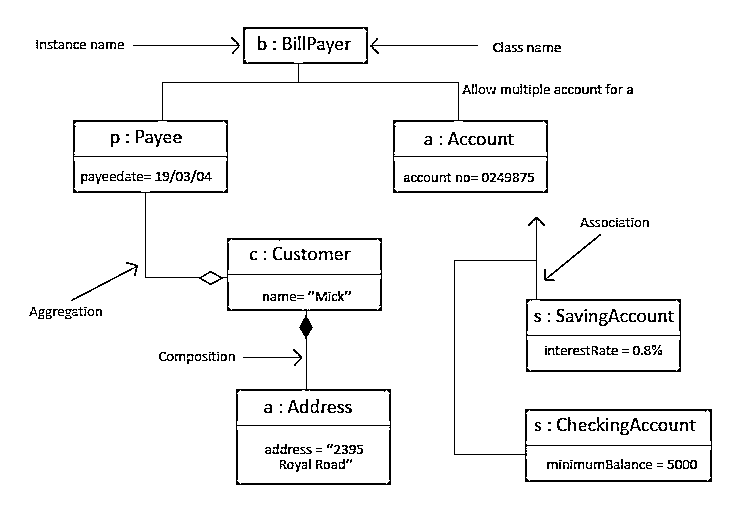

对象图可以被看作类图的一个特例。对象图将利用类图方面的子集，以便将来能够突出类的实例之间的关系。它们在实现类图时很有用。它们不显示任何与类图不同的架构，但是揭示了多样性和功能。

*   对象图描述了在某个时间点上类实例之间的行为关系。
*   这捕获了程序条件下的动态和运行时修改。
*   它可以由结构内部的实体或属性的数据值组成。
*   对象图显示了这些对象在运行时的行为。

虽然对象是类的实例，但对象图是程序中对象在特定时刻的概述，例如它们之间的关系。在应用程序执行的不同阶段，只要需要建模或查看对象的属性值和条件，就需要使用对象图。它们对于模拟复杂过程或计算操作的“自己动手”性能非常有帮助。您可以创建沿途对象的第一阶段和对象的最后阶段的回顾，以了解全貌。因为它显示实例而不是类，所以也称为实例图。

### 基本对象图符号和符号

下面是 UML 的一些对象图，如下所示:

#### 1.对象名称

每个对象都被表示出来，比如一个矩形，它通过对象和类提供名称，并使用冒号加下划线和共享。

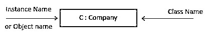

#### 2.对象属性

就像类一样，可以在一个单独的框中列出对象属性。即便如此，与类不同，对象属性必须有分配给它们的值。

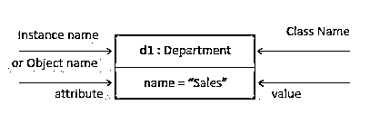

#### 3.链接

链接通常是与关系相联系的实例。当使用应用于类图的线条时，您能够绘制链接。

**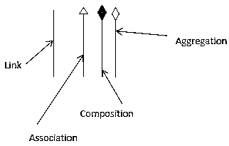

** 

*   **链接:**我们用链接来象征两个对象之间的关系。

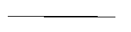

*   **扩展或关联:**关联是两个对象(或类)之间的引用关系。

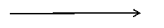

上图中的关联符号

当一个对象使用另一个对象时，它可以被称为关联。当一个对象引用另一个对象的关联时，我们应用关联。该关联可以是单向的，也可以是双向的。我们用箭头来象征联想。

**示例:**管理员类的对象与杂志类的对象相关联。

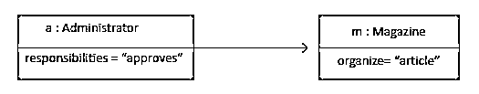

如上图，使用关联的对象图

*   **组成:**组成可以被描述为一种关系形式，在这种关系中，孩子不能独立于差异而发生。

上图中的组成符号

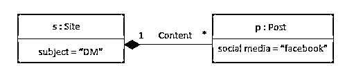

这里 Site 是一个包含 0(零)个或更多实现 Post 的对象的类。称为内容的集合。这意味着一个网站使用许多职位关系。

所以当和孩子独立存在肯定是不可能的时候，我们理想地使用一种复合关系。我们在包含的对象中使用一个填满的菱形，用一条线将它连接到包含的对象。

*   **聚合:**聚合表示“有”关系。

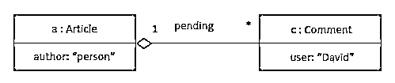

这里的空心钻石不是实心的，而是一个集合体。一篇文章是其内容以及待定和完整评论集的集合。然而，空心钻石并不意味着任何形式的毁灭关系。如果有一个空心的菱形，文章就消失了，未完成的评论也不会被销毁。现在我们在这里需要它，因为待定的注释也是另一个列表的一部分，所以我们不想破坏它们两次。

### 如何制作对象图的示例

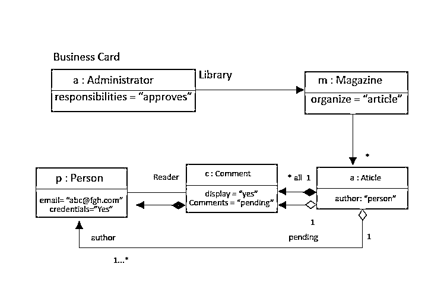

根据上图:

*   杂志和文章之间的界限。消息从杂志流向文章。那是箭头。每一本杂志都有许多文章。*(星号)表示 0(零)或更多。实心菱形表示一种组合关系，即包含或包含关系。在代码中，一个对象实际上会包含另一个对象，不是对一个对象的引用，而是对象本身。换句话说，杂志包含文章。
*   它包含的东西也应该被销毁。杂志有一本字典，它包含作者索引的文章字典，作者是一个人对象。换句话说，这实际上是一个哈希表。UML 调用，这是一个合格的关联。所以在每个限定的关联中:一个键(属性)和值。由键索引的对象，对象本身是关联的值。

**举例:**

`class Magazine {
private static instance = new Library();
public static instance() { return instance;  }
private HashMap<Person, Article> articles;
public void displayPendingComments()……
public void iAmApproved (Comment pending)…..`

在对象图中，列出责任，而不是单个方法

### 结论

*   一旦建立了组织数据，UML 对象图就很有帮助。通过简单有效地构建属性以及类实体的关联，我们可以将这些类型的类图特性映射到带有实例的实体 beans。对象属性映射到抽象持久字段和相关任务的发现技术映射到抽象获得对关系字段选项的访问。
*   可导航性决定了关系访问方法是出现在同等相关的实体 beans 中，还是仅仅出现在单个实体中。实际上，多重性符号决定了相关字段、生命周期问题和流动删除特性的正确类别。因此，对象图是结构的概述，也是它可以管理的数据的概述(只是它必须如何被管理)。

### 推荐文章

这是一个 UML 对象图指南。这里我们已经讨论了什么是 UML 图对象？如何制作对象图？以及它们的基本对象符号和符号，以及分别带有适当示例的属性。您也可以浏览我们推荐的其他文章，了解更多信息——

1.  [UML 图的类型](https://www.educba.com/types-of-uml-diagrams/)
2.  [UML 用例图](https://www.educba.com/uml-use-case-diagram/)
3.  [UML 顺序图](https://www.educba.com/uml-sequence-diagram/)
4.  [Python 中的字典](https://www.educba.com/dictionary-in-python/)

