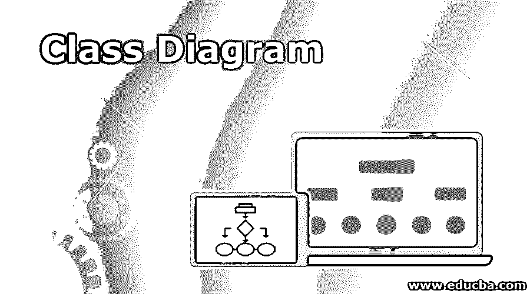
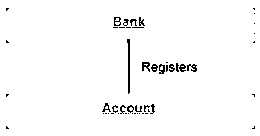
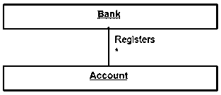
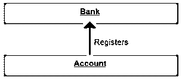
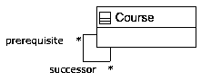
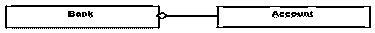
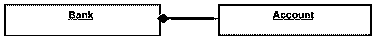
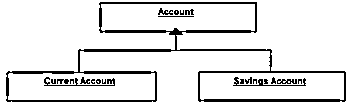
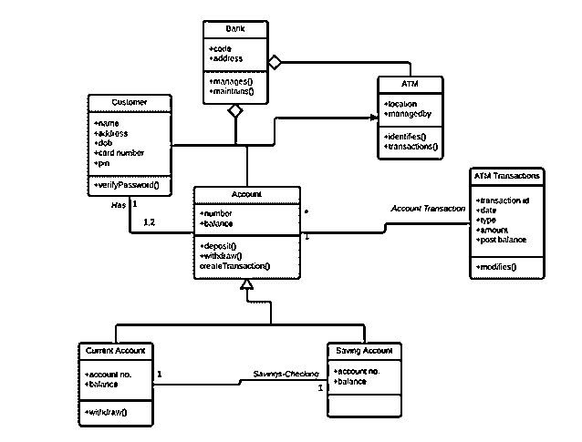

# 类图

> 原文：<https://www.educba.com/class-diagram/>

## 类图介绍

类图是 UML 图的一种类型，用于通过使用不同对象之间的类、属性、关系和操作来映射系统的结构来表示静态图。类图有各种各样的类；每个有三个部分；第一部分包含类名，即参与活动的类或实体的名称，第二部分包含显示类的各种属性的类属性，第三部分包含显示由类执行的各种操作的类操作，关系显示两个类之间的关系。

<small>网页开发、编程语言、软件测试&其他</small>

### 关系

在类图中，类之间必须存在关系。不幸的是，各种关系的相似性往往让人难以理解。

下面是类图中存在的关系。

#### 1.联合

在关联关系中的两个其他类之间，关联类构成了它的一部分。通过将关联关系附加到关联类，可以获得关于该关系的附加信息。各种操作、属性等。，存在于关联类中。

下图显示了银行和帐户之间的关联。

#### 2.多样性

元素的数量或基数可以通过多重性来定义。这是最容易被误解的关系之一，它通过提供非负整数区间来描述特定元素允许的实例数量。它有下限和上限。例如，一家银行会有许多注册账户。因此，在 account 类附近，会出现一个星号。

#### 3.定向联想

这是类图中的单向关系，确保控制从一个分类器流向另一个分类器。可导航性由其中一个关联端指定。两个分类器之间的关系可以通过命名任何关联来描述。箭头指示导航的方向。

下面的示例显示了容器和所包含的之间的箭头关系。

#### 4.自反联想

一个类与其自身的关联称为自反关联，它可以分为对称和非对称类型的关联。在对称自反关联中，每个关联端的语义没有逻辑差异，而在非对称自反关联中，关联的类是相同的，但是在关联端之间有语义差异。

#### 5.聚合

在这种类型的关系中，通过将不同的对象组合在一起来创建更复杂的对象。不同对象组内的交互由聚合定义。对象的完整性受到保护，而组合对象的响应由控制对象决定。总的来说，这些阶层培养了“有关系的人”。

#### 6.作文

它是一种代表整体-部分关系的聚合形式。这里，部分分类器寿命依赖于整个分类器寿命。在一个类中，强生命周期由组合关系表示。这里通常有单向的数据流。一般用实线表示。

#### 7.一般化

在这种关系中，子模型基于父模型。该关系用于描述各种用例图，并确保子类接收父类中存在的属性。子模型可以在泛化关系的帮助下重用父模型的属性。因此，不同的属性只需要在子元素中定义；其余的将从父母那里继承。在这种关系中可能有单亲、多子女或多父母、独生子女的特征。泛化关系中没有名称。它也被称为“是一种关系”。

#### 8.实现

一个模型元素的行为由另一个模型元素的指定行为实现。这种关系没有名字。

### 为什么要用类图？

系统的结构是由类图定义的，类图显示了系统的属性、对象之间的关系等等。它是面向对象建模的支柱，也可以用于数据建模。类图有助于制定预先计划，从而简化编程过程。此外，你可以随时修改类图，因为事后编写不同的功能代码有点烦人。它是一个设计计划，一个系统是基于这个计划建立的。这很容易理解，不需要太多的技术知识。

类图提供了应用程序的静态视图，其与面向对象语言的映射能力使其可以随时用于构造。不像序列图、活动图等。，类图是最流行的 UML 图。

下面是一个类图的用途。

*   设计和分析应用程序的静态视图。
*   一个系统的职责由它来描述。
*   组件和部署图的基础是类图。
*   正向和反向工程受类图的影响。

### 类图的类型

类图可以分为三个部分:

*   上半部分由类名组成，是一个强制组件。
*   中间部分描述了类的性质，并在描述一个类的具体实例时使用了它们。
*   底部描述了类与数据的交互。

此外，UML 分为行为图和结构图，类图位于结构图之下。

### 类图的优点

类图可以在项目的不同阶段实现，是 UML 的核心。在分析过程中，类图通过出现在领域模型上来创建现实的表示。软件建模在设计阶段完成，而代码在实现阶段生成。软件产品的基础是类图，它是任何项目的基本部分。

类图给人一种方向感。通过类图对系统的结构进行了详细的分析，并对不同元素之间的协同作用及其性质进行了概述。它读起来又快又容易，如果有合适的软件，也可以很容易地创建。任何需要创建的系统，类图都是其基础。

### 利益

*   任何简单或复杂的数据模型都可以使用类图来说明，以获得最大限度的信息。
*   借助它可以理解应用程序的原理图。
*   任何系统需求都可以被可视化，并在业务中传递，以便采取特定的行动。
*   实现特定代码的任何需求都可以通过图表突出显示，并编程到所描述的结构中。
*   独立于实现的描述可以被提供并传递给组件。

### 类图的缺点

虽然类图是在生产环境中构建完美系统的第一件要考虑的事情，但是它当然也有它的缺点。

*   类图可能经常需要更长的时间来管理和维护，这对于开发人员来说有时很烦人。建立和维护与软件代码的同步需要时间。开发人员或小公司经常发现很难同步代码，因为这需要额外的工作量。
*   对图的受益者缺乏清晰的理解也是一个缺点。当软件开发人员处理代码时，有时类图并没有多大帮助。然而，项目经理可以从图表中受益，因为它给出了特定工具的工作流程的概述。因此，经常有一种观点认为不要在类图上浪费时间，而应该使用白板或纸张来绘制图表。
*   过于复杂或过于庞大的图表对软件开发人员的工作没有帮助。开发人员可能会因为类图的结构而感到沮丧。画出每一个场景可能会使图表变得混乱，难以处理。使用高层次的信息可能有助于解决这些问题。
*   过分强调设计会对开发者和公司造成阻碍。在查看类图之后，涉众很容易过度分析问题，并且在软件特性上投入太多精力可能会导致注意力分散。人们需要开始实际工作，而不是花时间查看图表和解决问题。

正如你所看到的，尽管类图在[软件开发生命周期](https://www.educba.com/what-is-sdlc/)中很重要，但它肯定不是没有任何缺点，如果不明智地使用，可能会给开发者和公司带来困难。

### 类图示例

没有技术上的限制，图表是很容易创建的。使用自动取款机时，顾客只需按几个按钮就可以提取现金。尽管现金流出很容易，但后端系统具有多层安全性，需要通过这些安全性来防止欺诈、洗钱等。

正如这里看到的，有几个实体遵循前面描述的不同关系的属性。这些关系描述了 ATM 系统的构建结构以及为确保交易的透明性和完整性而必须通过的安全层。

类图可以分为三个角度:

*   首先是概念视角，借助概念图来描述现实世界的对象。研究中的领域由图表表示。它独立于语言，与类相关。
*   软件组件是由带有接口和规范的规范透视图描述的。然而，在具体实施的情况下，没有给出任何承诺。
*   特定的语言实现可以用实现透视图类图来完成。

### 使用类图

对于软件开发来说，最重要的 UML 图是类图。

要绘制代表应用程序各个方面的类图，需要考虑以下几个属性:

*   应该给描述系统真实方面的类图起一个有意义的名字。
*   有必要事先了解每个元素之间的关系。
*   为了开发更好的产品，需要认识到各个阶层之间的责任。
*   为了避免使图表变得复杂，应该指定一个类的具体属性。
*   文档在任何软件开发项目中都是一个很好的实践。因此，定义图中的任何方面都需要适当的文档或注释，以便他人理解。软件开发团队最终应该理解图中配置了什么。
*   在创建最终版本之前，需要在白板或普通纸上绘图。然而，需要确保只有准备好的图才应该被提交，这可能包括几个返工。

### 这项技术将如何帮助你的职业发展？

如果你在软件行业，你必须事先定义你的问题的结构，以构建一个好的产品。类图有助于理解项目生命周期的不同方面，并有助于理解代码中元素之间的关系。

### 结论

为了设计和可视化软件系统工件，使用的标准语言是 UML。不同对象之间的关系由类图描述，类图确保应用程序的设计和分析，并以静态形式查看它。作为最重要的 UML 图，类图由类、属性和关系组成，这些是它的基本元素。为了了解应用程序的结构，使用了类图，这有助于减少维护时间。

### 推荐文章

这篇文章是类图的指南。这里我们讨论基本概念与关系和不同类型的类图。您也可以浏览我们推荐的其他文章，了解更多信息——

1.  [什么是数据分析师？](https://www.educba.com/what-is-data-analyst/)
2.  [什么是 SQL Server？](https://www.educba.com/what-is-sql-server/)
3.  什么是蜂巢？
4.  [什么是阿帕奇 Spark？](https://www.educba.com/what-is-apache-spark/)

