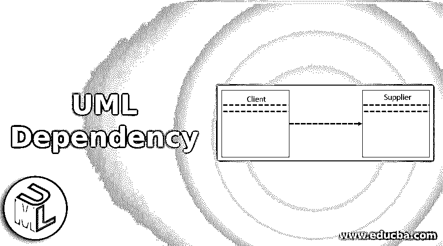
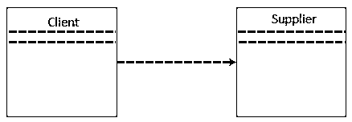

# UML 依赖性

> 原文：<https://www.educba.com/uml-dependency/>

## UML 依赖关系简介

依赖关系是在一系列元素中建立的，这些元素需要其他模型组件来实现 UML 中的独特规范。模型组件依赖于称为供应商的自定模型组件。建立多个组件以形成称为元组的关系。UML 中的依赖性由虚线表示，虚线将作为可靠来源的客户指向作为独立来源的供应商组件。行中的箭头表示依赖关系，依赖关系代表关系的方向，不代表流程的方向。

### 什么是 UML 依赖？

*   术语“依赖”指的是一种有向关系，用于表示一些 UML 组件或一系列元素，这些组件依赖于其他模型组件来实现或规范。由于这种依赖性被称为客户-供应商关系，在这里供应商向客户提供一些信息，而客户面对一些具有语义概念的不完整视图，并且在结构上依赖于供应商来获得更多数据。
*   供应商的变更影响了客户的因素。命名组件用于建立依赖关系之间的关系。这里，UML 包括许多不同类型的组件，如接口、类、包和工件。不同组件之间建立了许多依赖关系。UML 中的关系用来表示不同事物之间的关联。它被命名为一个链接，它解释了在一个系统中执行时两个或多个对象之间的关系的过程。
*   UML 中结构和行为状态的对象分组被称为关系的建立。UML 由三个重要元素组成，如事物、关系和图表表示。模型的基本构建组件由事物提供。关系是 UML 中的一个术语，用来表示事物之间的相互关系。
*   通过图表来描述被分组和相关的聚集元素的图形表示。UML 中的依赖架构涉及客户和供应商。它在组件图、类图、用例图和部署图中实现，表示对供应商设施的任何调整，以便对客户进行任何更改。在 UML 中，依赖是一种重要的情况，客户和供应商用它来描述系统中不同的事物是如何相互依赖的。

如下图所示，客户和供应商相互依赖，用虚线表示。

<small>网页开发、编程语言、软件测试&其他</small>

### UML 依赖的类型

原型、关键字、依赖性和关系的类型如下所示:

*   **衍生:**有限制，表示模板可以由目标位置的任何源使用所有输入参数启动。它还表示从目标对象计算的源对象的位置。
*   **朋友:**源置于目标对象的个体性。
*   **InstanceOf:** 描述了源对象的能力，用于开发一个目标对象的多个实例。
*   **实例化:**通过开发目标的多个实例来描述源对象的能力。
*   **Refine:** 定义了比目标对象满足异常抽象值的源。
*   **使用:**如果包是用 XML 开发的，那么原型的使用定义了源包的组成。这些包存在于目标包中，目标包指定了目标包中某些可用元素的用法。
*   **替换:**它交换了原型，其中客户机是由供应商提供的运行时。
*   **访问:**被称为私人组合。这里，源包允许访问目标包的一个元素。
*   **Import:** 该选项表示从目标源中描述的源组件导入包的目标。也叫公开组合。
*   **Permit:** 定义了启用供应商组件的源元素，或者供应商给出的可见性。
*   **Extend:** 定义了目标可以延长的源组件的字符。
*   **Include:** 解释源组件，涉及到关注位置的另一个组件的字符，类似于 C++和 C 中的函数调用。
*   **成为:**定义与源相同的目标，具有唯一的值和角色。
*   **调用:**定义了源可以调用的目标对象。
*   **复制:**这里的目标是源对象的独立复制
*   **参数:**定义基于客户行为的供应商的参数。
*   **发送:**客户根据不确定目标的操作向供应商工作。
*   **调用 2:** 客户的操作调用供应商的操作
*   **创建:**客户的分类器从供应商的分类器创建许多实例。
*   **跟踪:**客户的组件用于跟踪供应商。它可以用于不同层次的需求。

### 重要

UML 以说明性符号而闻名。UML 用于非软件和软件系统中软件元素的规范、可视化、构造和文档化。因为可视化是需要清楚解释和理解的重要部分。UML 符号是建模中的重要组成部分。正确有效地使用符号对于创建一个有意义和完整的模型是必不可少的。如果没有清楚地定义和描述开发的模型的目的，它将变得毫无用处。学习符号应该从初始阶段就强调。

各种各样的符号变得容易建立关系和学习的东西。UML 图用于表示那些特定的对象和关系。使 UML 更加灵活和强大的显著特征是由于它的可扩展性。用于表示 UML 模型中最常用名词的结构事物的图形符号。结构化的事物被表示为对象、接口、类、用例、活动类、组件、节点和协作。

### 推荐文章

这是一个 UML 依赖的指南。这里我们讨论 UML 依赖的介绍，什么是 UML 依赖以及它的类型和重要性。您也可以看看以下文章，了解更多信息–

1.  [UML 组件图](https://www.educba.com/uml-component-diagram/)
2.  [UML 顺序图](https://www.educba.com/uml-sequence-diagram/)
3.  [UML 对象图](https://www.educba.com/uml-object-diagram/)
4.  [UML 用例图](https://www.educba.com/uml-use-case-diagram/)

