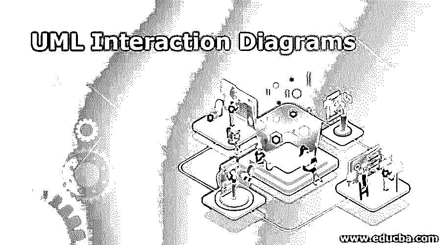

# UML 交互图

> 原文：<https://www.educba.com/uml-interaction-diagrams/>

## UML 交互图介绍

当我们听到“交互”这个词时，我们脑海中浮现的一个想法是，图表与系统不同元素之间的联系有关。这个特性显示了系统的动态行为。现在，在 UML 的情况下，交互由两个图来表示，我们将在后面深入研究这两个图，即序列图和协作图。虽然这两个图的目的非常相似，但是从表面上理解细微的区别，序列图与消息的时间顺序有关，协作图与负责发送和接收消息的对象的整体组织结构有关。

### UML 交互图的组件

在我们深入理解 UML 交互图之前，让我们快速检查一下那些对理解 UML 交互图有本质帮助的术语。

<small>网页开发、编程语言、软件测试&其他</small>

UML 图的主要组成部分是生命线、消息、操作符、状态不变量和约束。在本节中，我们将逐一介绍这些组件，并深入了解每个组件，以获得清晰的整体印象。我们会举一些在我们的社会中非常普遍的类似例子，这样我们的读者会更容易更快地理解这些概念。

从 lifeline 开始，它表示交互中的单个参与者。生命线可以被认为是交互图中最小的构件，也可以是实例在交互中扮演的角色。生命线有许多可能的属性。其中之一是“名称”，在交互中用它来引用生命线。该属性对于生命线是可选的。下一个属性是“Type ”,这是一个强制属性，因为它表示这个生命线所属的分类器的名称。最后一个属性是“选择器”，它类似于标志选项，即布尔条件，用于选择特定的实例。同样，这个属性是可选的。生命线就像一个社会中的个体“人”。

下一个组件是“消息”，它表示交互中生命线之间的特定通信类型。这非常类似于“人”和另一个人的对话。该组件规定了两条生命线如何相互作用。消息本身包含许多活动。可能存在用于调用操作(由稍后讨论的另一个组件“Operator”执行)的调用消息、用于创建实例的消息、用于销毁实例的消息以及最后用于发送信号的消息。同样，在交互图中使用了不同类型的消息。其中一些是同步消息、异步消息、返回消息、对象创建等等。需要理解的另一件事是，当消息被执行时，控制的焦点和交互随着时间的推移而发展，控制的焦点在生命线之间移动。

下一个组件是“状态不变量和约束”。这一部分非常类似于社会中的情况，即接收到的信息可能会导致人的状态发生变化，比如变得高兴或生气，或者信息携带的任何感觉。这个组件也是生命线在其生命周期中的“状态”,它可能满足某些约束或执行操作，或者可能是空闲的。

下一个也是最后一个组件是“操作符”。该组件表示要对操作数执行的操作。例如，一些操作符可能导致流中的分支，一些操作符可能导致流的中断，等等。这类似于一个人在一个社会中所做的决定，这个决定将最终决定行动的方向。

#### UML 交互图的类型

因此，为了更好地理解 UML 交互图，我们需要更深入地理解 UML 中定义的不同类型的交互图。交互由带有小五边形的矩形表示，有 3 种类型:

*   **序列图:**使用这个图的目的是为了以连续的顺序描述对象之间的交互。使用这个图，我们可以看到图中消息流的顺序。这是生命线在执行过程中参与的地方，用竖线表示。在此图中，虚线表示两个或多个对象之间的消息流，一直延伸到页面的末尾。
*   **协作图:**借助于协作图，描述软件对象之间的关系和交互。协作图旨在用于了解系统中对象的体系结构，这与描述消息流的序列图不同。有时这个图也被称为通信图。因为它试图只描述一个对象的架构，所以假设协作图在语义上是弱的。
*   **时序图:**最后一种图，时序图，用于以波形或图形的形式描绘生命线在任意时刻的状态。时序图中不需要符号。

### UML 交互图是如何绘制的？

为了绘制交互图，我们倾向于遵循一个过程，尽管在下面步骤的适用性上，它可能因情况而异。

1.  **识别和添加组件:**首先，我们需要识别系统中存在哪些组件，需要用图表表示出来。
2.  **形状导入或添加:**一旦我们知道了组件，我们就需要开始在图中添加形状来表示操作符或状态。如果需要更多的形状；我们也可以进口它们。
3.  **使用序列标记实现自动化:**假设我们必须不止一次地重复一个图的一部分，最好有一个序列标记并重复使用它，而不是多次制作同一个图。
4.  **在图表中添加文字/概念:**我们需要确保信息发出正确的信息，审查它是最重要的事情。
5.  **想法实现、发布和共享:**在图表实现后，我们可以很容易地发布它，并为了扩展和知识转移而共享它们。

### 结论

通过这篇文章，我们知道了交互图拥有的能力。一旦到了那里，它就是理解信息流和结构组织的重要工具。这些图在工业中广泛使用，如控制流建模、逆向工程、交互元素的结构组织以及更多类似的类型。这个图表有助于捕捉交互的不同方面！

### 推荐文章

这是 UML 交互图的指南。在这里，我们讨论了 UML 交互图及其组件的介绍，并详细解释了不同的类型。您也可以浏览我们推荐的其他文章，了解更多信息——

1.  [UML 顺序图](https://www.educba.com/uml-sequence-diagram/)
2.  [UML 用例图](https://www.educba.com/uml-use-case-diagram/)
3.  [UML 部署图](https://www.educba.com/uml-deployment-diagram/)

