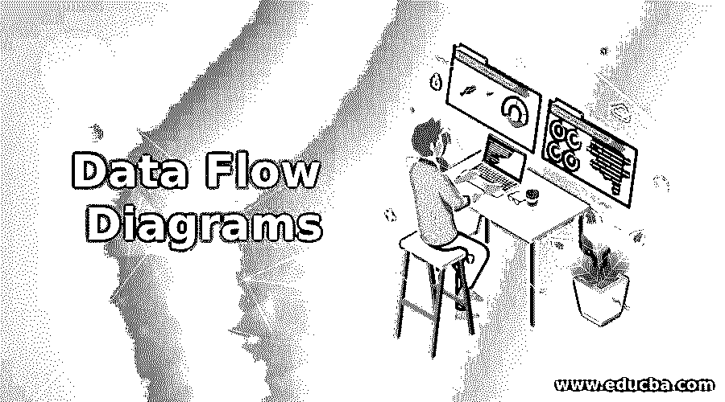

# 数据流程图

> 原文：<https://www.educba.com/data-flow-diagrams/>

## 数据流图介绍

数据流图是系统数据的图形表示，该系统通过给定的输入和流程提供信息作为输出。数据流图可以是物理的，也可以是逻辑的。物理的定义了数据的整个实现，逻辑的定义了执行一些动作的数据流。数据流图基本上是用数字符号表示的，如圆圈、箭头、矩形，以对输入数据、输出结果和数据在整个流程结构中的流动方向进行分类。

### 为什么需要数据流程图？

它实际上是数据流的图形表示，主要与数据项的过程和功能相关联，这些数据项在不同环境和程序的各种组件之间存储、修改、更新和操纵数据。由于它以图解的方式表示，在最终用户和程序设计者之间很容易理解信息。数据流图的整个结构从数据的简要总结开始，并扩展到详细描述要存储和执行的每个程序。因此，由于一些原因，数据流的整个过程是必需的。

<small>网页开发、编程语言、软件测试&其他</small>

*   该图表示系统信息的逻辑流程。
*   该图有助于满足构建系统物理元素的要求。
*   该图也有助于借助容易理解的简单而复杂的数字符号来表示数据的整体流动。
*   它有助于手工和自动连接的系统需求之间的连接。

### 数据流图的工作原理

这是一个数据表示过程，可以分为以下几个层次和步骤。这些级别被编号为 0 级、1 级、2 级、3 级以及更高级别。

0 级数据流图表示被分析和原型化的整个过程的概述。单个气泡表示软件需求，向内和向外的箭头分别表示输入数据和输出数据。它被进一步分解为传达有关数据的详细信息的高级流程。它基本上是一个上下文图，整个过程被重复，直到需求被更好地理解和解决。在这两个级别之间，保存输入和输出数据是非常明智的。

第 1 级它代表了第 0 级数据流图中断裂图的更好和更好解释的细节。所以，基本上，这个层次被进一步细分为多个气泡图或流程，这些图或流程承载了关于系统的更多信息。当 0 级上下文图的高层过程进一步细分为多个过程时，主要目标或功能通过这一级突出显示。在这一级，需要大量的输入箭头来形成包含多个输出数据流的图。

第 2 级它是第 0 级数据流图的下一步，慢慢地深入到系统的主要功能中。这些过程再次深入，然后记录系统的每个功能和特性。这一层充当实体之间的数据链接，并帮助将实体和流程提取到单独的信息流中，作为图表。

第 3 级以上也是可能的，但很少发生，因为它会导致根据所提供的要求对系统功能进行通信或建模时更加复杂。

### 数据流图的符号

数据流图中的符号扮演了一个有价值的角色，因为它有助于确定数据流的整个可视化表示，这有助于收集、分析、可视化和执行外部系统提供的信息。这些符号具有不同的形状和大小，是独特的，以提供有效的沟通和协作。基本上有四个部分来描述数据流图的符号或记号。

**外部实体符号:**该符号有助于表示外部系统之间的数据流、系统数据的来源和目的地。就业务目的而言，这种符号决定了流入和流出系统的数据。外部实体绘制在图的边缘上。

**流程符号:**它用气泡表示，在气泡中处理业务流程的全部功能，信息被细分为更深层次。符号表示数据是如何通过特定流程流动的。

**数据存储符号:**这个符号表示要存储在系统中的数据项的集合。处理过程中需要或将要需要的数据存储在这里。

**数据流符号:**该符号用箭头表示，箭头表示整个数据流及其在系统中流动和前进的方向。

### 数据流图的好处

数据流图的简单易用在各种行业和不同领域的使用中广泛有效。它们是:

*   它用在软件开发工具中，主要关注技术部分，并通过使用伪代码来帮助研究元素。
*   世界各地的各种业务分析师都使用这种方法来分析和检测效率低下的系统，并通过发现程序中的瑕疵或缺陷来帮助整个方法。
*   它帮助中小型组织降低管理费用，改善客户维护服务，并为用户提供更好的质量。
*   它恰好是有效沟通和快速增长的有力组成部分之一。
*   它也有助于对过程或系统进行更深层次的分析，理解和解决它以提供细节。

### 结论

数据流程图被证明是一种简单而又最强大的开发工具，可以让不同领域、不同行业的商业目的所需的信息流入，图表的简单性使我们很容易理解。

### 推荐文章

这是数据流图指南。在这里，我们讨论数据流图的介绍，为什么我们需要它，它是如何工作的，以及好处。您也可以浏览我们的其他相关文章，了解更多信息——

1.  [软件工程中的凝聚力](https://www.educba.com/cohesion-in-software-engineering/)
2.  [软件配置管理](https://www.educba.com/software-configuration-management/)
3.  [软件质量保证](https://www.educba.com/software-quality-assurance/)
4.  [软件设计原理](https://www.educba.com/software-design-principles/)

