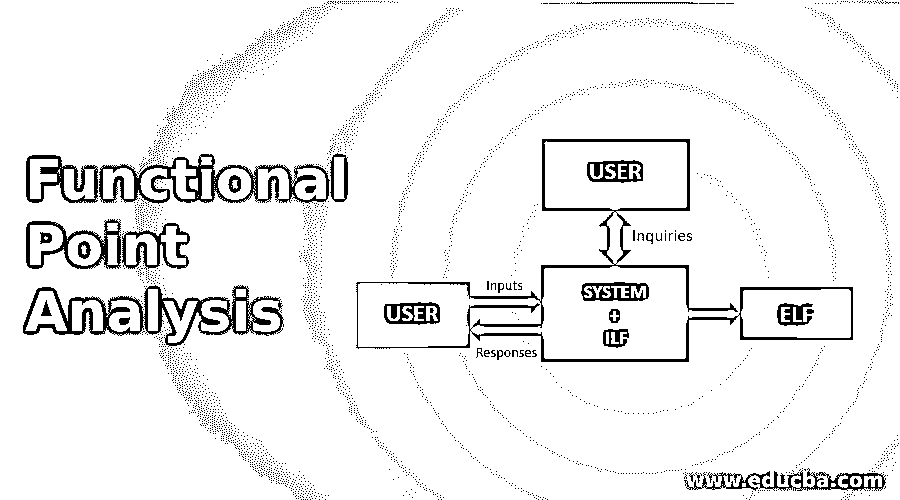
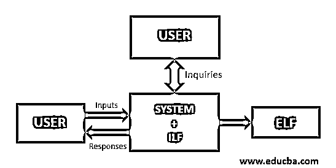

# 功能点分析

> 原文：<https://www.educba.com/functional-point-analysis/>

## 功能点分析简介

功能点分析(FPA)是一种最常用的软件评估技术，用于测量软件工作的功能大小，即它是一种测量软件功能数量和软件开发产品的软件大小的方法或规则。它取决于应用程序的逻辑视图流，即交付给用户的功能数量。功能点(FP)是软件应用程序功能大小的度量

### 功能点分析

当一个新的项目来到组织，组织开始计划和评估该项目的进度时间，成本，资源等。软件产品的评估过程包括应用程序的每个功能的测试阶段，所以这个名字表示功能点分析。

<small>网页开发、编程语言、软件测试&其他</small>

功能点分析过程计算中有多个参数。

它们如下:

*   外部输入(EI)
*   外部输出
*   外部调查(EI)
*   内部逻辑文件(ILF)
*   外部逻辑文件(ELF)

#### 1.外部输入(EI)

它是在功能点分析过程中使用的基本输入参数，其中应用程序的输入数据来自外部来源，如输入屏幕或业务文档或外部数据库或外部表格或文件，即来自外部但在业务标准边界内的应用程序输入。

#### 2.外部输出

在这个基本过程中，处理后的数据将被发送到外部输出，即生成日志报告或文件形式的响应。该报告或文件用作其他应用程序的输入。输出屏幕或报告是 EO 的例子。

#### 3.外部调查(EI)

它是一个基本参数，提供输入和输出组件之间的关系，以检索响应/输出。中断是外部查询的例子。

#### 4.内部逻辑文件(ILF)

在这个过程中，一组相关的或逻辑的数据被存储在与应用标准相关的系统中。输入数据由应用程序处理，存储在具有逻辑结构的文件中。数据库或目录就是它的例子。

#### 5.外部逻辑文件(ELF)

它也称为外部接口文件，其中存储了一组逻辑上相关的外部文件，供软件应用程序参考和使用。它由外部维护，以验证/获取该文件中的数据。共享数据库或共享系统就是这样的例子。

**计算:**

**步骤 1:** 计算总计数(TC)因子，即各个权重因子和参数数量的所有单独乘积相加。

**第二步:**利用给定的公式计算功能点(FP)。

FP = TC *[0.65+0.01*∑ (Xi)] , where Xi = Addition of all given Processing factors.

**步骤 3:** 计算软件应用程序每个功能的生产率、文档和成本。

| **参数** | **权重因子** |
| **低** | **平均值** | **高** |
| 外部输入(EI) | Three | Four | Six |
| 外部输出 | Four | Five | Seven |
| 外部调查(EI) | Three | Four | Six |
| 内部逻辑文件(ILF) | Seven | Ten | Fifteen |
| 外部逻辑文件(ELF) | Five | Seven | Ten |

(功能点分析参数和权重因子表)

### 例子

**场景:**使用以下给定日期，计算具有多个处理因子 5、1、0、4、3、5、4、3、4、4、5、2、3、4、2 的软件应用程序的功能点、生产率、文档和每个功能的成本:EI(平均)数:22，EO(低)数:45，EI(高)数:06，ILF(平均)数:05，ELF(低)数:02，工作量:37 MM，软件技术文档:250 页

**解:**总成本系数(TC)=(22 * 4)+(45 * 5)+(06 * 6)+(05 * 10)+(02 * 5)

= 409

功能点(FP)= TC *[0.65+0.01 *∑(Xi)]

 **= 409 *[0.65 + 0.01*(5+1+0+4+3+ 5+4+3+4+5+ 2+3+ 4+2)]

= 409 * [0.65 + 0.01*45]

= 409 * [0.65 + 0.45]

= 409* 1.10

= 450

生产率(P) = FP 努力

=45037

= 12.16

= 45037

= 12.16
文档总页数(PD) =软件技术文档+用户相关文档

= 250 + 120

= 370 页

文档(D)= pdf FP

= 370450

=0.82

每项功能的成本=成本生产率

=752012.16

=$618.421

= $618.5

### 功能点分析的优缺点

下面给出了优点和缺点:

#### 优势

*   它增强了软件应用程序的生产力和工作流程。
*   它估计软件应用程序的功能大小。
*   它估计软件应用程序的开发时间。
*   作为一个非 IT 人员，他们很容易理解应用程序的功能规模。
*   这是一种独立于技术的方法，用于衡量软件应用程序所需的支持和维护。
*   它估计了软件应用程序的每个功能的成本。

#### 不足之处

*   在软件应用程序中实现是一个耗时的过程。
*   这是一个昂贵的估算模型。
*   FPA 的准确性是非常困难的，因为它涉及多种因素。
*   它需要大量的内部或外部参数或未来数据。
*   它在设计配置之后执行。

### 结论

在本文中，我们从功能点和总成本因素的角度简要讨论了软件功能点分析。它估计软件应用程序的功能规模、生产率、功能成本、文档和文档数量。该过程涉及一些内部或外部或环境参数，这些参数具有一些标准的权重因子。有多种估算方法，但是，功能点分析(FPA)是一个最佳估算过程，它描述了项目的每个功能成本、功能点计算、文档、软件应用程序的大小等。

### 推荐文章

这是功能点分析的指南。这里我们讨论功能点分析的介绍和例子。您也可以看看以下文章，了解更多信息–

1.  [恶意软件分析](https://www.educba.com/malware-analysis/)
2.  [统计分析工具](https://www.educba.com/statistical-analysis-tools/)
3.  [线性回归分析](https://www.educba.com/linear-regression-analysis/)
4.  [非功能测试](https://www.educba.com/non-functional-testing/)

**