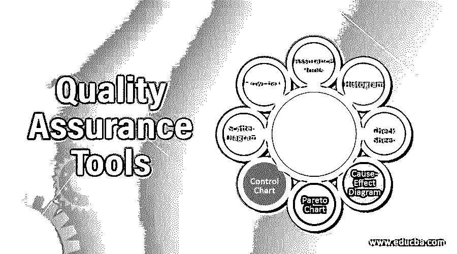

# 质量保证工具

> 原文：<https://www.educba.com/quality-assurance-tools/>

## 质量保证工具介绍

质量保证——QA 被定义为通过遵守软件工程策略和过程来确保发布的软件系统的标准。它真正跨越了整个 SDLC——软件开发生命周期，包括适当的需求管理、软件风格、编码、测试和管理。测试团队还确保产品和服务的标准。

QA 联合管理和组织管理目标、各种流程和政策，专门满足客户需求和提高客户满意度。这样，客户就有可能感觉到他们收到的是好产品，这些产品在这个新的、充满活力的技术时代里不断得到改进。

<small>网页开发、编程语言、软件测试&其他</small>

### 质量保证工具的类型

许多组织使用质量保证工具来帮助监控和管理他们的质量计划。总共有七种不同的 QA 工具被使用，列举如下。

#### 1.流程图

*   流程图可以是表示工作流程方法的图表，也可以是通过箭头和线条在几个方向上进行连接的逐步方法。
*   流程图习惯于在创建增强功能后显示超出方法的变化，或者指示新替换的工作流流程。
*   它们允许识别系统中特定的事件流。
*   在流程图中，每一步都是一个关联的动作，其结果产生一个输出，该输出再次用作后续步骤的输入。
*   然后，该方法将提供其外观的信息或图片，并有助于识别与质量相关的问题。流程图的简单结构如下所示。

#### 2.柱状图

*   直方图是条形图的图形说明，显示了模式在完全不同的典型方法条件下的变化。
*   直方图是一种常用的频率分布图，或一组数据中不同值出现的频率。
*   为了构建直方图，有必要将值的范围划分为五个、十个、十五个等特定区间。这些间隔被称为连续且相邻的仓。
*   直方图中测量数据的例子可以是加入的新学生的数量、登记的新患者的数量等。直方图的基本结构如下所示。

#### 3.板式挡帘

*   检查表是用于收集数据的结构化质量工具。它是一种用于分析数据的准备好的表格，可以用于各种目的。
*   当收集的信息是定量的时，检查表也可以称为计数表。
*   有了检查表，您可以用表格或指标格式列出重要的检查点或事件。
*   检查表通常是文档或电子表格中的问题列表。
*   在审核过程中也会用到它，以确保所有必需的步骤和必要的先决条件都已完成。

#### 4.因果图

*   因果图，也称为鱼骨图，显示了问题的许多可能原因。
*   因果也把想法分成有用的类别，直到我们能够确定问题的根本原因。
*   鱼骨捕捉所有的原因，想法，并使用头脑风暴的方法来确定最强的根本原因。它还记录了处理器系统特定问题的原因。
*   要使用这个工具，您首先需要确定问题并以问题的形式陈述。这将有助于集思广益，因为每个问题都应该有答案。你也可以简单地从写在鱼的第一个压头箱开始。
*   接下来，您将在书脊上列出问题的主要原因，书脊由一条水平穿过页面的线和一条绘制为树枝或骨头的垂直线组成。

#### 5.帕累托图

*   帕累托图是一个数据条形图，显示哪些因素更重要。
*   帕累托图的主要目的是突出最重要的因素，这些因素是问题或失败的主要原因。
*   为了构造一个帕累托图，不同范围的数据被分成不同的组，这些组被称为段或类别。
*   在帕累托图中，图形中的条形以降序表示值，其中左轴表示频率，右轴表示总出现次数的百分比。

#### 6.检查图

*   控制图用于绘制一段时间内的数据点，并给出该数据的运动情况。
*   控制图用于将当前数据与控制极限进行比较，从而得出工艺变化一致性的结论。
*   控制图的主要目的是确定流程在当前条件下是否稳定。
*   控制图是一种图表，用于按时间顺序绘制过程数据。

#### 7.散点图

*   散点图是一种显示变量之间关系的图表，其中变量代表原因和结果。
*   散点图的主要目的是在问题的总体影响和影响问题的原因之间建立关系。
*   散点图有助于识别这两个变量之间的相关性。如果变量是相关的，那么这些点将落在一条直线或非常小的曲线上。
*   变量可能正相关，也可能负相关，并在散点图方程的斜率上标出。

### 结论

所有上述质量保证工具对于选定的场景都有其独特的特征和优势，并且这些工具可以用于解决该情形的问题支持事项。此外，长期正确地使用这些工具会让你精通并成为一个好的聚合思考者。

### 推荐文章

这是质量保证工具指南。在这里，我们详细讨论了质量保证工具和 7 大 QA 工具的介绍。您也可以浏览我们的其他相关文章，了解更多信息——

1.  [Web 测试工具](https://www.educba.com/web-testing-tools/)
2.  [安全测试工具](https://www.educba.com/security-testing-tools/)
3.  [功能测试工具](https://www.educba.com/functional-testing-tools/)
4.  [GUI 测试工具](https://www.educba.com/gui-testing-tools/)

