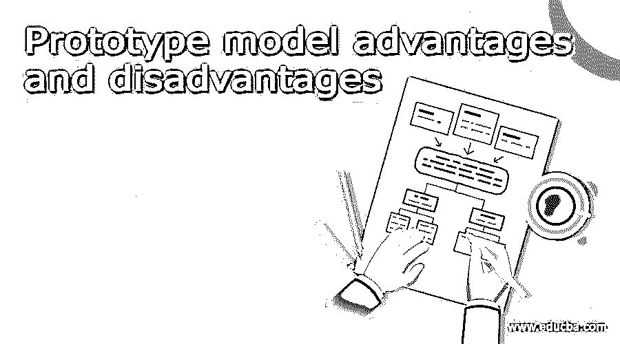

# 原型模型的优点和缺点

> 原文：<https://www.educba.com/prototype-model-advantages-and-disadvantages/>

## 原型模型优缺点介绍

有多种不同的方法可以使软件公式化。这些不同的技术有助于开发稳定的应用软件。一些最常见的软件应用程序开发技术包括构建应用程序的瀑布模型、敏捷模型和原型模型。在这些原型模型中，有一种是最受欢迎的软件开发技术。这个过程包括建立一个原型；预期建造的原型将有一些特定的要求。基于对已经形成的原型的评估，期望收集客户级反馈和测试反馈。根据该信息，将进行开发进一步应用的下一个过程。在本主题中，我们将了解原型模型的优点和缺点。

### 原型模型的优点和缺点

这里我们讨论原型模型的优点和缺点

<small>网页开发、编程语言、软件测试&其他</small>

#### 原型模型优势

*   开发过程的速度可以稳步提高，因为初始级别的原型已经准备好了，这为过程提供了很大的灵活性。这里的关键优势是开发过程。它可以在很短的时间内很好地制定和组织。这是另一个关键优势。由于对构建的这种理解，系统级的设计可以很容易地在团队间转化。
*   从设计的角度来看，该模型易于构建且稳定。因此，原型模型的设计阶段可以非常灵活地设计。这是原型模型的主要优势之一。因为设计过程决定了构建过程的后续部分。因此，灵活的设计是需要考虑的一个重要方面。此外，设计越灵活，项目在整体上看起来就越稳定。
*   除了基于设计的灵活性和以面向速度的方式制定构建和开发过程中获得的优势之外，使用基于原型的模型的另一个关键优势是其检测错误的能力。因此，在原型模型下分配的项目具有交付无错误产品的优势。发生这种情况是因为能够快速识别主要错误，甚至是项目设计阶段涉及的次要错误。
*   这里可以确定所涉及功能的关键方面。因此，功能透视图中涉及的主要元素可以在原型过程中很早就确定下来。从功能的角度来看，原型模型的优势在于能够很好地理解已经放置的过程和感知。就所设计的应用程序或软件的灵活性而言，这是另一个关键方面。
*   此外，原型模型总是包含新变化的空间。因此，每当设计视角中出现新的变化时，它们都可以灵活地嵌入到应用程序中。这带来了从系统的任何角度分配设计的可能性。这是基于原型的模型的另一个关键优势。
*   从顾客的角度来看，他们有特权享受更大的舒适和满足感。这是另一个优势，也是为什么当今的项目建设者在信息技术时代更喜欢原型模型的关键方面。
*   从开发人员和架构师的角度可以理解底层系统。这是另一个关键优势。设计的系统层次可以很容易地在团队间转化。因为在原型模型上设计的项目具有在当地建立一个著名系统的优势。
*   流程和部署渠道可以很早就被理解和决定。这是部署原型级模型的另一个关键优势。此外，在原型模型下分配的项目具有交付无错误产品的优势。发生这种情况是因为能够快速识别主要错误，甚至是项目设计阶段涉及的次要错误。

#### 原型模型缺点

*   从业务的成本导向角度来看，原型模型可能看起来相对更昂贵。这使得在选择基于原型的模型的竞争中，成本成为一个关键的考虑因素。基本上，基于成本的炒作之所以发生，是因为预期项目的整个设计都包含在系统的初始原型阶段。这额外增加了应用程序的成本。
*   由于原型模型的需求不断变化，文档的系统和功能级别在这些应用中将明显滞后。这是考虑原型模型的一个关键方面，因为在稍后的阶段，在产品已经部署之后，相同的文档将是保持应用程序稳定性的一个关键方面。因此，在那些时间段，可能需要重新努力来构建系统的文档。因此在应用的后期明显增加了项目的跨度和成本。因此，这些可以被认为是间接手段，这导致了应用程序成本的增加。
*   也有可能增加需求改变的次数。因此，这需要相当长的时间来修改需求。这又带来了大量的时间，直接或间接地涉及到一次又一次地设置应用程序。因此，在某些情况下，这是另一个可能增加建造成本的方面。
*   从问题级别分析来看，问题级别分析可能执行得不太好。所以，这可能会再次导致更多的错误和程序错误在以后的时间里产生。因此，这是与相关应用相关的另一个明显的可能性。因此在应用的后期明显增加了项目的跨度和成本。所以，这些可以被认为是间接的手段，这导致了应用程序成本的增加。

### 结论

这篇文章解释了原型级模型实际上意味着什么，并简要地提到了与原型级模型相关的各种优点和缺点。

### 推荐文章

这是一个原型模型优点和缺点的指南。这里我们讨论原型模型的各种优点和缺点。您也可以看看以下文章，了解更多信息–

1.  [原型模型](https://www.educba.com/prototype-model/)
2.  [Javascript 原型](https://www.educba.com/javascript-prototype/)
3.  [C 语言中的函数原型](https://www.educba.com/function-prototype-in-c/)
4.  [Perl 函数](https://www.educba.com/perl-function/)

