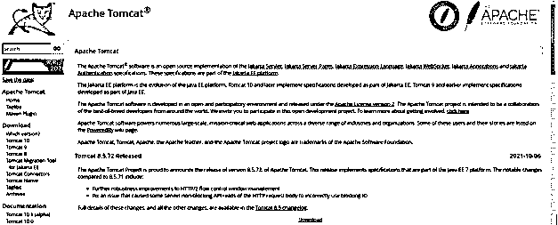
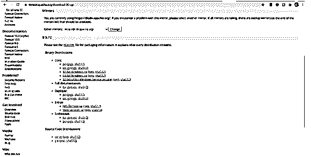
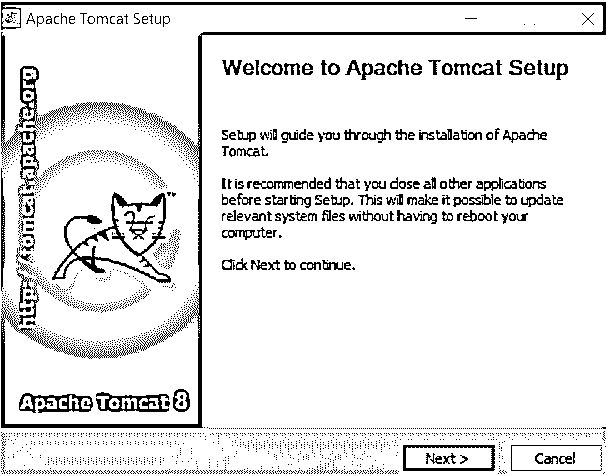
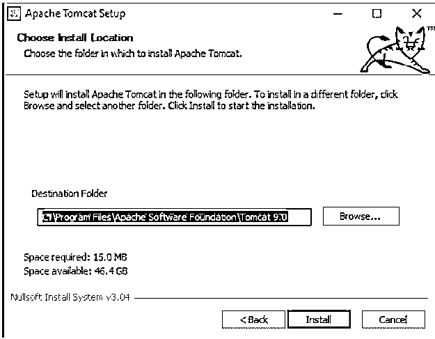
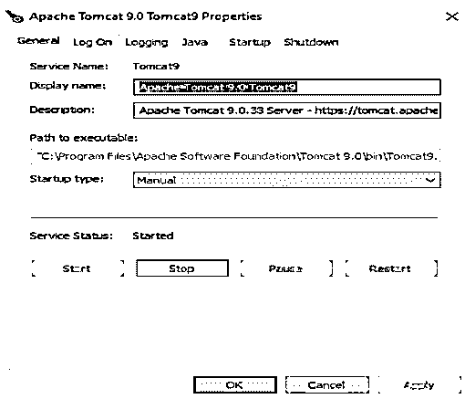

# Tomcat 服务器

> 原文：<https://www.educba.com/tomcat-server/>

## Tomcat 服务器简介

Tomcat server 是由 Apache Software Foundation 开发的开源工具，它是 Jakarta Expression Language、Jakarta Servlet、Jakarta Annotations、Jakarta WebSocket、Jakarta Authentication 和 Jakarta Server pages 等项目的实现。Java EE 平台被修改成 Jakarta EE 平台，对它的进一步修改导致了 Tomcat 9 和 Tomcat 10 的形成。在本文中，我们将看看什么是 tomcat web server。它是如何工作的，创建一个 tomcat 的 web 服务器，并使用 tomcat 管理器来简化我们的任务？

### 什么是 Tomcat 服务器？

Apache tomcat 是 servlet 容器和 web 服务器，可用于部署和测试以及为 java 应用程序提供服务。Tomcat server 是开源的，是在 Apache License version 2 的许可下发布的参与环境中开发的。我们可以在各种应用程序中使用 Apache web 服务器，这些应用程序是基于大规模的，并且涉及各种领域和工业应用程序中的关键任务。

<small>网页开发、编程语言、软件测试&其他</small>

Apache tomcat web server 的最新版本为 10.0.12，之前的版本为 8.5.72，于 2021 年 10 月 6 日发布，实现了 Java EE 7 平台的功能，包括 HTTP/2 流控制的 windows 管理中最显著的健壮性变化，并修复了与读取 HTTP 请求的 servlet 的非阻塞 API 相关的问题，该问题导致阻塞输入/输出的错误使用。

### 如何使用 tomcat 服务器？

Web 服务器可以简单地理解为帮助运行网站和分发所需网页的计算机。它存储所有的网页，然后对它们进行单独处理并传输，即将网页交付给最终用户，以便在屏幕上显示和呈现。超文本传输协议 HTTP 用于网络服务器和浏览器之间的相互通信。

存储在 web 服务器中的网页主要包含图像、文本、音频、样式表、文档等静态内容。除此之外，web 服务器还可以使用 FTP 和 SMTP 协议来存储和传输文件和电子邮件。

作为域名服务器的 DNS 将作为统一资源定位符的 URL 转换为网络服务器的相应 IP 地址，统一资源定位符只不过是用于在浏览器中导航到页面的链接。web 服务器接收请求，以在其浏览器上传送和显示用户请求的内容。互联网上可用的网站借助于分配给每个网站的 IP 地址的唯一标识符来识别。此外，互联网协议(即 IP 地址)的使用是由网络服务器完成的，用于通过互联网进行通信。

### 创建 tomcat 服务器

tomcat web server 有许多版本，您可以根据自己的需求、目的和偏好进行选择。尽管总是建议下载并安装任何软件的最新稳定版本。Tomcat web server 可以通过以下步骤轻松安装和使用

*   打开任何一个浏览器，然后进入链接——http://tomcat.apache.org/，这是 tomcat 的官方链接。在那里，您可以点击任何版本的 web 服务器的下载按钮，如下所示

*   单击下载按钮后，您可以看到以下页面，您可以在其中单击任何 windows 计算机选项，您可能有 32 位或 64 位，甚至可以下载 zip 文件

*   下载过程可能需要一定的时间，这取决于你的网络速度，然后你可以看到 the.exe 文件，可用于安装。点击它，你会看到下面的屏幕

*   继续点击下一步，我同意，下一步，继续，确定和完成。您可以输入您的用户名和密码，同意许可文档，然后选择软件包的安装路径以及 JRE 的安装路径。

单击“完成”按钮后，安装将完成。此后，它会要求重新启动系统。

现在，您可以随时通过点击图标或在搜索框中搜索来访问 tomcat。您可以看到以下屏幕

您可以使用上面的窗口选择启动或停止 tomcat 的 web 服务器。

### 作为 Windows 服务的 Tomcat 服务器

打开 localhost http://localhost:8080/manager/html 的链接就可以轻松使用 tomcat web server。请注意，8080 是 tomcat web 服务器的默认端口，您可以通过更改配置文件来更改它。转到这个链接会将您导航到 Tomcat 管理器网页。您需要输入用户名和密码，这是您在安装时设置的凭据。您可以在屏幕上看到所有已部署应用程序的完整列表，如下所示

您可以取消部署、停止、启动和重新加载此处显示的应用程序。

您可以通过向下滚动并选择 deploy 选项来部署您的任何项目，在这里您可以上传您的部署。

您还可以在 windows 和 Linux 平台上创建包含用户列表及其相关密码的文件，只需创建一个文件，该文件可以使用以下命令创建

在 windows 平台上–

`C:\Java\Apache Tomcat 8.5.9\conf\tomcat-users.XML`

在这个文件中，您可以使用<user>标签，在这里您可以使用属性 username 和 password 来指定用户名及其相应的密码。除此之外，您还可以利用角色属性来指定用户的角色。</user>

### tomcat 应用服务器

除了 web 服务器之外，tomcat 还可以用作应用服务器，其完全开源的解决方案在内部执行 java 的 servlets，有助于交付和呈现 Java EE 的 Java 服务器页面和其他 web 页面。事实上，它是市场上最流行、最广泛使用的应用服务器之一。

### 结论

Tomcat server 是 servlet 容器，也是 web 服务器，您可以在其中部署所有的 web 应用程序，还可以使用 Tomcat Manager 管理多个部署。Tomcat manager 向您显示所有部署的状态，并为您提供启动、停止或重新加载已部署文件的选项。

### 推荐文章

这是一个 Tomcat 服务器的指南。这里我们讨论一下入门，什么是 tomcat 服务器，如何使用 tomcat 服务器，用代码实现的例子。您也可以看看以下文章，了解更多信息–

1.  [Spring Boot 雄猫](https://www.educba.com/spring-boot-tomcat/)
2.  [Nginx vs Tomcat](https://www.educba.com/nginx-vs-tomcat/)
3.  [什么是阿帕奇雄猫？](https://www.educba.com/what-is-apache-tomcat/)
4.  [阿帕奇兴趣点依赖关系](https://www.educba.com/apache-poi-dependency/)

