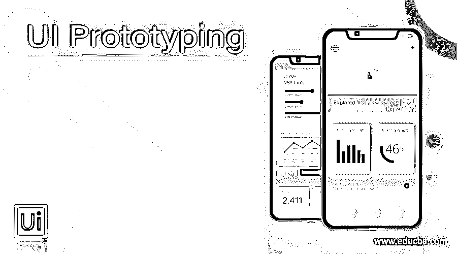

# 用户界面原型

> 原文：<https://www.educba.com/ui-prototyping/>

## UI 原型介绍

原型就是在实际实现之前对系统建模。它帮助用户界面设计者与用户期望的功能进行交叉检查，并获得用户对系统模型是否合适的反馈。首先评估用户界面原型，然后用于实现。只有当原型在评估阶段通过了用户验收，它才被用作实际实现的基础。

### UI 原型制作流程

在设计了原型之后，对结果模型进行质量评估。当 UI 要被原型化时，有 4 个不同的模型设计步骤。

<small>网页开发、编程语言、软件测试&其他</small>

**1。用户模型:**它是将使用系统的所有最终用户的配置文件。为了构建一个好的界面，需要有关于系统用户的年龄、性别、身体能力、文化背景、教育水平和富裕程度的数据。系统的用户可以根据界面知识进行分类:

*   新手:他们对系统界面如何设计没有任何语法知识，但对界面的语义知识却很少。
*   **有知识的频繁用户:**他们对系统有很好的语义和很好的句法知识，这使得这类用户经常寻找快捷和缩写的操作方式。
*   **有知识的间歇用户:**他们有足够的系统语义知识，但缺乏使用界面所需的语法知识。

**2。设计模型:**是用户模型的设计实现。这个模型应该符合在需求分析阶段指定的所有用户期望

**3。系统感知模型:**它代表了用户对界面外观和工作方式的看法。它是关于用户头脑中的系统的观点。

**4。系统映像模型:**它代表了系统的外观和感觉，并结合了支持信息，如描述系统界面语法和语义的手册和帮助文件。

只有当系统感知和系统图像模型一致时，用户才会对界面感到满意。只有当设计模型被开发来适应用户模型的信息时，这种一致性才能实现。所有这些模型的成功设计都基于关键要素——了解用户和了解任务。

### 用户界面评估

一旦通过上面定义的建模步骤创建了 UI 原型，下一步就是评估原型模型。评估是为了发现模型是否满足用户需求。对用户界面设计进行一些评估，以判断其适用性。对于护城河系统来说，全面评估是非常昂贵和不切实际的。界面实际上是根据可用性属性来评估的。

### 用户界面评估流程

用户界面评估涉及的步骤如下

第一步:用户界面设计师首先创建系统的初步设计

**步骤 2:** 设计完成后，创建 UI 的第一级原型

第三步:系统的用户然后评估 UI 原型。他们向设计者提供关于系统界面效率的反馈

**第四步:**通过正式的方法进行评估，如从用户处获得反馈的问卷、评分表、系统使用的视频记录和随后的磁带评估等。然后，设计者研究该评估反馈，并从该数据中提取信息。

**第五步:**用户界面设计师根据用户反馈进行修改，开发下一级 UI 原型。

这种评估循环一直持续到用户不再推荐进一步的修改，即直到用户接受原型。

### 可用性属性

*   健壮性:这意味着系统容忍用户错误的效率有多高。
*   可学习性:这意味着新用户需要多长时间来适应这个系统
*   **适应性:**这意味着系统应对不同用户环境的效率有多高。
*   **运行速度:**这意味着系统对用户请求的响应速度有多快。
*   **可恢复性:**这意味着系统从用户错误中恢复的能力有多强。

### 评定标准

在评估 UI 原型时，可以强加一些评估标准

*   规范中规定的用户任务数量和每个任务中的平均动作数量表明了所需的交互时间和系统的整体效率。
*   界面风格、帮助工具和错误处理工具表明了界面的复杂性和用户接受它的程度。
*   许多系统任务、动作和系统状态表明了系统用户的内存负载。
*   用户需求规范中定义的系统界面的长度和复杂性提供了系统用户所需学习量的线索。

### 结论–用户界面原型

在本文中，我们逐步讨论了 UI 原型及其过程。我们还加入了 UI 评估的概念。我希望你喜欢这篇文章。

### 推荐文章

这是一个 UI 原型的指南。在这里，我们讨论 UI 原型制作过程以及用户界面评估及其过程。您也可以看看以下文章，了解更多信息–

1.  [UI 设计工具](https://www.educba.com/ui-design-tools/)
2.  [UI 设计师面试问题](https://www.educba.com/ui-designer-interview-questions/)
3.  什么是 Firebase？
4.  [Figma 备选方案](https://www.educba.com/figma-alternatives/)

